# HTTP/2.0
https://cloud.tencent.com/developer/article/2040982
https://cloud.tencent.com/developer/article/1464264
https://www.sohu.com/a/129367974_505802
## 开篇
### HTTP发展的心路历程
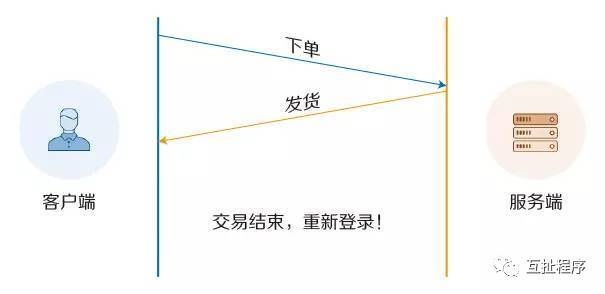
上图：连接无法复用
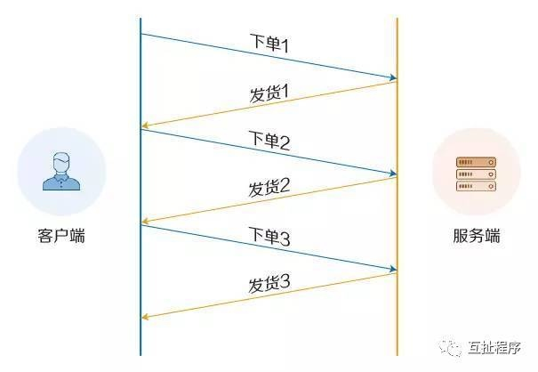
上图：设置Connection:Keep-Alive，保持连接在一段时间内不断开。
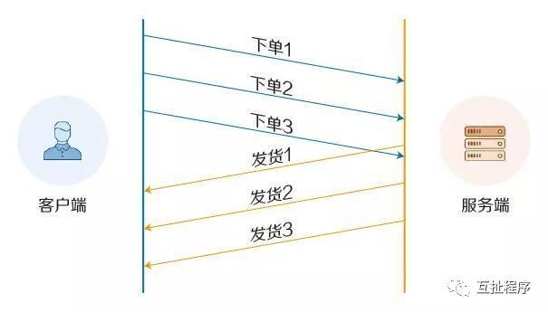
上图：HTTPpipelining：建立多个连接
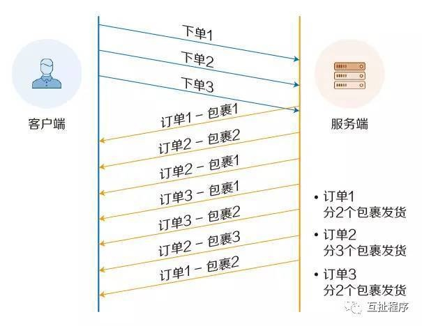
上图：多路复用
**HTTP 协议简单介绍**
1. HTTP协议 ：Hyper Text Transfer Protocol（超文本传输协议）,是用于从万维网（WWW:World Wide Web ）服务器传输超文本到本地浏览器的传送协议。是互联网上应用最为广泛的一种网络协议。所有的WWW文件都必须遵守这个标准。
2. HTTP是一个基于TCP/IP通信协议来传递数据（HTML 文件, 图片文件, 查询结果等）。
3. HTTP是一个属于应用层的面向对象的协议，由于其简捷、快速的方式，适用于分布式超媒体信息系统。它于1990年提出，经过几年的使用与发展，得到不断地完善和扩展。
4. HTTP协议工作于客户端-服务端架构为上。浏览器作为HTTP客户端通过URL向HTTP服务端即WEB服务器发送所有请求。Web服务器根据接收到的请求后，向客户端发送响应信息。

**HTTP 协议版本**
1. HTTP 0.9作为HTTP协议的第一个版本。是非常弱的。请求(Request)只有一行,比如: GET www.leautolink.com
2. HTTP1.0最早在网页中使用是在1996年，那个时候只是使用一些较为简单的网页上和网络请求上。
3. HTTP1.1则在1999年才开始广泛应用于现在的各大浏览器网络请求中，同时HTTP1.1也是当前使用最为广泛的HTTP协议。
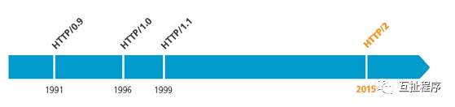
### HTTP 1.1 做了哪些升级
* **缓存处理**，在HTTP1.0中主要使用header里的If-Modified-Since,Expires来做为缓存判断的标准，HTTP1.1则引入了更多的缓存控制策略例如Entity tag，If-Unmodified-Since, If-Match, If-None-Match等更多可供选择的缓存头来控制缓存策略。
* **带宽优化及网络连接的使用**，HTTP1.0中，存在一些浪费带宽的现象，例如客户端只是需要某个对象的一部分，而服务器却将整个对象送过来了，并且不支持断点续传功能，HTTP1.1则在请求头引入了range头域，它允许只请求资源的某个部分，即返回码是206（Partial Content），这样就方便了开发者自由的选择以便于充分利用带宽和连接。
* **错误通知的管理**，在HTTP1.1中新增了24个错误状态响应码，如409（Conflict）表示请求的资源与资源的当前状态发生冲突；410（Gone）表示服务器上的某个资源被永久性的删除。
* **Host头处理**，在HTTP1.0中认为每台服务器都绑定一个唯一的IP地址，因此，请求消息中的URL并没有传递主机名（hostname）。但随着虚拟主机技术的发展，在一台物理服务器上可以存在多个虚拟主机（Multi-homed Web Servers），并且它们共享一个IP地址。HTTP1.1的请求消息和响应消息都应支持Host头域，且请求消息中如果没有Host头域会报告一个错误（400 Bad Request）。
* **长连接**，HTTP 1.1支持长连接（Persistent Connection）和请求的流水线（Pipelining）处理，在一个TCP连接上可以传送多个HTTP请求和响应，减少了建立和关闭连接的消耗和延迟，在HTTP1.1中默认开启Connection： keep-alive，一定程度上弥补了HTTP1.0每次请求都要创建连接的缺点。

### 如何建立连接（三次握手）
HTTP 是基于 TCP 协议的，浏览器最快也要在第三次握手时才能捎带 HTTP 请求报文，达到真正的建立连接，但是这些连接无法复用会导致每次请求都经历三次握手和慢启动。三次握手在高延迟的场景下影响较明显，慢启动则对文件类大请求影响较大。
* 第一次握手：建立连接时，客户端发送syn包（syn=j）到服务器，并进入**SYN_SENT**状态，等待服务器确认；
SYN：同步序列编号（Synchronize Sequence Numbers）。
* 第二次握手：服务器收到syn包，必须确认客户的SYN（ack=j+1），同时自己也发送一个SYN包（syn=k），即SYN+ACK包，此时服务器进入**SYN_RECV**状态；
* 第三次握手：客户端收到服务器的SYN+ACK包，向服务器发送确认包ACK(ack=k+1），此包发送完毕，客户端和服务器进入**ESTABLISHED**（TCP连接成功）状态，完成三次握手。

**完成三次握手，客户端与服务器开始传送数据。**
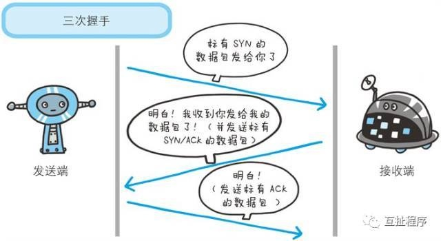
### 如何关闭连接（四次挥手）
由于TCP连接是全双工的，因此每个方向都必须单独进行关闭。这个原则是当一方完成它的数据发送任务后就能发送一个FIN来终止这个方向的连接。收到一个 FIN只意味着这一方向上没有数据流动，一个TCP连接在收到一个FIN后仍能发送数据。首先进行关闭的一方将执行主动关闭，而另一方执行被动关闭。
TCP的连接的拆除需要发送四个包，因此称为**四次挥手(four-way handshake)**。客户端或服务器均可主动发起挥手动作，在socket编程中，任何一方执行close()操作即可产生挥手操作。
* 客户端A发送一个FIN，用来关闭客户A到服务器B的数据传送。 
* 服务器B收到这个FIN，它发回一个ACK，确认序号为收到的序号加1。和SYN一样，一个FIN将占用一个序号。 
* 服务器B关闭与客户端A的连接，发送一个FIN给客户端A。 
* 客户端A发回ACK报文确认，并将确认序号设置为收到序号加1。 
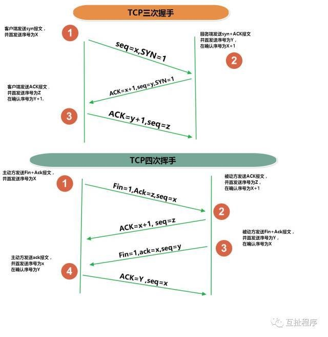

### 浏览器阻塞（HOL blocking）
浏览器对于同一个域名，一般PC端浏览器会针对单个域名的server同时建立6～8个连接，手机端的连接数则一般控制在4～6个（这个根据浏览器内核不同可能会有所差异），超过浏览器最大连接数限制，后续请求就会被阻塞。
在讲HTTP/2之前我们先来说说SPDY
**SPDY**协议是Google提出的基于传输控制协议(TCP)的应用层协议，通过**压缩、多路复用和优先级**来缩短加载时间。该协议是一种更加快速的内容传输协议，于2009 年年中发布。
Google Chrome、Mozilla Firefox以及Opera已默认开启SPDY。Google曾经称它的测试显示，页面载入提高了一倍。该协议是一种更加快速的内容传输协议。
**SPDY协议设定的目标**
1. 页面加载时间（PLT，Page Load Time）降低 50%；
2. 无需网站作者修改任何内容；
3. 最小化配置复杂度，无需变更网络基础设施；

注：为了达到降低50%页面加载时间的目标，SPDY 引入了一个新的二进制分帧数据层，以实现**多向请求和响应、优先次序、最小化及消除不必要的网络延迟**，目的是更有效地利用底层TCP 连接；
### HTTP/2：SPDY的升级版
* HTTP-WG（HTTP Working Group）在2012 年初把HTTP 2.0提到了议事日程，吸取SPDY 的经验教训，并在此基础上制定官方标准。
* HTTP/2 的主要目标是**改进传输性能，更有效地利用网络资源，实现低延迟和高吞吐量**。从另一方面看，HTTP 的高层协议语义并不会因为这次版本升级而受影响。所有HTTP 首部、值，以及它们的使用场景都不会变。
* HTTP/2 致力于突破上一代标准众所周知的性能限制，但它也是对之前1.x 标准的扩展，而非替代。之所以要递增一个大版本到2.0，主要是因为它改变了客户端与服务器之间交换数据的方式
### HTTP/2 是如何提高效率呢？
#### 二进制分帧：HTTP 2.0 的所有帧都采用二进制编码
* 帧：客户端与服务器通过交换帧来通信，帧是基于这个新协议通信的最小单位。
* 消息：是指逻辑上的 HTTP 消息，比如请求、响应等，由一或多个帧组成。
* 流：流是连接中的一个虚拟信道，可以承载双向的消息；每个流都有一个唯一的整数标识符（1、2…N）；
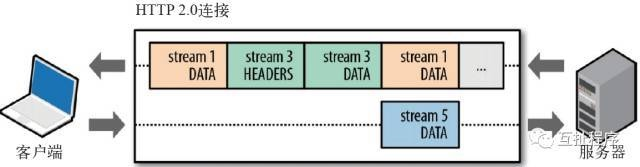
#### 多路复用 (Multiplexing)
多路复用允许同时通过单一的 HTTP/2 连接发起多重的请求-响应消息。有了新的分帧机制后，HTTP/2 不再依赖多个TCP 连接去实现多流并行了。每个数据流都拆分成很多互不依赖的帧，而这些帧可以交错（乱序发送），还可以分优先级。最后再在另一端把它们重新组合起来。HTTP 2.0 连接都是持久化的，而且客户端与服务器之间也只需要一个连接（每个域名一个连接）即可。 
#### 请求优先级
* 把HTTP 消息分解为很多独立的帧之后，就可以通过优化这些帧的交错和传输顺序，每个流都可以带有一个31 比特的优先值：0 表示最高优先级；2的31次方-1 表示最低优先级。
* 服务器可以根据流的优先级，控制资源分配（CPU、内存、带宽），而在响应数据准备好之后，优先将最高优先级的帧发送给客户端。
* HTTP 2.0 一举解决了所有这些低效的问题：浏览器可以在发现资源时立即分派请求，指定每个流的优先级，让服务器决定最优的响应次序。这样请求就不必排队了，既节省了时间，也最大限度地利用了每个连接。
#### header压缩
HTTP1.x的header带有大量信息，而且每次都要重复发送，HTTP/2使用encoder来减少需要传输的header大小，通讯双方各自cache一份header fields表，既避免了重复header的传输，又减小了需要传输的大小。
#### 服务端推送
* 服务器可以对一个客户端请求发送多个响应。服务器向客户端推送资源无需客户端明确地请求。
* HTTP 2.0 连接后，客户端与服务器交换SETTINGS 帧，借此可以限定双向并发的流的最大数量。
* 所有推送的资源都遵守同源策略。换句话说，服务器不能随便将第三方资源推送给客户端，而必须是经过双方确认才行。
* 服务器必须遵循请求- 响应的循环，只能借着对请求的响应推送资源

**服务器推送到底是什么？**
服务端推送能把客户端所需要的资源伴随着index.html一起发送到客户端，省去了客户端重复请求的步骤。正因为没有发起请求，建立连接等操作，所以静态资源通过服务端推送的方式可以极大地提升速度。
普通的客户端请求过程：
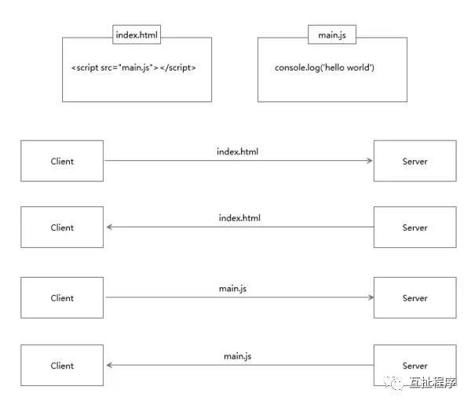
服务端推送的过程：
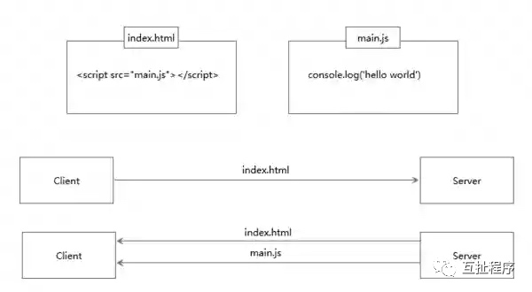
### HTTP/2的多路复用和HTTP1.1中的长连接复用有什么区别？
* HTTP/1.0 一次请求-响应，建立一个连接，用完关闭；每一个请求都要建立一个连接；
* HTTP/1.1 Pipeling解决方式为，若干个请求排队串行化单线程处理，后面的请求等待前面请求的返回才能获得执行机会，一旦有某请求超时等，后续请求只能被阻塞，毫无办法，也就是人们常说的线头阻塞；
* HTTP/2多个请求可同时在一个连接上并行执行。某个请求任务耗时严重，不会影响到其它连接的正常执行；
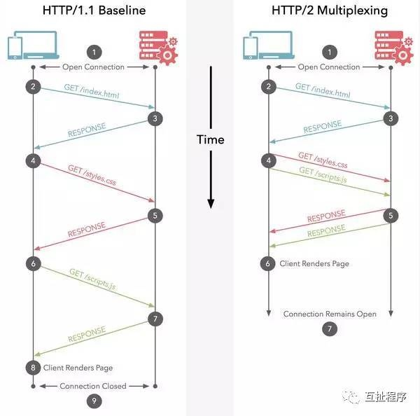
### 如何应用到自己的项目里
现有的任何网站和应用，无需做任何修改都可以在HTTP 2.0 上跑起来。不用为了利用HTTP 2.0 的好处而修改标记。HTTP 服务器必须运行HTTP 2.0 协议，但大部分用户都不会因此而受到影响。
如果你使用NGINX，只要在配置文件中启动相应的协议就可以了，可以参考NGINX白皮书，NGINX配置HTTP2.0官方指南。
使用了HTTP2.0，那么原本的HTTP1.x怎么办，这个问题其实不用担心，HTTP2.0完全兼容HTTP1.x的语义，对于不支持HTTP2.0的浏览器，NGINX会自动向下兼容的。
