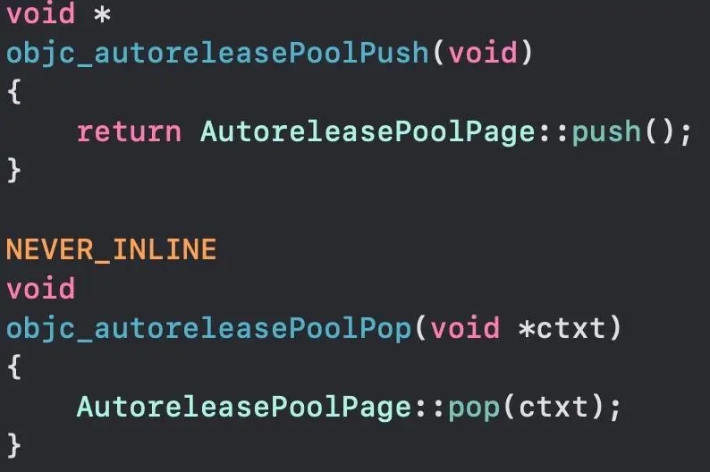

# iOS autorelease与自动释放池
## autorelease、autorelease pool以及原理
### autorelease与MRC、ARC
* autorelease：在MRC下，内存管理允许有三个操作，分别是**release,retain,autorelease**。release会使对象的引用计数立刻-1，retain使对象的引用计数立刻+1，autorelease也会让对象的引用计数-1，但不是立刻-1.调用autorelease的对象会被加入到autorelease pool中，在合适的时间autorelease pool向对象调用release，也就是说，对象被延迟释放了。
* 而在ARC下，Apple禁止了手动调用autorelease方法。使用@autoreleaseblock创建自动释放池后，runtime会自动向在block中的对象加上autorelease
### autorelease pool
`
A thread's autorelease pool is a stack of pointers. Each pointer is either an object to release, or POOL_BOUNDARY which is an autorelease pool boundary. A pool token is a pointer to the POOL_BOUNDARY for that pool. When the pool is popped, every object hotter than the sentinel is released. The stack is divided into a doubly-linked list of pages. Pages are added and deleted as necessary. Thread-local storage points to the hot page, where newly autoreleased objects are stored.
`
以上是objc-781源码中NSObject.mm对于自动释放池的定义。从定义里面可以得知，**自动释放池实际上是一个存放了指针的栈，栈中的指针有两类，一类是等待释放的对象指针，一类是名为POOL_BOUNDARY的哨兵指针**。释放池之间以链表的形式相连，一个Page通常是4096个字节的大小(虚拟内存中的一页)。而前面提到的POOL_BOUNDARY哨兵指针的作用就是标示每个池子的尾端。
当在MRC中调用autorelease方法或者在ARC中将对象编写在@autoreleaseblock中，对象将会被注册到自动释放池中，当合适的时机到来自动释放池将会向这些对象调用release方法，以释放对象。

`
The Application Kit creates an autorelease pool on the main thread at the beginning of every cycle of the event loop, and drains it at the end, thereby releasing any autoreleased objects generated while processing an event. If you use the Application Kit, you therefore typically don’t have to create your own pools. If your application creates a lot of temporary autoreleased objects within the event loop, however, it may be beneficial to create “local” autorelease pools to help to minimize the peak memory footprint.
`
以上是Developer Documentation中Apple对于autorelease pool的一个介绍。可以看到在**主线程中，每一个事件循环Runloop的开始，Appkit框架都会为程序创建一个自动释放池，并且在每次Runloop结束时释放所有在池中的对象**。
需要注意的是，在这里Apple提到了一点：如果程序中临时创建了大量的autorelease对象，那么更好的做法是开发者自行新增一个释放池来最小化内存峰值的发生。

## 原理
### First of all,最简单的代码
我们先来写出最常见的@autorelease代码。

当我们在Xcode中建立一个macOS项目时，通常模版中的main函数就包含了这样一段类似的代码。其中的@autorelease pool就是在ARC环境下使用自动释放池的API。
### OC to C++
在终端中使用clang -rewrite-objc main.m命令将main.m文件转换成C++代码文件。
转换出来的代码会很多，我们挑重点的看。

在C++代码的main函数中，@autoreleasepool{}已经被转换成了如上代码。我们可以看到熟悉的objc_msgSeng，这是**OC的灵魂-消息发送**。
同时，@autoreleasepool{}变成了__AtAutoreleasePool，看来自动释放池的真实结构就是这个。我们再找一下它的定义在哪里。
通过搜索关键字，我们找到了它的定义语句。

可以看到，__AtAutoreleasePool结构体中定义了一个构造函数和一个析构函数，并调用了objc_autoreleasePoolPush()和objc_autoreleasePoolPop()两个函数。
### objc源码
这一步，我们到objc4-781代码中找上述两个方法的实现。

可以看到，这两个方法实际上是调用了AutoreleasePoolPage类的push()和pop()方法，也就是说，**自动释放池在runtime中的实际结构其实是AutoreleasePoolPage**，这就是它的最终面目了。

AutoreleasePoolPage类继承于AutoreleasePoolPageData

从这里我们可以看到，**autoreleasepool 是与线程一一对应的，同时线程池之间以双向链表相连。**
这里引用网上一位同学分享的内存分布图

AutoreleasePoolPage
接着我们来看一下几个关键方法的具体实现。
### autorelease
首先是autorelease方法。调用该方法会将对象加入到自动释放池中。

autorelease
第一行和第二行代码分别对传入参数做了一些检验，从第二行代码可以见到，如果传入的对象是TaggedPointer类型的，比如由小于等于9个字符的字面量字符串创建的NSString，将会有其他的处理操作。

autoreleaseFast-w465
该方法是autorelease方法的关键方法。可以看到第一行通过hotPage()方法拿到一个最近使用过的Page，然后来到流程控制。
* 如果获取到了该hotPage并且Page还没有满，那么将对象加入到该Page中；
* 如果Page满了，则调用autoreleaseFullPage方法创建一个新的page，将对象加入到新创建的page后并将新建立的page与通过hotPage()获取到的page相连接。
* 如果没有获取到hotpage，那么将会调用autoreleaseNoPage方法建立并初始化自动释放池。
### AutoreleasePoolPage::push()
在前面我们提到将对象加入到自动释放池时首先调用objc_autoreleasePoolPush方法，而该方法只起到了调用AutoreleasePoolPage::push()方法的作用。

其中，if-else的if分支是当出错时Debug会执行的流程，正常将会执行else分支里的代码。而autoreleaseFast()方法的实现在上一小段中已给出，这里传入的POOL_BOUNDARY就是哨兵对象。当创建一个自动释放池时，会调用该push()函数。
### _objc_autoreleasePoolPrint()
使用_objc_autoreleasePoolPrint();方法可以打印出目前自动释放池中的对象，当然在使用前要先extern void _objc_autoreleasePoolPrint(void);.
该方法会调用AutoreleasePoolPage::printAll();打印出自动释放池中的相关信息。

从打印出的信息来看，自动释放池确实是跟线程一一对应的，并且在创建时会将一个哨兵对象加入到池中，这与我们在上文的代码分析结果相互映证。
### 写在最后
关于autorelease和autoreleasePool的原理和代码的分析大概就是这些，当然还有很多具体实现是本文没有提到的，有兴趣的读者也可以自行到objc4-781的源码里找到NSObject.mm文件更加详细地研究。
总得来说，**自动释放池机制延迟了对象的生命周期，并且可以为开发者自动释放需要被释放的对象，减少了内存泄漏发生的可能**。