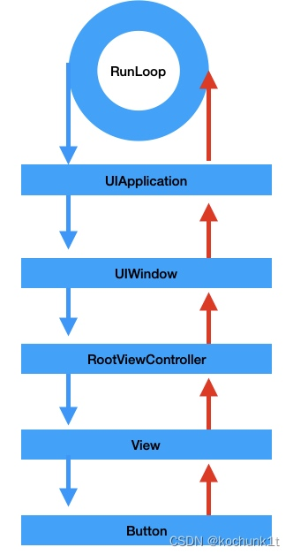
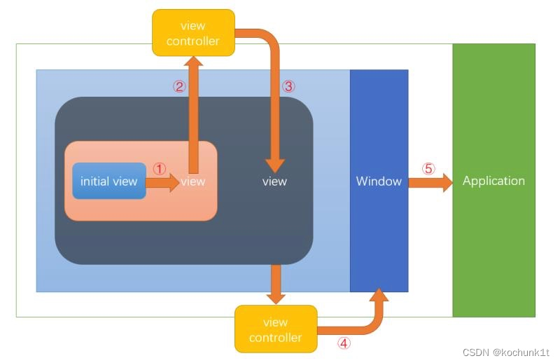
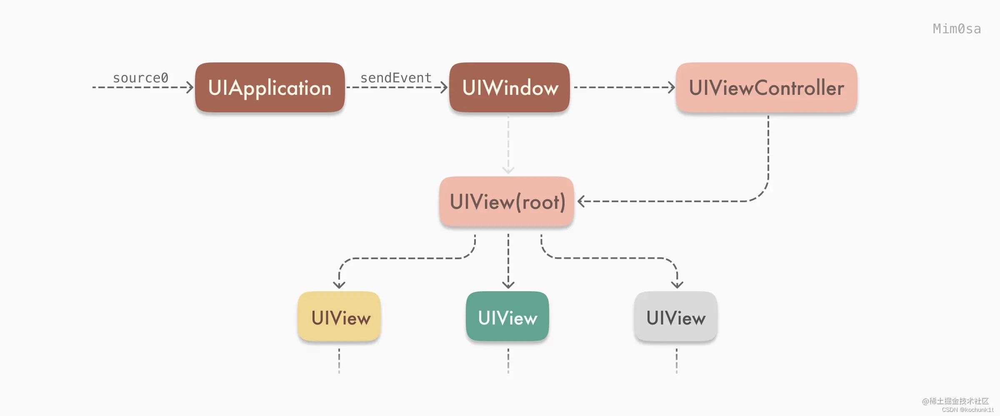

# iOS中的事件传递及响应链机制
https://blog.csdn.net/kochunk1t/article/details/125134149
## 事件产生
如下图所示，点击屏幕时，首先UIApplication对象先收到该点击事件，再依次传递给它上面的所有子view，直到传递到最上层，即**UIApplication——>UIWindow——>RootViewController——>View——>Button，即传递链**。而反之**Button——>View——>RootViewController——>UIWindow——>UIApplication则为响应链**。简单总结，**事件链包含传递链和响应链，事件通过传递链传递下去，通过响应链找到相应的UIResponse**。

### UIResponder的点击事件
在自定义UIView为基类的控件时，我们可以重写这几个方法来进行点击回调。在回调中，我们可以看到方法接收两个参数，一个UITouch对象的集合，还有一个UIEvent对象。这两个参数分别代表的是点击对象和事件对象。
### 事件对象
iOS使用UIEvent表示用户交互的事件对象，在UIEvent.h文件中，我们可以看到有一个UIEventType类型的属性，这个属性表示了当前的响应事件类型。分别有多点触控、摇一摇以及远程操作（在iOS之后新增了3DTouch事件类型）。在一个用户点击事件处理过程中，UIEvent对象是唯一的
### 点击对象
UITouch表示单个点击，其类文件中存在枚举类型UITouchPhase的属性，用来表示当前点击的状态。这些状态包括**点击开始、移动、停止不动、结束和取消**五个状态。每次点击发生的时候，点击对象都放在一个集合中传入UIResponder的回调方法中，我们通过集合中对象获取用户点击的位置。其中通过- (CGPoint)locationInView:(nullable UIView *)view获取当前点击坐标点，- (CGPoint)previousLocationInView:(nullable UIView *)view获取上个点击位置的坐标点。
* 为了确认UIView确实是通过UIResponder的点击方法响应点击事件的，我创建了UIView的类别，并重写+ (void)load方法，使用method_swizzling的方式交换点击事件的实现
## 传递链
**传递链**：Application -> window -> root view -> … -> first view
**UIResponse**：响应对象的基类，定义了事件处理的接口
**常见的子类**：UIView，UIViewController，UIApplication以及所有继承自UIView的UIKit类都直接或间接的继承自UIResponder


* 蓝色箭头为事件的传递过程，红色箭头为事件响应的过程
* 当发生点击事件后，系统会将事件加入到UIApplication管理的一个任务队列中
* UIApplication将处于任务队列最前端的事件向下分发给UIWindow
* UIWindow将事件向下分发给View
* UIView首先看自己是否能够处理事件，触摸点击是否在自己身上，如果能，那么继续寻找子视图（递归添加顺序）
* 遍历子控件，重复以上两步
* 如果没有找到，那么window自己就是事件处理
* 如果自己不能处理，那么不做任何处理
### hitTest
hitTest的作用：当在一个view上添加一个屏蔽罩，但又不影响对下面view的操作，也就是可以透过屏蔽罩对下面的view进行操作。
```
- (UIView *)hitTest:(CGPoint)point withEvent:(UIEvent *)event {

}
```
### 调用过程
iOS系统检测到手指触摸（Touch）操作时会将其放入当前活动应用程序的事件队列，UIApplication会从事件队列中取出触摸事件并传递给关键窗口（当前接收用户事件的窗口）处理，窗口对象首先会使用hitTest:withEvent:方法寻找此次触摸操作初始点所在的视图（View），即需要触摸事件传递给其处理的视图，称之为**hit-test视图**。
* 窗口对象会首先在视图层次结构的顶级视图上调用hitTest:withEvent:，此方法会在视图层级结构中的每个视图上调用点内部：withEvent:，如果pointInside :withEvent:返回YES，则继续逐级调用，直到找到触摸操作发生的位置，这个视图也就是测试视图。

则hitTest:withEvent:方法方法的处理流程如下：
* 首先调用当前视图的pointInside：withEvent：方法判断触摸点是否在当前视图内;
* 若返回NO，则则hitTest：withEvent：方法返回0;
* 若返回YES，则向当前视图的所有子视图（子视图）发送一则hitTest：withEvent：方法消息，所有子视图的遍历顺序是从顶部到底部，即从子视图数组的末尾向前遍历，直到有子视图返回非空对象或者全部子视图遍历完毕;
* 若第一次有子视图返回非空对象，则hitTest:withEvent:方法方法返回此对象，处理结束;
* 如所有子视图都返回非，则hitTest:withEvent:方法方法返回自身。

hitTest:withEvent:方法忽略隐藏（hidden = YES）的视图，禁止用户操作（userInteractionEnabled = YES）的视图，以及alpha级别小于0.01（alpha <0.01）的视图。如果一个子视图的区域超过父视图的约束区域（父视图的clipsToBounds 属性为NO，这样超过父视图绑定区域的子视图内容也会显示），那么正常情况下对子视图在父视图之外区域的触摸操作不会被识别，因为父视图的pointInside:withEvent:方法。方法会返回NO，这样就不会继续向下遍历子视图了当然，也可以重写pointInside:withEvent:方法方法来处理这种情况。
对于每个触摸操作都会有一个UITouch对象，UITouch对象用来表示一个触摸操作，即一个手指在屏幕上按下，移动，离开的整个过程。UITouch对象在触摸操作的过程中在不断变化，所以在使用UITouch对象时，不能直接保留，而需要使用其他手段存储UITouch的内部信息。UITouch对象有一个视图属性，表示此触摸操作初始发生所在的视图，即上面检测到的命中测试视图，此属性在UITouch的生命周期不再改变，即使触摸操作后续移动到其他视图之上。
### pointInside
* 这个函数的用处是判断当前的点击或者触摸事件的点是否在当前的view中。
```
- (BOOL)pointInside:(CGPoint)point withEvent:(UIEvent *)event {
}
```
它被hitTest:withEvent:调用，通过对每个子视图调用pointInside:withEvent:决定最终哪个视图来响应此事件。如果pointInside:withEvent:返回YES，然后子视图的继承树就会被遍历（遍历顺序中最先响应的为：与用户最接近的那个视图。it starts from the top-level subview），即子视图的子视图继续调用递归这个函数，直到找到可以响应的子视图（这个子视图的hitTest:withEvent:会返回self，而不是nil）；否则，视图的继承树就会被忽略。
## 响应链
响应链：由离用户最近的view向系统传递。如下所示

### 谁来响应事件
在 UIKit 中我们使用响应者对象（Responder）接收和处理事件。**一个响应者对象一般是 UIResponder 类的实例，它常见的子类包括 UIView，UIViewController 和 UIApplication**，这意味着几乎所有我们日常使用的控件都是响应者，如 UIButton，UILabel 等等。
* 在 UIResponder 及其子类中，我们是通过有关触摸（UITouch）的方法来处理和传递事件（UIEvent）
UIResponder 还可以处理 UIPress、加速计、远程控制事件，这里仅讨论触摸事件。

在 UITouch 内，存储了大量触摸相关的数据，当手指在屏幕上移动时，所对应的 UITouch 数据也会更新，例如：这个触摸是在哪个 window 或者哪个 view 内发生的？当前触摸点的坐标是？前一个触摸点的坐标是？当前触摸事件的状态是？这些都存储在 UITouch 里面。另外需要注意的是，在这四个方法的参数中，传递的是 UITouch 类型的一个集合（而不是一个 UITouch），这对应了两根及以上手指触摸同一个视图的情况。
### 第一响应者
当有人触摸了屏幕之后，我们需要找到使用者到底触摸了一个什么东西，或者可以理解为我们要找到，在这次使用者触摸之后，使用者最想要哪个控件发起响应。这个过程就是确定这次触摸事件的第一响应者是谁。
这里我们使用 UIView 来作为视图层级的主要组成元素，便于理解。但不止 UIView 可以响应事件，实际只要是 UIResponder 的子类，都可以响应和传递事件。

回到开头的问题，我现在变成了一台手机，并且我知道有人触摸了屏幕。我所拥有的信息是触摸点的坐标，我知道应该就是视图层级中其中的某一个，但我无法直接知道用户是想点哪个视图。我需要一个策略来找到这个第一响应者，UIKit 为我们提供了命中测试（hit-test）来确定触摸事件的响应者，这个策略具体是这样运作的：

注意：
* 在检查自身可否接收事件中，如果视图符合以下三个条件中的任一个，都会无法接收事件：
```
view.isUserInteractionEnabled = false
view.alpha <= 0.01
view.isHidden = true
```
* 检查坐标是否在自身内部这个过程使用了 pointInside-> Bool 方法来判断坐标是否在自身内部，该方法是可以被重写的。
* 从后往前遍历子视图重复执行指的是按照 FILO 的原则，将其所有子视图按照 「后添加的先遍历」 的规则进行命中测试。该规则保证了系统会优先测试视图层级树中最后添加的视图，如果视图之间有重叠，该视图也是同级视图中展示最完整的视图，即用户最可能想要点的那个视图。