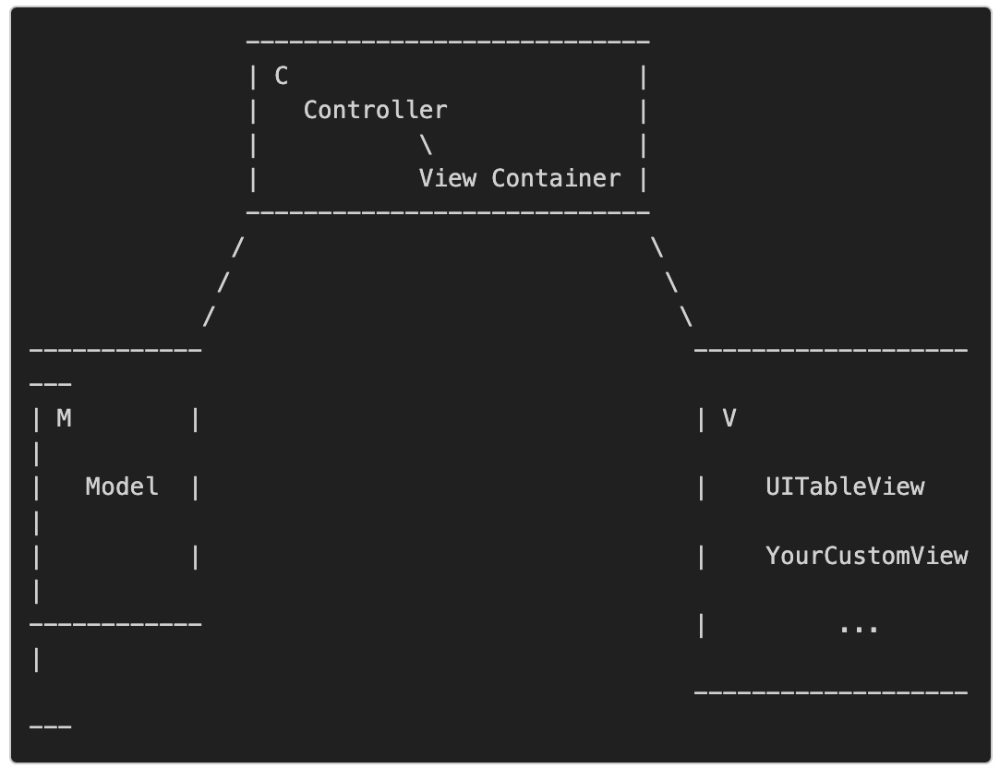
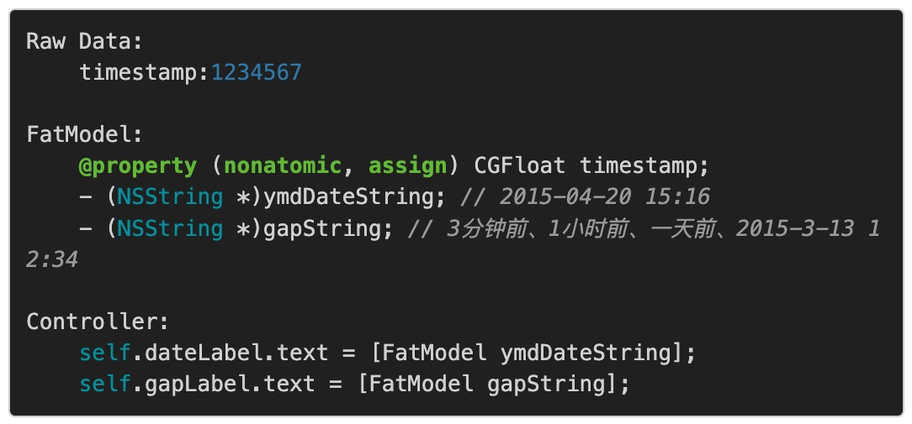
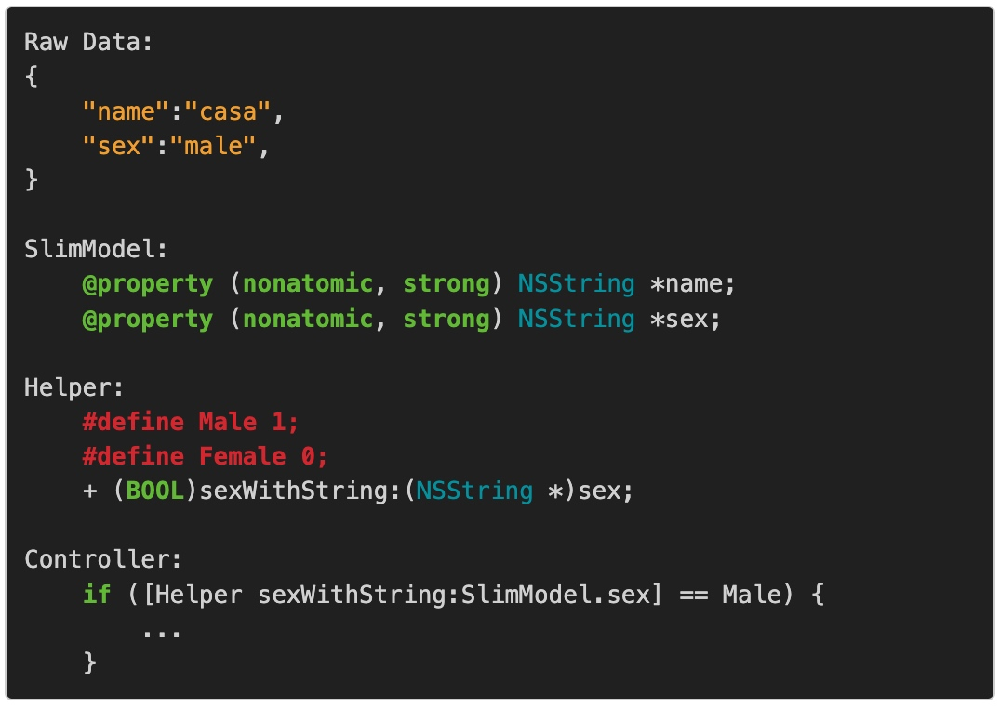
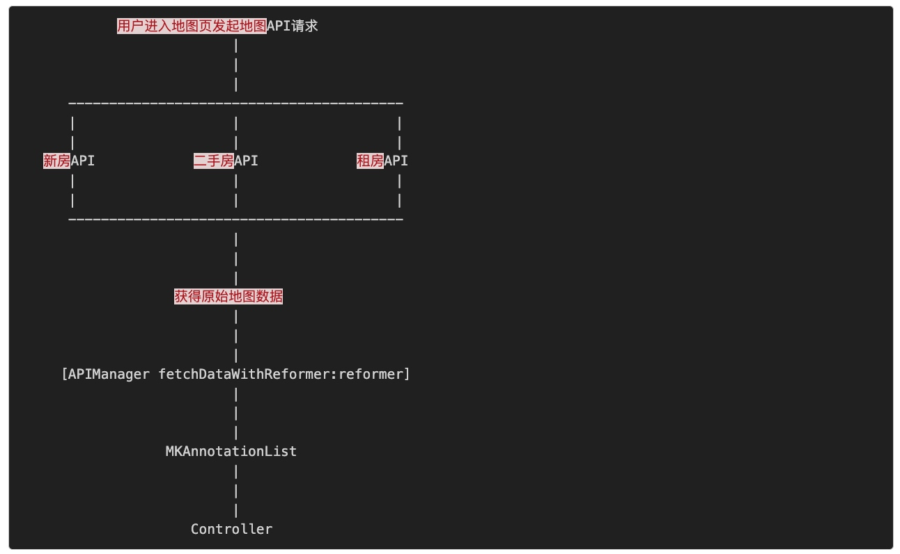
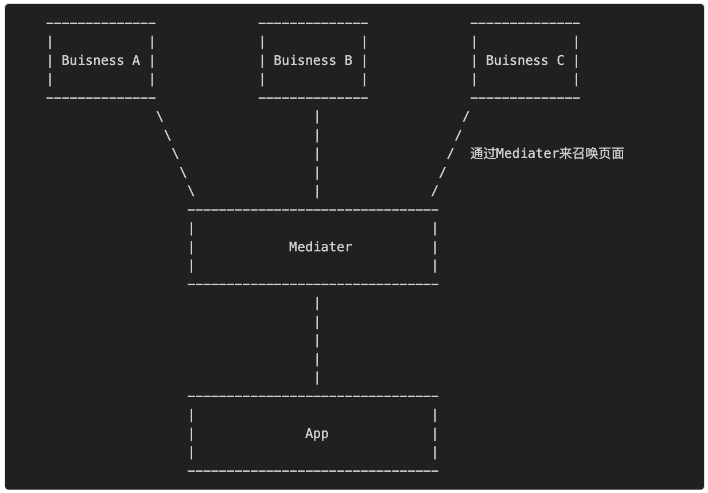
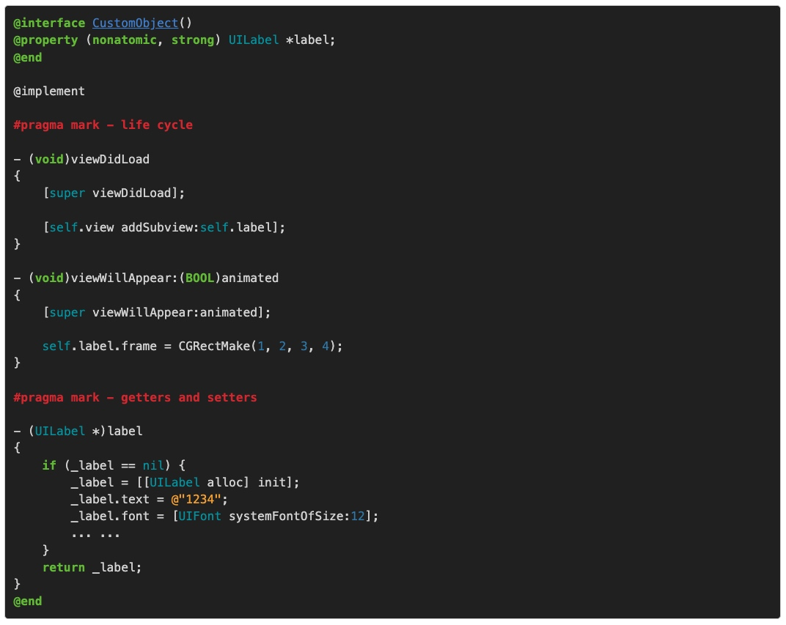
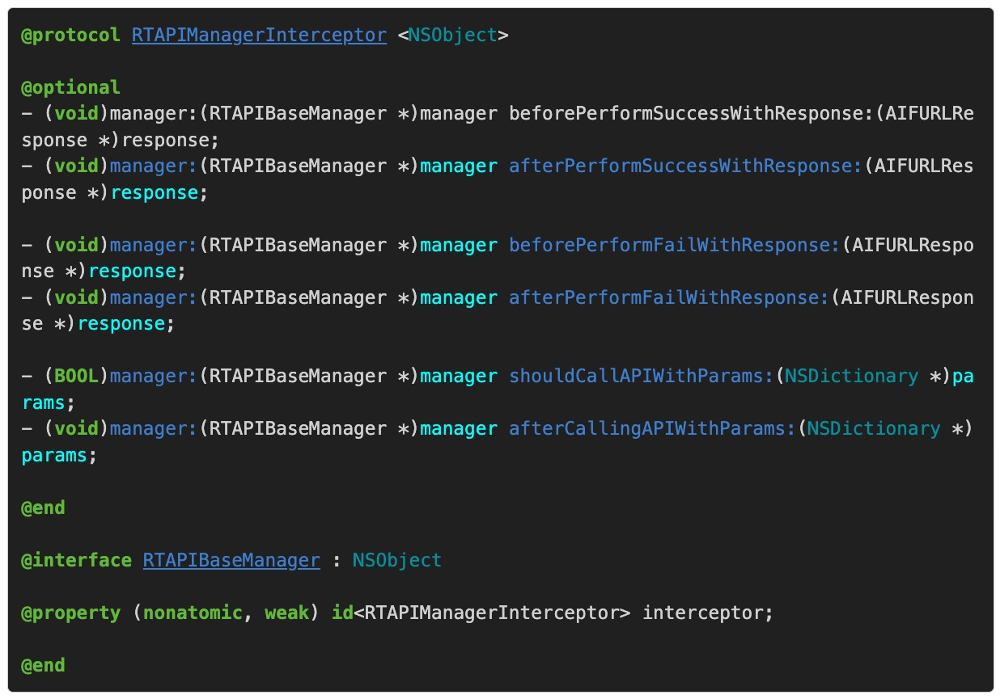

# iOS应用架构谈
https://casatwy.com/iosying-yong-jia-gou-tan-kai-pian.html
* Introduction to Coding Guidelines for Cocoa
https://developer.apple.com/library/archive/documentation/Cocoa/Conceptual/CodingGuidelines/CodingGuidelines.html
## App主要工作
* 调用网络API（如何让业务开发工程师方便安全地调用网络API？然后尽可能保证用户在各种网络环境下都能有良好的体验？）
* 页面展示（页面如何组织，才能尽可能降低业务方代码的耦合度？尽可能降低业务方开发界面的复杂度，提高他们的效率？）
* 数据的本地持久化（当数据有在本地存取的需求的时候，如何能够保证数据在本地的合理安排？如何尽可能地减小性能消耗？）
* 动态部署方案（iOS应用有审核周期，如何能够通过不发版本的方式展示新的内容给用户？如何修复紧急bug？）
## 团队工作
* 收集用户数据，给产品和运营提供参考
* 合理地组织各业务方开发的业务模块，以及相关基础模块
* 每日app的自动打包，提供给QA工程师的测试工具
## 常见问题
1. 网络层设计方案？设计网络层时要考虑哪些问题？对网络层做优化的时候，可以从哪些地方入手？
2. 页面的展示、调用和组织都有哪些设计方案？我们做这些方案的时候都要考虑哪些问题？
3. 本地持久化层的设计方案都有哪些？优劣势都是什么？不同方案间要注意的问题分别都是什么？
4. 要实现动态部署，都有哪些方案？不同方案之间的优劣点，他们的侧重点？
## 架构分层
我们常见的分层架构，有三层架构的：**展现层、业务层、数据层**。也有四层架构的：**展现层、业务层、网络层、本地数据层**。这里说三层、四层，跟TCP/IP所谓的五层或者七层不是同一种概念。再具体说就是：你这个架构在逻辑上是几层那就几层，具体每一层叫什么，做什么，没有特定的规范。这主要是针对模块分类而言的。
也有说MVC架构，MVVM架构的，这种层次划分，主要是针对数据流动的方向而言的。
在实际情况中，针对数据流动方向做的设计和针对模块分类做的设计是会放在一起的，也就是说，一个MVC架构可以是四层：展现层、业务层、网络层、本地数据层。
那么，为什么我要说这个？
大概在五六年前，业界很流行三层架构这个术语。然后各种文档资料漫天的三层架构，并且喜欢把它与MVC放在一起说，**MVC三层架构/三层架构MVC**，以至于很多人就会认为三层架构就是MVC，MVC就是三层架构。其实不是的。**三层架构里面其实没有Controller的概念，而且三层架构描述的侧重点是模块之间的逻辑关系。MVC有Controller的概念，它描述的侧重点在于数据流动方向。**
所有的模块角色只会有三种：**数据管理者、数据加工者、数据展示者**，意思也就是，笼统说来，软件只会有三层，每一层扮演一个角色。
## 架构设计的方法
* 第一步：搞清楚要解决哪些问题，并找到解决这些问题的充要条件
* 第二步：问题分类，分模块
* 第三步：搞清楚各问题之间的依赖关系，建立好模块交流规范并设计模块
* 第四步：推演预测一下未来可能的走向，必要时添加新的模块，记录更多的基础数据以备未来之需
* 第五步：先解决依赖关系中最基础的问题，实现基础模块，然后再用基础模块堆叠出整个架构
* 第六步：打点，跑单元测试，跑性能测试，根据数据去优化对应的地方

总而言之就是要遵循这些原则：**自顶向下设计**（1，2，3，4步），**自底向上实现**（5），**先测量，后优化**（6）。
## 好架构师的标准
* 每天都在学习，新技术新思想上手速度快，理解速度快
* 业务出身，或者至少非常熟悉公司所处行业或者本公司的业务
* 熟悉软件工程的各种规范，踩过无数坑。不会为了完成需求不择手段，不推崇quick & dirty
* 及时承认错误，不要觉得承认错误会有损你架构师的身份
* 不为了炫技而炫技
* 精益求精
## 好架构的标准
* 代码整齐，分类明确，没有common，没有core
* 不用文档，或很少文档，就能让业务方上手
* 思路和方法要统一，尽量不要多元
* 没有横向依赖，万不得已不出现跨层访问
* 对业务方该限制的地方有限制，该灵活的地方要给业务方创造灵活实现的条件
* 易测试，易拓展
* 保持一定量的超前性
* 接口少，接口参数少
* 高性能

高性能非常重要，但是在客户端架构中，它不是第一考虑因素。原因有下：
* 客户端业务变化非常之快，做架构时首要考虑因素应当是便于业务方快速满足产品需求，因此需要尽可能提供简单易用效果好的接口给业务方，而不是提供高性能的接口给业务方。
* 苹果平台的性能非常之棒，正常情况下很少会出现由于性能不够导致的用户体验问题。
* 苹果平台的优化手段相对有限，甚至于有些时候即便动用了无所不用其极的手段乃至不择手段牺牲了稳定性，性能提高很有可能也只不过是100ms到90ms的差距。10%的性能提升对于服务端来说很不错了，因为服务端动不动就是几十万上百万的访问量，几十万上百万个10ms是很可观的。但是对于客户端的用户来说，他无法感知这10ms的差别，如果从10s优化成9s用户还是有一定感知的，但是100ms变90ms，我觉得吧，还是别折腾了。
## View层架构（最贴近业务的底层架构）
* View代码结构的规定
* 关于view的布局
* 何时使用storyboard，何时使用nib，何时使用代码写View
* 是否有必要让业务方统一派生ViewController？
* 方便View布局的小工具
* MVC、MVVM、MVCS、VIPER
* 本门心法
* 跨业务时View的处理
### 制定View层规范
* 提高业务方View层的可读性可维护性
* 防止业务代码对架构产生腐蚀
* 确保传承
* 保持架构发展的方向不轻易被不合理的意见所左右
### 按照顺序来分配代码块的位置
* life cycle（viewDidLoad之类的方法）
* Delegate方法实现（把对应的protocol名字带上，例如：#pragma mark - UITableViewDelegate）
* event response（专门开一个代码区域，所有button、gestureRecognizer的响应事件都放在这个区域里面）
* getters and setters
* private methods（一般是用于日期换算、图片裁剪等，ViewController里面不应该写）
### View的布局
Autolayout可以考虑使用**Masonry**
https://github.com/SnapKit/Masonry
Frame可以考虑**HandyAutoLayout**
https://github.com/glt3953/HandyAutoLayout/tree/master
实现简单的东西，用Code一样简单，实现复杂的东西，Code比StoryBoard更简单，所以提倡用code去画view而不是storyboard。
### 业务方统一派生ViewController
出于记录用户操作行为数据的需要，或者统一配置页面的目的，会从UIViewController里面派生一个自己的ViewController，来执行一些通用逻辑。
结论：**没有必要**
* 使用派生比不使用派生更容易增加业务方的使用成本
  * 集成成本
  要么把所有依赖全部搞定，然后基于App环境（比如天猫）下开发Demo，要么就是自己Demo写好之后，按照环境要求改代码。
  * 上手接受成本
  * 架构的维护难度
  尽可能少地使用继承能提高项目的可维护性，**跳出面向对象思想(一) 继承**：https://casatwy.com/tiao-chu-mian-xiang-dui-xiang-si-xiang-yi-ji-cheng.html
* 不使用派生手段一样也能达到统一设置的目的
* 使用AOP（Aspect Oriented Programming，面向切片编程）

架构师实现具体方案之前需要考虑的问题
* 方案的效果，和最终要达到的目的是什么？
  方案的效果应该是：
  * 业务方可以不用通过继承的方法，然后框架能够做到对ViewController的统一配置。
  * 业务方即使脱离框架环境，不需要修改任何代码也能够跑完代码。业务方的ViewController一旦丢入框架环境，不需要修改任何代码，框架就能够起到它应该起的作用。
    
  要实现**不通过业务代码上对框架的主动迎合，使得业务能够被框架感知**这样的功能。细化下来就是两个问题，框架要能够拦截到ViewController的生命周期，另一个问题就是，拦截的定义时机。
    对于方法拦截，很容易想到**Method Swizzling**，那么我们可以写一个实例，在App启动的时候添加针对UIViewController的方法拦截，这是一种做法。还有另一种做法就是，使用**NSObject的load函数**，在应用启动时自动监听。使用后者的好处在于，这个模块只要被项目包含，就能够发挥作用，不需要在项目里面添加任何代码。
    关于Method Swizzling手段实现方法拦截，业界也已经有了现成的开源库：**Aspects**（https://github.com/glt3953/Aspects/tree/master）
* 在自己的知识体系里面，是否具备实现这个方案的能力？
* 在业界已有的开源组件里面，是否有可以直接拿来用的轮子？
### MVC
MVC（Model-View-Controller）是最老牌的的思想，老牌到4人帮的书里把它归成了一种模式，其中Model就是作为数据管理者，View作为数据展示者，Controller作为数据加工者，Model和View又都是由Controller来根据业务需求调配，所以Controller还负担了一个数据流调配的功能。
座谈会：移动开发中的痛点
https://www.infoq.cn/news/2015/04/symposium-web-mvc/

**M应该做的事：**
* 给ViewController提供数据
* 给ViewController存储数据提供接口
* 提供经过抽象的业务基本组件，供Controller调度

**C应该做的事：**
* 管理View Container的生命周期
* 负责生成所有的View实例，并放入View Container
* 监听来自View与业务有关的事件，通过与Model的合作，来完成对应事件的业务。

**V应该做的事：**
* 响应与业务无关的事件，并因此引发动画效果，点击反馈（如果合适的话，尽量还是放在View去做）等。
* 界面元素表达
### MVCS
从概念上来说，它拆分的部分是Model部分，拆出来一个Store。这个Store专门负责数据存取。但从实际操作的角度上讲，它拆开的是Controller。
这算是瘦Model的一种方案，瘦Model只是专门用于表达数据，然后存储、数据处理都交给外面的来做。MVCS使用的前提是，它假设了你是瘦Model，同时数据的存储和处理都在Controller去做。所以对应到MVCS，它在一开始就是拆分的Controller。因为Controller做了数据存储的事情，就会变得非常庞大，那么就把Controller专门负责存取数据的那部分抽离出来，交给另一个对象去做，这个对象就是Store。
* 什么叫胖Model？
**Fat model, skinny controller**
胖Model包含了部分弱业务逻辑。胖Model要达到的目的是，Controller从胖Model这里拿到数据之后，不用额外做操作或者只要做非常少的操作，就能够将数据直接应用在View上。

* 什么叫瘦Model？
瘦Model只负责业务数据的表达，所有业务无论强弱一律扔到Controller。瘦Model要达到的目的是，尽一切可能去编写细粒度Model，然后配套各种helper类或方法来对弱业务做抽象，强业务依旧交给Controller。

### MVVM
MVVM本质上也是从MVC中派生出来的思想，MVVM着重想要解决的问题是尽可能地减少Controller的任务。不管MVVM也好，MVCS也好，他们的共识都是Controller会随着软件的成长，变很大很难维护很难测试。只不过两种架构思路的前提不同，MVCS是认为Controller做了一部分Model的事情，要把它拆出来变成Store，MVVM是认为Controller做了太多数据加工的事情，所以MVVM把数据加工的任务从Controller中解放了出来，使得Controller只需要专注于数据调配的工作，ViewModel则去负责数据加工并通过通知机制让View响应ViewModel的改变。

MVVM是基于胖Model的架构思路建立的，然后在胖Model中拆出两部分：Model和ViewModel。关于这个观点我要做一个额外解释：胖Model做的事情是先为Controller减负，然后由于Model变胖，再在此基础上拆出ViewModel，跟业界普遍认知的MVVM本质上是为Controller减负这个说法并不矛盾，因为胖Model做的事情也是为Controller减负。

另外，我前面说MVVM把数据加工的任务从Controller中解放出来，跟MVVM拆分的是胖Model也不矛盾。要做到解放Controller，首先你得有个胖Model，然后再把这个胖Model拆成Model和ViewModel。

原本复杂的MKAnnotation组装逻辑就从Controller里面拆分了出来，Controller可以直接拿着Reformer返回的数据进行展示。APIManager就属于Model，reformer就属于ViewModel。

在MVVM中使用ReactiveCocoa的第一个目的就是如上所说，View并不适合直接持有ViewModel。第二个目的就在于，ViewModel有可能并不是只服务于特定的一个View，使用更加松散的绑定关系能够降低ViewModel和View之间的耦合度。
**MMVC和MVVM他们之间的关系应该是这样：**

**View <-> C <-> ViewModel <-> Model**，严格来说MVVM其实是MVCVM。Controller夹在View和ViewModel之间做的其中一个主要事情就是将View和ViewModel进行绑定。在逻辑上，Controller知道应当展示哪个View，Controller也知道应当使用哪个ViewModel，然而View和ViewModel它们之间是互相不知道的，所以Controller就负责控制他们的绑定关系，所以叫Controller/控制器就是这个原因。

在MVC的基础上，把C拆出一个ViewModel专门负责数据处理的事情，就是MVVM。然后，为了让View和ViewModel之间能够有比较松散的绑定关系，于是我们使用ReactiveCocoa，因为苹果本身并没有提供一个比较适合这种情况的绑定方法。iOS领域里KVO，Notification，block，delegate和target-action都可以用来做数据通信，从而来实现绑定，但都不如ReactiveCocoa提供的RACSignal来的优雅，如果不用ReactiveCocoa，绑定关系可能就做不到那么松散那么好，但并不影响它还是MVVM。所以Controller在MVVM中，一方面负责View和ViewModel之间的绑定，另一方面也负责常规的UI逻辑处理。
### VIPER
VIPER（View，Interactor，Presenter，Entity，Routing）。
**Architecting iOS Apps with VIPER**
https://www.objc.io/issues/13-architecture/viper/
### 拆分心法
**重剑无锋，大巧不工。 ---- 《神雕侠侣》**
拆分方式的不同诞生了各种不同的衍生架构方案（MVCS拆胖Controller，MVVM拆胖Model，VIPER什么都拆）。
* 第一心法：保留最重要的任务，拆分其它不重要的任务
在iOS开发领域内，UIViewController承载了非常多的事情，比如View的初始化，业务逻辑，事件响应，数据加工，协调V和M等等。任何比较大的，放在ViewController里面比较脏的，只要不是Controller的核心逻辑，都可以考虑拆出去，然后在架构的时候作为一个独立模块去定义，以及设计实现。
* 第二心法：拆分后的模块要尽可能提高可复用性，尽量做到DRY（Don't Repeat Yourself）
拆出来的部分最好能够归成某一类对象，然后最好能够抽象出一个通用逻辑出来，使他能够复用。即使不能抽出通用逻辑，那也尽量抽象出一个protocol，来实现IOP。
**跳出面向对象思想(二) 多态**
https://casatwy.com/tiao-chu-mian-xiang-dui-xiang-si-xiang-er-duo-tai.html
* 第三心法：要尽可能提高拆分模块后的抽象度
拆分的粒度要尽可能大一点，封装得要透明一些。提高抽象度事实上就是增加封装的力度，将一个负责的业务抽象成只需要很少的输入就能完成，就是高度抽象。
提高抽象程度的好处在于，对于业务方来说，他只需要收集很少的信息（最小充要条件），做很少的调度（Controller负责大模块调度，大模块里面再去做小模块的调度），就能够完成任务，这才是给Controller减负的正确姿势。
### 设计心法
* 第一心法：尽可能减少继承层级，涉及苹果原生对象的尽量不要继承
尽量不要通过继承的方案来给原生对象添加功能，前面提到的Aspect方案和Category方案都可以使用。用Aspect＋load来实现重载函数，用Category来实现添加函数，当然，耍点手段用Category来添加property也是没问题的。
  * 在业务方做业务开发或者做Demo时，可以脱离App环境，或花更少的时间搭建环境。
  * 对业务方来说功能更加透明，也符合业务方在开发时的第一直觉。
* 第二心法：做好代码规范，规定好代码在文件中的布局，尤其是ViewController
* 第三心法：能不放在Controller做的事情就尽量不要放在Controller里面去做
模棱两可的模块，就不要塞到Controller去了，塞到V或者塞到M或者其他什么地方都比塞进Controller好，便于将来拆分。针对代码量优化的结果，往往要么就是牺牲可读性，要么就是牺牲可移植性（通用性），Every magic always needs a pay, you have to make a trade-off.。
* 第四心法：架构师是为业务工程师服务的，而不是去使唤业务工程师的
### 跨业务页面调用方案的设计
跨业务页面调用是指，当一个App中存在A业务，B业务等多个业务时，B业务有可能会需要展示A业务的某个页面，A业务也有可能会调用其他业务的某个页面。
跨业务的页面调用在多业务组成的App中会导致横向依赖。如果不去设法解决，会导致什么样的结果？
* 当一个需求需要多业务合作开发时，如果直接依赖，会导致某些依赖层上端的业务工程师在前期空转，依赖层下端的工程师任务繁重，而整个需求完成的速度会变慢，影响的是团队开发迭代速度。
* 当要开辟一个新业务时，如果已有各业务间直接依赖，新业务又依赖某个旧业务，就导致新业务的开发环境搭建困难，因为必须要把所有相关业务都塞入开发环境，新业务才能进行开发。影响的是新业务的响应速度。
* 当某一个被其他业务依赖的页面有所修改时，比如改名，涉及到的修改面就会特别大。影响的是造成任务量和维护成本都上升的结果。

**让依赖关系下沉，引入Mediator模式。**
所谓引入Mediator模式来让依赖关系下沉，实质上就是每次呼唤页面的时候，通过一个中间人来召唤另外一个页面，这样只要每个业务依赖这个中间人就可以了，中间人的角色就可以放在业务层的下面一层，这就是依赖关系下沉。

当A业务需要调用B业务的某个页面的时候，将请求交给Mediater，然后由Mediater通过某种手段获取到B业务页面的实例，交还给A就行了。
* 设计一套通用的请求机制，请求机制需要跟业务剥离，使得不同业务的页面请求都能够被Mediater处理。
* 设计Mediater根据请求如何获取其他业务的机制，Mediater需要知道如何处理请求，上哪儿去找到需要的页面。
### 关于Getter和Setter
我比较习惯一个对象的"私有"属性写在extension里面，然后这些属性的初始化全部放在getter里面做，在init和dealloc之外，是不会出现任何类似_property这样的写法的。就是这样：

**高度的封装性**，getter事实上是工厂方法，有了getter之后，业务逻辑可以更加专注于调用，而不必担心当前变量是否可用。
针对View层的架构设计，还是要做好三点：
* 代码规范（制定良好的规范）
* 架构模式（选择好合适的模式：MVC、MVCS、MVVM、VIPER）
* 工具集（根据业务情况针对ViewController做好拆分，提供一些小工具方便开发）
### 关于AOP
AOP（Aspect Oriented Programming），面向切片编程。
程序要完成一件事情，一定会有一些步骤，1，2，3，4这样。这里分解出来的每一个步骤我们可以认为是一个切片。
面向切片编程：你针对每一个切片的间隙，塞一些代码进去，在程序正常进行1，2，3，4步的间隙可以跑到你塞进去的代码，那么你写这些代码就是面向切片编程。
你要想做到在每一个步骤中间做你自己的事情，不用AOP也一样可以达到目的，直接往步骤之间塞代码就好了。但是事实情况往往很复杂，直接把代码塞进去，主要问题就在于：塞进去的代码很有可能是跟原业务无关的代码，在同一份代码文件里面掺杂多种业务，这会带来业务间耦合。为了降低这种耦合度，我们引入了AOP。
AOP一般都是需要有一个拦截器，然后在每一个切片运行之前和运行之后（或者任何你希望的地方），通过调用拦截器的方法来把这个jointpoint扔到外面，在外面获得这个jointpoint的时候，执行相应的代码。
在iOS开发领域，objective-C的runtime有提供了一系列的方法，能够让我们拦截到某个方法的调用，来实现拦截器的功能，这种手段我们称为Method Swizzling。Aspects通过这个手段实现了针对某个类和某个实例中方法的拦截。
另外，也可以使用protocol的方式来实现拦截器的功能，具体实现方案就是这样：

这么做对比Method Swizzling有个额外好处就是，你可以通过拦截器来给拦截器的实现者提供更多的信息，便于外部实现更加了解当前切片的情况。另外，你还可以更精细地对切片进行划分。Method Swizzling的切片粒度是函数粒度的，自己实现的拦截器的切片粒度可以比函数更小，更加精细。
缺点就是，你得自己在每一个插入点把调用拦截器方法的代码写上（笑），通过Aspects（本质上就是Mehtod Swizzling）来实现的AOP，就能轻松一些。