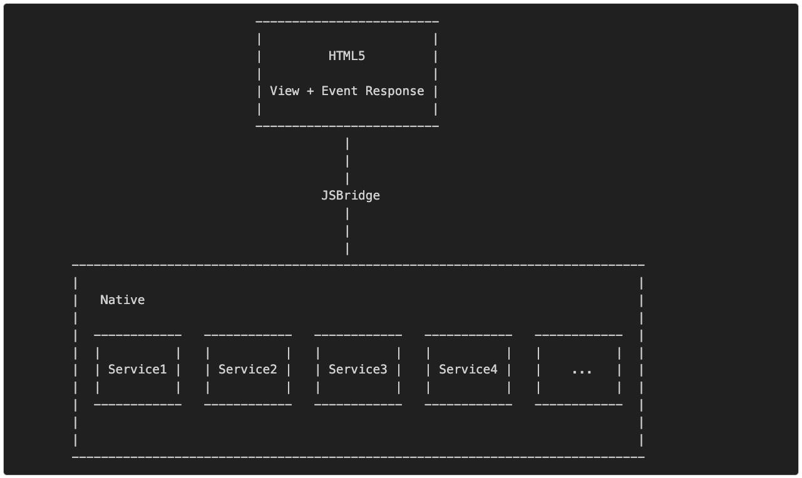
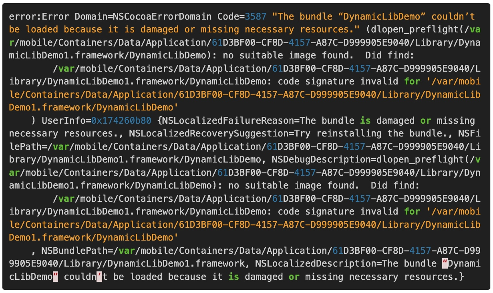

# iOS动态部署方案
## 前言
动态部署方案，就是指通过不发版的方式，将新的内容、新的业务流程部署进已发布的App。因为苹果的审核周期比较长，而且苹果的限制比较多，业界在这里也没有特别多的手段来达到动态部署方案的目的。
其实单纯就动态部署方案来讲，没什么太多花头可以说的，就是H5、Lua、JS、OC/Swift这几门基本技术的各种组合排列。写到后面觉得，动态部署方案其实是非常好的用于讲解某些架构模式的背景。一般我们经验总结下来的架构模式包括但不限于：
* Layered Architecture
* Event-Driven Architecture
* Microkernel Architecture
* Microservices Architecture
* Space-Based Architecture

比较容易混淆的就是容易把MVC这些方案跟Layered Architecture混淆，这个我在开篇这篇文章里面也做过了区分：**MVC等方案比较侧重于数据流动方向的控制和数据流的管理。Layered Architecture更加侧重于各分层之间的功能划分和模块协作**。
## Web App
### 实现方案
其实所谓的web app，就是通过手机上的浏览器进行访问的H5页面。这个H5页面是针对移动场景特别优化的，比如UI交互等。
### 优点
* 无需走苹果流程，所有苹果流程带来的成本都能避免，包括审核周期、证书成本等。
* 版本更新跟网页一样，随时生效。
* 不需要Native App工程师的参与，而且市面上已经有很多针对这种场景的框架。
### 缺点
* 由于每一页都需要从服务器下载，因此web app重度依赖网络环境。
* 同样的UI效果使用web app来实现的话，流畅度不如Native，比较影响用户体验。
* 本地持久化的部分很难做好，绕过本地持久化的部分的办法就是提供账户体系，对应账户的持久化数据全部存在服务端。
* 即时响应方案、远程通知实现方案、移动端传感器的使用方案复杂，维护难度大。
* 安全问题，H5页面等于是所有东西都暴露给了用户，如果对安全要求比较高的，很多额外的安全机制都需要在服务端实现。
### 总结
web app一般是创业初期会重点考虑的方案，因为迭代非常快，而且创业初期的主要目标是需要验证模式的正确性，并不在于提供非常好的用户体验，只需要完成闭环即可。早年facebook曾经尝试过这种方案，最后因为用户体验的问题而宣布放弃。所以这个方案只能作为过渡方案，或者当App不可用时，作为降级方案使用。
## Hybrid App
通过市面上各种Hybrid框架，来做H5和Native的混合应用，或者通过JS Bridge来做到H5和Native之间的数据互通。
### 优点
* 除了要承担苹果流程导致的成本以外，具备所有web app的优势
* 能够访问本地数据、设备传感器等
### 缺点
* 跟web app一样存在过度依赖网络环境的问题
* 用户体验也很难做到很好
* 安全性问题依旧存在
* 大规模的数据交互很难实现，例如图片在本地处理后，将图片传递给H5
### 总结
Hybrid方案更加适合跟本地资源交互不是很多，然后主要以内容展示为主的App。在天猫App中，大量地采用了JS Bridge的方式来让H5跟Native做交互，因为天猫App是一个以内容展示为主的App，且营销活动多，周期短，比较适合Hybrid。
## React-Native
严格来说，React-Native应当放到Hybrid那一节去讲，单独拎出来的原因是Facebook自从放出React-Native之后，业界讨论得非常激烈。天猫的鬼道也做了非常多的关于React-Native的分享。
React-Native这个框架比较特殊，它展示View的方式依然是Native的View，然后也是可以通过URL的方式来动态生成View。而且，React-Native也提供了一个Bridge通道来做Javascript和Objective-C之间的交流，还是很贴心的。
然而研究了一下发现**有一个比较坑的地方在于，解析JS要生成View时所需要的View，是要本地能够提供的**。举个例子，比如你要有一个特定的Mapview，并且要响应对应的delegate方法，在React-Native的环境下，你需要先在Native提供这个Mapview，并且自己实现这些delegate方法，在实现完方法之后通过Bridge把数据回传给JS端，然后重新渲染。
在这种情况下我们就能发现，其实React-Native在使用View的时候，这些View是要经过本地定制的，并且将相关方法通过RCT_EXPORT_METHOD暴露给js，js端才能正常使用。在我看来，这里在一定程度上限制了动态部署时的灵活性，比如我们需要在某个点击事件中展示一个动画或者一个全新的view，由于本地没有实现这个事件或没有这个view，React-Native就显得捉襟见肘。
### 优点
* 响应速度很快，只比Native慢一点，比webview快很多。
* 能够做到一定程度上的动态部署
### 缺点
* 组装页面的元素需要Native提供支持，一定程度上限制了动态部署的灵活性。
### 总结
由于React-Native框架中，因为View的展示和View的事件响应分属于不同的端，展示部分的描述在JS端，响应事件的监听和描述都在Native端，通过Native转发给JS端。所以，从做动态部署的角度上讲，React-Native只能动态部署新View，不能动态部署新View对应的事件。当然，React-Native本身提供了很多基础组件，然而这个问题仍然还是会限制动态部署的灵活性。因为我们在动态部署的时候，大部分情况下是希望View和事件响应一起改变的。
另外一个问题就在于，View的原型需要从Native中取，这个问题相较于上面一个问题倒是显得不那么严重，只是以后某个页面需要添加某个复杂的view的时候，需要从现有的组件中拼装罢了。
所以，**React-Native事实上解决的是如何不使用Objc/Swift来写iOS App的View的问题，对于如何通过不发版来给已发版的App更新功能这样的问题，帮助有限**。
## Lua Patch
大众点评的屠毅敏同学在基于wax的基础上写了waxPatch，这个工具的主要原理是通过lua来针对objc的方法进行替换，由于lua本身是解释型语言，可以通过动态下载得到，因此具备了一定的动态部署能力。然而iOS系统原生并不提供lua的解释库，所以需要在打包时把lua的解释库编译进app。
### 优点
* 能够通过下载脚本替换方法的方式，修改本地App的行为。
* 执行效率较高
### 缺点
* 对于替换功能来说，lua是很不错的选择。但如果要添加新内容，实际操作会很复杂
* 很容易改错，小问题变成大问题
### 总结
lua的解决方案在一定程度上解决了动态部署的问题。实际操作时，一般不使用它来做新功能的动态部署，主要还是用于修复bug时代码的动态部署。实际操作时需要注意的另外一点是，真的很容易改错，尤其是你那个方法特别长的时候，所以改了之后要彻底回归测试一次。
## Javascript Patch
这个工作原理其实跟上面说的lua那套方案的工作原理一样，只不过是用javascript实现。而且最近新出了一个**JSPatch**这个库，相当好用。
### 优点
* 同Lua方案的优点
* 打包时不用将解释器也编译进去，iOS自带JavaScript的解释器，只不过要从iOS7.0以后才支持。
### 缺点
* 同Lua方案的缺点
### 总结
在对app打补丁的方案中，目前我更倾向于使用JSPatch的方案，在能够完成Lua做到的所有事情的同时，还不用编一个JS解释器进去，而且会javascript的人比会lua的人多，技术储备比较好做。
## JSON Descripted View
其实这个方案的原理是这样的：使用JSON来描述一个View应该有哪些元素，以及元素的位置，以及相关的属性，比如背景色，圆角等等。然后本地有一个解释器来把JSON描述的View生成出来。
这跟React-Native有点儿像，一个是JS转Native，一个是JSON转Native。但是同样有的问题就是事件处理的问题，在事件处理上，React-Native做得相对更好。因为JSON不能够描述事件逻辑，所以JSON生成的View所需要的事件处理都必须要本地事先挂好。
### 优点
* 能够自由生成View并动态部署
### 缺点
* 天猫实际使用下来，发现还是存在一定的性能问题，不够快
* 事件需要本地事先写好，无法动态部署事件
### 总结
其实JSON描述的View比React-Native的View有个好处就在于对于这个View而言，不需要本地也有一套对应的View，它可以依据JSON的描述来自己生成。然而对于事件的处理是它的硬伤，所以JSON描述View的方案，一般比较适用于换肤，或者固定事件不同样式的View，比如贴纸。
## 架构模式
其实我们要做到动态部署，至少要满足以下需求：
* View和事件都要能够动态部署
* 功能完整
* 便于维护

我更加倾向于**H5和Native以JSBridge的方式连接的方案进行动态部署**，在cocoapods里面也有蛮多的JSBridge了。看了一圈之后，我还是选择写了一个CTJSBridge，来满足动态部署和后续维护的需求。接下来的内容，会主要讨论以下这些问题：
### 为什么不是React-Native或其它方案？
首先针对React-Native来做解释，前面已经分析到，**React-Native有一个比较大的局限在于View需要本地提供**。假设有一个页面的组件是跑马灯，如果本地没有对应的View，使用React-Native就显得很麻烦。然而同样的情况下，HTML5能够很好地实现这样的需求。这里存在一个这样的取舍在性能和动态部署View及事件之间，选择哪一个？
我更加倾向于**能够动态部署View和事件**，至少后者是能够完成需求的，性能再好，难以完成需求其实没什么意义。然而对于HTML5的Hybrid和纯HTML5的web app之间，也存在一个相同的取舍，但是还要额外考虑一个新的问题，纯HTML5能够使用到的设备提供的功能相对有限，**JSBridge能够将部分设备的功能以Native API的方式交付给页面**，因此在考虑这个问题之后，选择HTML5的Hybrid方案就显得理所应当了。
在诸多Hybrid方案中，除了JSBridge之外，其它的方案都显得相对过于沉重，对于动态部署来说，其实需要补充的软肋就是提供本地设备的功能，其它的反而显得较为累赘。
### 基于JSBridge的微服务架构模式

解释一下这种架构背后的思想：
因为H5和Native之间能够通过JSBridge进行交互，然而JSBridge的一个特征是，只能H5主动发起调用。所以理所应当地，被调用者为调用者提供服务。
另外一个想要处理的问题是，希望能够通过微服务架构，来把H5和Native各自的问题域区分开。**所谓区分问题域就是让H5要解决的问题和Native要解决的问题之间，交集最小**。因此，我们设计时希望H5的问题域能够更加偏重业务，然后Native为H5的业务提供基础功能支持，例如API的跨域调用，传感器设备信息以及本地已经沉淀的业务模块都可以作为Native提供的服务交给H5去使用。**H5的快速部署特性特别适合做重业务的事情，Native对iPhone的功能调用能力和控制能力特别适合将其封装成服务交给H5调用**。
所以这对Native提供的服务有两点要求：
* Native提供的服务不应当是强业务相关的，最好是跟业务无关，这样才能方便H5进行业务的组装
* 如果Native一定要提供强业务相关的服务，那最好是一个完整业务，这样H5就能比较方便地调用业务模块。

只要Native提供的服务符合上述两个条件，HTML5在实现业务的时候，束缚就会非常少，也非常容易管理。
然后这种方案也会有一定的局限性，就是如果Native没有提供这样的服务，那还是必须得靠发版来解决。等于就是Native向HTML5提供API，这其实跟服务端向Native提供API的道理一样。
但基于Native提供的服务的通用性这点来看，添加服务的需求不会特别频繁，每一个App都有属于自己的业务领域，在同一个业务领域下，其实需要Native提供的服务是有限的。然后结合**JSPatch提供的动态patch的能力**，这样的架构能够满足绝大部分动态部署的需求。
然后随着App的不断迭代，某些HTML5的实现其实是可以逐步沉淀为Native实现的，这在一定程度上，降低了App早期的试错成本。
### 基于动态库的微内核模式
https://github.com/glt3953/CTDynamicLibKit
我开发了CTDynamicLibKit这个库来解决动态库的调用问题，其实原先的打算是拿动态库做动态部署的，不过我用@念纪 的个人App把这个功能塞进去之后，发现苹果还是能审核通过的，但是下载下来的动态库是无法加载的。报错如下：

主要原因是因为签名无法通过。**因为Distribution的App只能加载相同证书打包的framework。在in house和develop模式下，可以使用相同证书既打包App又打包framework，所以测试的时候没有问题。但是在正式的distribution下，这种做法是行不通的**。
所以就目前看来，基于动态库的动态部署方案是没办法做到的。
## 总结
我在文中针对业界常见的动态部署方案做了一些总结，并且提供了我自己认为的最佳解决方案以及对应的JSBridge实现（**H5和Native以JSBridge的方式连接的方案进行动态部署**）。
https://github.com/glt3953/CTJSBridge