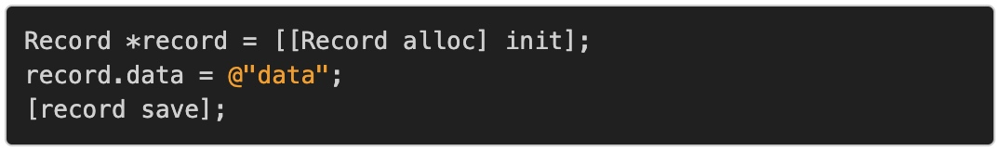
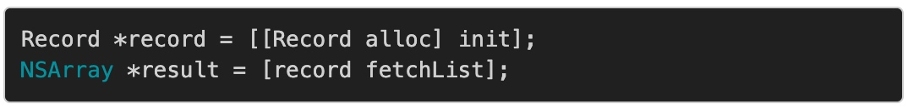
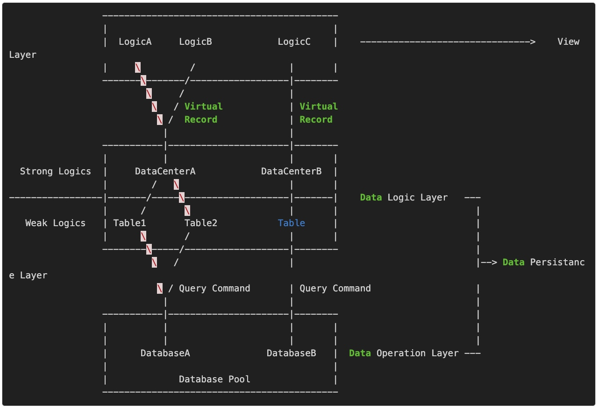
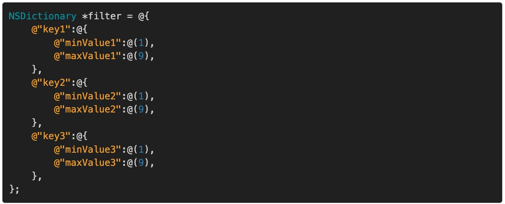
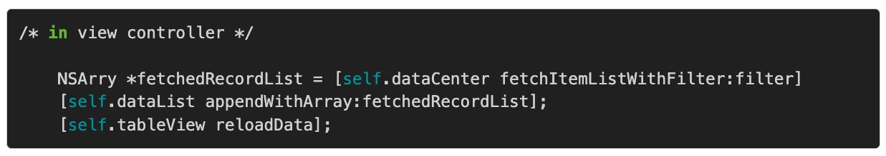
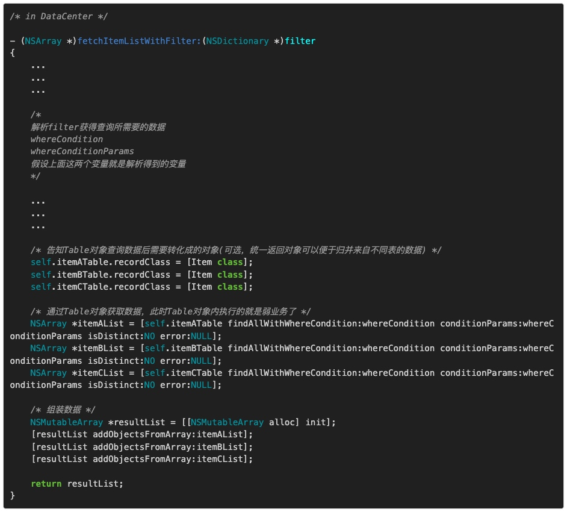

# 本地持久化方案
https://casatwy.com/iosying-yong-jia-gou-tan-ben-di-chi-jiu-hua-fang-an-ji-dong-tai-bu-shu.html
## 前言
https://github.com/casatwy/CTPersistance
https://github.com/casatwy/CTJSBridge
我在移动端这边做持久化方案设计的时候，考虑更多的是方案的可维护和可拓展，然后在此基础上才是性能调优。
持久化方案对整个App架构的影响和网络层方案对整个架构的影响类似，一般都是导致整个项目耦合度高的罪魁祸首。而我也是一如既往的**去Model化**的实践者，在持久层去Model化的过程中，我引入了**Virtual Record**的设计。
## 根据需求决定持久化方案
在有需要持久化需求的时候，我们有非常多的方案可供选择：**NSUserDefault、KeyChain、File，以及基于数据库的无数子方案**。因此，当有需要持久化的需求的时候，我们首先考虑的是应该采用什么手段去进行持久化。
### NSUserDefault
一般来说，小规模数据，弱业务相关数据，都可以放到NSUserDefault里面，内容比较多的数据，强业务相关的数据就不太适合NSUserDefault了。
### Keychain
Keychain是苹果提供的带有可逆加密的存储机制，普遍用在各种存密码的需求上。另外，由于App卸载只要系统不重装，Keychain中的数据依旧能够得到保留，以及可被iCloud同步的特性，大家都会在这里存储用户唯一标识串。所以有需要加密、需要存iCloud的敏感小数据，一般都会放在Keychain。
### 文件存储
文件存储包括了**Plist、archive、Stream**等方式，一般结构化的数据或者需要方便查询的数据，都会以Plist的方式去持久化。Archive方式适合存储平时不太经常使用但很大量的数据，或者读取之后希望直接对象化的数据，因为Archive会将对象及其对象关系序列化，以至于读取数据的时候需要Decode很花时间，Decode的过程可以是解压，也可以是对象化，这个可以根据具体NSCoding中的实现来决定。Stream就是一般的文件存储了，一般用来存存图片啊啥的，适用于比较经常使用，然而数据量又不算非常大的那种。
### 数据库存储
数据库存储的话，花样就比较多了。苹果自带了一个Core Data，当然业界也有无数替代方案可选，不过真正用在iOS领域的除了Core Data外，就是FMDB比较多了。数据库方案主要是为了便于增删改查，当数据有状态和类别的时候最好还是采用数据库方案比较好，而且尤其是当这些状态和类别都是强业务相关的时候，就更加要采用数据库方案了。因为你不可能通过文件系统遍历文件去甄别你需要获取的属于某个状态或类别的数据，这么做成本就太大了。当然，特别大量的数据也不适合直接存储数据库，比如图片或者文章这样的数据，一般来说，都是数据库存一个文件名，然后这个文件名指向的是某个图片或者文章的文件。如果真的要做全文索引这种需求，建议最好还是挂个API丢到服务端去做。
**WCDB（WeChat DataBase）** 是微信官方的移动端数据库组件，致力于提供一个高效、易用、完整的移动端存储方案。https://github.com/Tencent/wcdb 它包含三个模块：
* WCDB-iOS/Mac
* WCDB-Android
* 数据库损坏修复工具WCDBRepair

微信移动端数据库组件WCDB系列
https://mp.weixin.qq.com/s?__biz=MzAwNDY1ODY2OQ==&mid=2649286538&idx=1&sn=d11de2d87539a64e991e916013b0f729&chksm=8334c308b4434a1e5670fb68dc087cf34fe91e79bbfc64dbbf092424fd0cd3b28023c67b29ca&scene=21#wechat_redirect
## 持久层实现时要注意的隔离
在设计持久层架构的时候，我们要关注以下几个方面的隔离：
### 持久层与业务层的隔离
* Data Model
Data Model这个术语针对的问题领域是业务数据的建模，以及代码中这一数据模型的表征方式。两者相辅相承：因为业务数据的建模方案以及业务本身特点，而最终决定了数据的表征方式。同样操作一批数据，你的数据建模方案基本都是细化业务问题之后，抽象得出一个逻辑上的实体。在实现这个业务时，你可以选择不同的表征方式来表征这个逻辑上的实体，比如**字节流(TCP包等)，字符串流(JSON、XML等)，对象流**。对象流又分**通用数据对象(NSDictionary等)，业务数据对象(HomeCellModel等)**。
前面已经遍历了所有的Data Model的形式。在习惯上，当我们讨论Model化时，都是单指对象流中的业务数据对象这一种。然而去Model化就是指：**更多地使用通用数据对象去表征数据，业务数据对象不会在设计时被优先考虑的一种设计倾向。这里的通用数据对象可以在某种程度上理解为范型。**
* Model Layer
Model Layer描述的问题领域是如何对数据进行**增删改查(CURD, Create Update Read Delete)**，和相关业务处理。一般来说如果在Model Layer中采用瘦Model的设计思路的话，就差不多到CURD为止了。胖Model还会关心如何为需要数据的上层提供除了增删改查以外的服务，并为他们提供相应的解决方案。例如**缓存、数据同步、弱业务处理**等。

我更加倾向于去Model化的设计，**在网络层，我设计了reformer来实现去Model化。在持久层，我设计了Virtual Record来实现去Model化。**
因为具体的Model是一种很容易引入耦合的做法，在尽可能弱化Model概念的同时，就能够为引入业务和对接业务提供充分的空间。同时，也能**通过去Model的设计达到区分强弱业务的目的**，这在将来的代码迁移和维护中，是至关重要的。很多设计不好的架构，就在于架构师并没有认识到区分强弱业务的重要性，所以就导致架构腐化的速度很快，越来越难维护。
所以说回来，持久层与业务层之间的隔离，是通过强弱业务的隔离达到的。而Virtual Record正是因为这种去Model化的设计，从而达到了强弱业务的隔离，进而做到持久层与业务层之间既隔离同时又能交互的平衡。
### 数据库读写隔离
在网站的架构中，对数据库进行读写分离主要是为了提高响应速度。在iOS应用架构中，对持久层进行读写隔离的设计主要是为了提高代码的可维护性。
在这里我们**所谓的读写隔离并不是指将数据的读操作和写操作做隔离。而是以某一条界限为准，在这个界限以外的所有数据模型，都是不可写不可修改，或者修改属性的行为不影响数据库中的数据，在这个界限以内的数据是可写可修改的**。一般来说我们在设计时划分的这个界限会和持久层与业务层之间的界限保持一致，也就是业务层从持久层拿到数据之后，都不可写不可修改，或业务层针对这一数据模型的写操作、修改操作都对数据库文件中的内容不产生作用。只有持久层中的操作才能够对数据库文件中的内容产生作用。
在苹果官方提供的持久层方案Core Data的架构设计中，并没有针对读写作出隔离，数据的结果都是以NSManagedObject扔出。所以只要业务工程师稍微一不小心动一下某个属性，NSManagedObjectContext在save的时候就会把这个修改给存进去了。另外，当我们需要对所有的增删改查操作做AOP的切片时，Core Data技术栈的实现就会非常复杂。整体上看，我觉得Core Data相对大部分需求而言是过度设计了。
读写隔离还能够便于加入AOP切点，因为针对数据库的写操作被隔离到一个固定的地方，加AOP时就很容易在正确的地方放入切片。
### 多线程控制导致的隔离
* Core Data
Core Data要求在多线程场景下，为异步操作再生成一个NSManagedObjectContext，然后设置它的ConcurrencyType为NSPrivateQueueConcurrencyType，最后把这个Context的parentContext设为Main线程下的Context。这相比于使用原始的SQLite去做多线程要轻松许多。只不过要注意的是，如果要传递NSManagedObject的时候，不能直接传这个对象的指针，要传NSManagedObjectID。这属于多线程环境下对象传递的隔离，在进行架构设计的时候需要注意。
* SQLite
纯SQLite其实对于多线程倒是直接支持，SQLite库提供了三种方式：**Single Thread，Multi Thread，Serialized**。
Single Thread模式不是线程安全的，不提供任何同步机制。Multi Thread模式要求database connection不能在多线程中共享，其他的在使用上就没什么特殊限制了。Serialized模式顾名思义就是由一个串行队列来执行所有的操作，对于使用者来说除了响应速度会慢一些，基本上就没什么限制了。大多数情况下SQLite的默认模式是Serialized。
根据Core Data在多线程场景下的表现，我觉得Core Data在使用SQLite作为数据载体时，使用的应该就是Multi Thread模式。**SQLite在Multi Thread模式下使用的是读写锁，而且是针对整个数据库加锁，不是表锁也不是行锁**，这一点需要提醒各位架构师注意。如果对响应速度要求很高的话，建议开一个辅助数据库，把一个大的写入任务先写入辅助数据库，然后拆成几个小的写入任务见缝插针地隔一段时间往主数据库中写入一次，写完之后再把辅助数据库删掉。
不过从实际经验上看，本地App的持久化需求的读写操作一般都不会大，只要注意好几个点之后一般都不会影响用户体验。因此相比于Multi Thread模式，Serialized模式我认为是性价比比较高的一种选择，代码容易写容易维护，性能损失不大。
### 数据表达和数据操作的隔离
数据表达和数据操作的隔离是否能够做好，直接影响的是整个程序的可拓展性。
长久以来，我们都很习惯Active Record类型的数据操作和表达方式，例如这样：

或者这种：

简单说就是，让一个对象映射了一个数据库里的表，然后**针对这个对象做操作就等同于针对这个表以及这个对象所表达的数据做操作**。**这里有一个不好的地方就在于，这个Record既是数据库中数据表的映射，又是这个表中某一条数据的映射**。我见过很多框架(不仅限于iOS，包括Python, PHP等)都把这两者混在一起去处理。如果按照这种不恰当的方式来组织数据操作和数据表达，在胖Model的实践下会导致强弱业务难以区分从而造成非常大的困难。
强弱业务不能区分带来的最大困难在于代码复用和迁移，因为持久层中的强业务对View层业务的高耦合是无法避免的，然而**弱业务相对而言只对下层有耦合关系对上层并不存在耦合关系**，当我们做代码迁移或者复用时，往往希望复用的是弱业务而不是强业务，若此时强弱业务分不开，代码复用就无从谈起，迁移时就倍加困难。
另外，数据操作和数据表达混在一起会导致的问题在于：**客观情况下，数据在view层业务上的表达方式多种多样，有可能是个View，也有可能是个别的什么对象**。如果采用映射数据库表的数据对象去映射数据，那么这种多样性就会被限制，实际编码时每到使用数据的地方，就不得不多一层转换。
我认为之所以会产生这样不好的做法原因在于，对象对数据表的映射和对象对数据表达的映射结果非常相似，尤其是在表达Column时，他们几乎就是一模一样。在这里要**做好针对数据表或是针对数据的映射要做的区分的关键要点是：这个映射对象的操作着手点相对数据表而言，是对内还是对外操作**。如果是对内操作，那么这个操作范围就仅限于当前数据表，这些操作映射给数据表模型就比较合适。如果是对外操作，执行这些操作时有可能涉及其他的数据表，那么这些操作就不应该映射到数据表对象中。
因此实际操作中，我是**以数据表为单位去针对操作进行对象封装，然后再针对数据记录进行对象封装**。数据表中的操作都是针对记录的普通增删改查操作，都是弱业务逻辑。数据记录仅仅是数据的表达方式，这些操作最好交付给数据层分管强业务的对象去执行。
## 持久层与业务层的交互方式

持久层有专门负责对接View层模块或业务的**DataCenter**，它们之间通过**Record**来进行交互。DataCenter向上层提供业务友好的接口，这一般都是强业务：比如根据用户筛选条件返回符合要求的数据等。
然后DataCenter在这个接口里面调度各个**Table**，做一系列的业务逻辑，最终生成record对象，交付给View层业务。
DataCenter为了要完成View层交付的任务，会涉及**数据组装和跨表的数据操作**。数据组装因为View层要求的不同而不同，因此是强业务。跨表数据操作本质上就是各单表数据操作的组合，DataCenter负责调度这些单表数据操作从而获得想要的基础数据用于组装。那么，这时候单表的数据操作就属于弱业务，这些弱业务就由Table映射对象来完成。
Table对象通过**QueryCommand**来生成相应的SQL语句，并交付给数据库引擎去查询获得数据，然后交付给DataCenter。
### DataCenter 和 Virtual Record
DataCenter其实是一个业务对象，DataCenter是整个App中，持久层与业务层之间的胶水。它向业务层开放业务友好的接口，然后通过调度各个持久层弱业务逻辑和数据记录来完成强业务逻辑，并将生成的结果交付给业务层。由于DataCenter处在业务层和持久层之间，那么它执行业务逻辑所需要的载体，就要既能够被业务层理解，也能够被持久层理解。
**CTPersistanceTable**就封装了弱业务逻辑，由DataCenter调用，用于操作数据。而**Virtual Record**就是前面提到的一个既能够被业务层理解，也能够被持久层理解的数据载体。
Virtual Record事实上并不是一个对象，它只是一个protocol，这就是它Virtual的原因。一个对象只要实现了Virtual Record，它就可以直接被持久层当作Record进行操作，所以它也是一个Record。连起来就是Virtual Record了。所以，Virtual Record的实现者可以是任何对象，这个对象一般都是业务层对象。在业务层内，常见的数据表达方式一般都是View，所以一般来说Virutal Record的实现者也都会是一个View对象。
我们回顾一下传统的数据操作过程：**一般都是先从数据库中取出数据，然后Model化成一个对象，然后再把这个模型丢到外面，让Controller转化成View，然后再执行后面的操作**。
Virtual Record也是一样遵循类似的步骤。唯一不同的是，整个过程中，它并不需要一个中间对象去做数据表达，对于数据的不同表达方式，由各自Virtual Record的实现者自己完成，而不需要把这些代码放到Controller，所以这就是一个去Model化的设计。如果未来针对这个数据转化逻辑有复用的需求，直接复用Virtual Record就可以了，十分方便。
用好Virtual Record的关键在于DataCenter提供的接口对业务足够友好，有充足的业务上下文环境。
所以DataCenter一般都是被Controller所持有，所以如果整个App就只有一个DataCenter，这其实并不是一个好事。我见过有很多App的持久层就是一个全局单例，所有持久化业务都走这个单例，这是一种很蛋疼的做法。DataCenter也是需要针对业务做高度分化的，每个大业务都要提供一个DataCenter，然后挂在相关Controller下交给Controller去调度。比如分化成SettingsDataCenter，ChatRoomDataCenter，ProfileDataCenter等，另外要要注意的是，几个DataCenter之间最好不要有业务重叠。如果一个DataCenter的业务实在是大，那就再拆分成几个小业务。如果单个小业务都很大了，那就拆成各个Category，具体的做法可以参考我的框架中CTPersistanceTable和CTPersistanceQueryCommand的实践。
这么一来，如果要迁移涉及持久层的强业务，那就只需要迁移DataCenter即可。如果要迁移弱业务，就只需要迁移CTPersistanceTable。
### 实际场景
假设业务层此时收集到了用户的筛选条件：

然后ViewController调用DataCenter向业务层提供的接口，获得数据直接展示：

在View层要做的事情其实到这里就已经结束了，此时我们回过头再来看DataCenter如何实现这个业务：

一般来说，架构师设计得差的持久层，都没有**通过设计DataCenter和Table，去将强业务和弱业务分开**。通过设计DataCenter和Table对象，主要是便于代码迁移。如果迁移强业务，把DataCenter和Table一起拿走就可以，如果只是迁移弱业务，拿走Table就可以了。
另外，通过代码我希望向你强调一下这个概念：**将Table和Record区分开**，这个在我之前画的架构图上已经有所表现，不过上文并没有着重强调。其实很多别的架构师在设计持久层框架的时候，也没有将Table和Record区分开，对的，这里我说的框架包括Core Data和FMDB，这个也不仅限于iOS领域，CodeIgniter、ThinkPHP、Yii、Flask这些也都没有对这个做区分。
* 多对一场景下，业务层如何与持久层交互？
多对一场景其实有两种理解，一种是一个记录的数据由多个View的数据组成。例如一张用户表包含用户的所有资料。然后有的View只包含用户昵称用户头像，有的对象只包含用户ID用户Token。然而这些数据都只存在一张用户表中，所以这是一种多个对象的数据组成一个完整Record数据的场景，这是多对一场景的理解之一。
第二种理解是这样的，例如一个ViewA对象包含了一个Record的所有信息，然后另一个ViewB对象其实也包含了一个Record的所有信息，这就是一种多个不同对象表达了一个Record数据的场景，这也是一种多对一场景的理解。
同时，这里所谓的交互还分两个方向：存和取。
其实这两种理解的解决方案都是一样的，Virtual Record的实现者通过实现Merge操作来完成record数据的汇总，从而实现存操作。任意Virtual Record的实现者通过Merge操作，就可以将自己的数据交付给其它不同的对象进行表达，从而实现取操作。具体的实现在下面有具体阐释。
    * 多对一场景下，如何进行存操作？
    * 多对一场景下，如何进行存操作？
* 一对多场景下，业务层如何与持久层交互？
    * 一个对象包含了多个表的数据时，如何进行存取操作？
    * 一个对象用于展示多种表的数据，如何进行存取操作？
### 交互方案的总结
在交互方案的设计中，**架构师应当区分好强弱业务，把传统的Data Model区分成Table和Record，并由DataCenter去实现强业务，Table去实现弱业务**。在这里由于DataCenter是强业务相关，所以在实际编码中，业务工程师负责创建DataCenter，并向业务层提供业务友好的方法，然后再在DataCenter中操作Table来完成业务层交付的需求。区分强弱业务，将Table和Record拆分开的好处在于：
* 通过业务细分降低耦合度，使得代码迁移和维护非常方便
* 通过拆解数据处理逻辑和数据表达形态，使得代码具有非常良好的可拓展性
* 做到读写隔离，避免业务层的误操作引入Bug
* 为Virtual Record这一设计思路的实践提供基础，进而实现更灵活，对业务更加友好的架构

在具体与业务层交互时，**采用Virtual Record的设计思路来设计Record，由具体的业务对象来实现Virtual Record，并以它作为DataCenter和业务层之间的数据媒介进行交互**。而不是使用传统的数据模型来与业务层做交互。
使用Virtual Record的好处在于：
* 将数据适配和数据转化逻辑封装到具体的Record实现中，可以使得代码更加抽象简洁，代码污染更少
* 数据迁移时只需要迁移Virtual Record相关方法即可，非常容易拆分
* 业务工程师实现业务逻辑时，可以在不损失可维护性的前提下，极大提高业务实现的灵活性
## 数据迁移方案
一般来说，具有持久层的App同时都会附带着有版本迁移的需求。当一个用户安装了旧版本的App，此时更新App之后，若数据库的表结构需要更新，或者数据本身需要批量地进行更新，此时就需要有版本迁移机制来进行这些操作。然而版本迁移机制又要兼顾跨版本的迁移需求，所以基本上大方案也就只有一种：**建立数据库版本节点，迁移的时候一个一个跑过去**。
数据迁移事实上实现起来还是比较简单的，做好以下几点问题就不大了：
* 根据应用的版本记录每一版数据库的改变，并将这些改变封装成对象
* 记录好当前数据库的版本，便于跟迁移记录做比对
* 在启动数据库时执行迁移操作，如果迁移失败，提供一些降级方案

在版本迁移时要注意的一点是性能问题。我们一般都不会在主线程做版本迁移的事情，这自然不必说。需要强调的是，SQLite本身是一个容错性非常强的数据库引擎，因此差不多在执行每一个SQL的时候，内部都是走的一个Transaction。当某一版的SQL数量特别多的时候，建议在版本迁移的方法里面自己建立一个Transaction，然后把相关的SQL都包起来，这样SQLite执行这些SQL的时候速度就会快一点。
## 数据同步方案
数据同步方案大致分两种类型，一种类型是单向数据同步，另一种类型是双向数据同步。
### 单向数据同步
单向数据同步就是只把本地较新数据的操作同步到服务器，不会从服务器主动拉取同步操作。
比如即时通讯应用，一个设备在发出消息之后，需要等待服务器的返回去知道这个消息是否发送成功，是否取消成功，是否删除成功。然后数据库中记录的数据就会随着这些操作是否成功而改变状态。但是如果换一台设备继续执行操作，在这个新设备上只会拉取旧的数据，比如聊天记录这种。但对于旧的数据并没有删除或修改的需求，因此新设备也不会问服务器索取数据同步的操作，所以称之为单向数据同步。
#### 如何完成单向数据同步的需求
* 添加identifier
添加identifier的目的主要是为了解决客户端数据的主键和服务端数据的主键不一致的问题。由于是单向数据同步，所以数据的生产者只会是当前设备，那么identifier也理所应当由设备生成。当设备发起同步请求的时候，把identifier带上，当服务器完成任务返回数据时，也把这些identifier带上。然后客户端再根据服务端给到的identifier再更新本地数据的状态。identifier一般都会采用UUID字符串。
* 添加isDirty
isDirty主要是针对数据的插入和修改进行标识。当本地新生成数据或者更新数据之后，收到服务器的确认返回之前，isDirty置为YES。当服务器的确认包返回之后，再根据包里提供的identifier找到这条数据，然后置为NO。这样就完成了数据的同步。
* 添加isDeleted
当有数据同步的需求的时候，删除操作就不能是简单的物理删除了，而只是逻辑删除，所谓逻辑删除就是在数据库里把这条记录的isDeleted记为YES，只有当服务器的确认包返回之后，才会真正把这条记录删除。
* 在请求的数据包中，添加dependencyIdentifier
在我看到的很多其它数据同步方案中，并没有提供dependencyIdentifier，这会导致一个这样的问题：假设有两次数据同步请求一起发出，A先发，B后发。结果反而是B请求先到，A请求后到。如果A请求的一系列同步操作里面包含了插入某个对象的操作，B请求的一系列同步操作里面正好又删除了这个对象，那么由于到达次序的先后问题错乱，就导致这个数据没办法删除。
这个在移动设备的使用场景下是很容易发生的，移动设备本身网络环境就多变，先发的包反而后到，这种情况出现的几率还是比较大的。所以在请求的数据包中，我们要带上上一次请求时一系列identifier的其中一个，就可以了。一般都是选择上次请求里面最后的那一个操作的identifier，这样就能表征上一次请求的操作了。
#### 总结
* 改造的时候添加identifier，isDirty，isDeleted字段。如果在请求期间依旧允许对数据做操作，那么就要把identifier和primaryKey再放到一个新的表中
* 每次生成数据之后对应生成一个identifier，然后只要是针对数据的操作，就修改一次isDirty或isDeleted，然后发起请求带上identifier和操作指令去告知服务器执行相关的操作。如果是复杂的同步方式，那么每一次修改数据时就新生成一次identifier，然后再发起请求带上相关数据告知服务器。
* 服务器根据请求包的identifier等数据执行操作，操作完毕回复给客户端确认
* 收到服务器的确认包之后，根据服务器给到的identifier（有的时候也会有tablename，取决于你的具体实现）找到对应的记录，如果是删除操作，直接把数据删除就好。如果是插入和更新操作，就把isDirty置为NO。如果有额外的表记录了更新操作，直接把identifier对应的这个操作记录删掉就行。
#### 要注意的点
在使用表去记录更新操作的时候，短时间之内很有可能针对同一条数据进行多次更新操作。因此在同步之前，最好能够合并这些相同数据的更新操作，可以节约服务器的计算资源。
### 双向数据同步
双向数据同步多见于笔记类、日程类应用。对于一台设备来说，不光自己会往上推数据同步的信息，自己也会问服务器主动索取数据同步的信息，所以称之为双向数据同步。
#### 如何完成双向数据同步的需求
* 封装操作对象
在双向数据同步时，你也得解析数据操作，所以互相之间要约定一个协议，通过封装这个协议，就做到了针对操作对象的封装。这个协议应当包括：
    * 操作的唯一标识
    * 数据的唯一标识
    * 操作的类型：Delete，Update，Insert
    * 具体的数据，主要是在Insert和Update的时候会用到：单条数据和批量数据的区分
    * 操作的依赖标识：防止先发的包后到后发的包先到
    * 用户执行这项操作时的时间戳：解决操作冲突或提交界面告知用户
* 新增待操作数据表和待同步数据表
从服务器拉下来的同步操作列表，我们存在待执行数据表中，操作完毕之后如果有告知服务器的需求，那就等于是走单向同步方案告知服务器。在执行过程中，这些操作也要跟待同步数据表进行匹配，看有没有冲突，没有冲突就继续执行，有冲突的话要么按照时间戳执行，要么就告知用户让用户做决定。在拉取待执行操作列表的时候，也要把最后一次操作的identifier丢给服务器，这样服务器才能返回相应数据。
待同步数据表的作用其实也跟单向同步方案时候的作用类似，就是防止在发送请求的时候用户有操作，同时也是为解决冲突提供方便。在发起同步请求之前，我们都应该先去查询有没有待执行的列表，当待执行的操作列表同步完成之后，就可以删除里面的记录了，然后再把本地待同步的数据交给服务器。同步完成之后就可以把这些数据删掉了。因此在正常情况下，只有在待操作和待执行的操作间会存在冲突。
* 何时从服务器拉取待执行列表
    * 每次要把本地数据丢到服务器去同步之前，都要拉取一次待执行列表，执行完毕之后再上传本地同步数据
    * 每次进入相关页面的时候都更新一次，看有没有新的操作
    * 对实时性要求比较高的，要么客户端本地起一个线程做轮询，要么服务器通过长链接将待执行操作推送过来
#### 总结
* 设计好同步协议，用于和服务端进行交互，以及指导本地去执行同步下来的操作
* 添加待执行，待同步数据表记录要执行的操作和要同步的操作
#### 要注意的点
我也见过有的方案是直接把SQL丢出去进行同步的，我不建议这么做。最好还是将操作和数据分开，然后细化，否则检测冲突的时候你就得去分析SQL了。要是这种实现中有什么bug，解这种bug的时候就要考虑前后兼容问题，机制重建成本等。
### 总结
主要是基于CTPersistance讲了一下如何设计持久层的设计方案，以及数据迁移方案和数据同步方案。
着重强调了一下各种持久层方案在设计时要考虑的隔离，以及提出了Virtual Record这个设计思路，并对它做了一些解释。然后在数据迁移方案设计时要考虑的一些点。在数据同步方案这一节，分开讲了单向的数据同步方案和双向的数据同步方案的设计，然而具体实现还是要依照具体的业务需求来权衡。