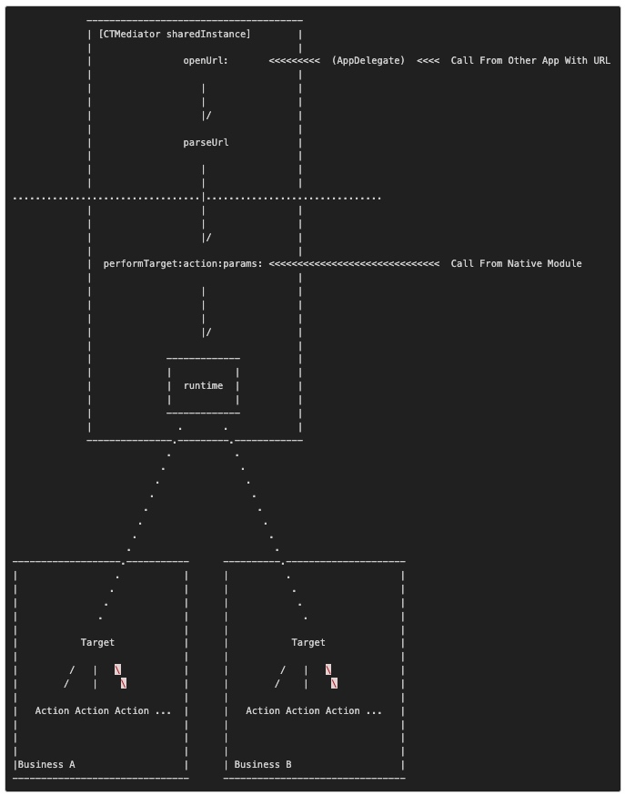

# 组件化方案
https://casatwy.com/iOS-Modulization.html
## 蘑菇街的组件化是怎么做的
《蘑菇街 App 的组件化之路》
https://limboy.me/posts/mgj-components/
https://limboy.me/posts/mgj-components-continued/
* App启动时实例化各组件模块，然后这些组件向ModuleManager注册Url，有些时候不需要实例化，使用class注册。
* 当组件A需要调用组件B时，向ModuleManager传递URL，参数跟随URL以GET方式传递，类似openURL。然后由ModuleManager负责调度组件B，最后完成任务。
## 正确的组件化方案

这幅图是组件化方案的一个简化版架构描述，主要是**基于Mediator模式和Target-Action模式，中间采用了runtime来完成调用**。这套组件化方案将远程应用调用和本地应用调用做了拆分，而且是由本地应用调用为远程应用调用提供服务，与蘑菇街方案正好相反。