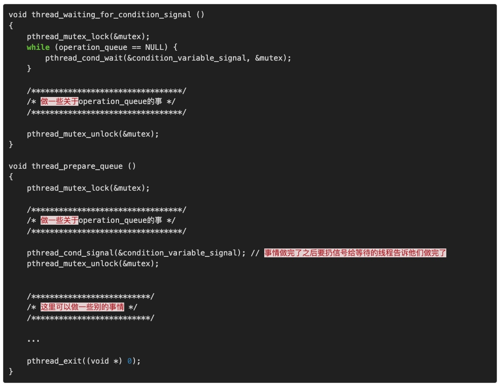
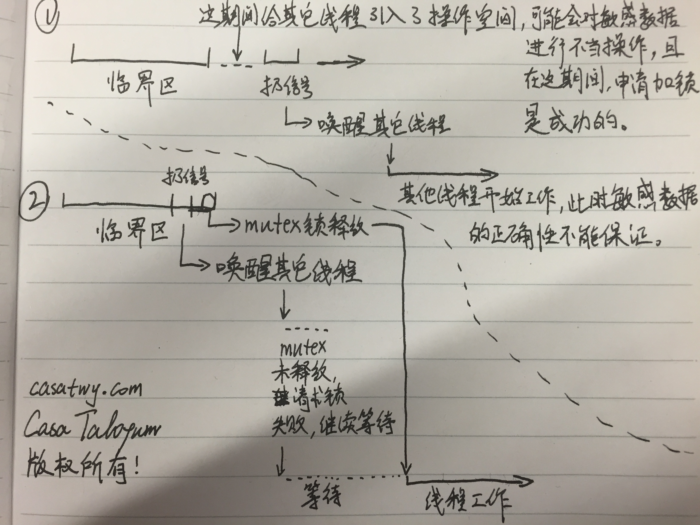

# pthread的各种同步机制
pthread是POSIX标准的多线程库，UNIX、Linux上广泛使用，windows上也有对应的实现，所有的函数都是pthread打头，也就一百多个函数，不是很复杂。
## Mutex Lock 互斥锁
MUTual-EXclude Lock，互斥锁。 它是理解最容易，使用最广泛的一种同步机制。顾名思义，被这个锁保护的临界区就只允许一个线程进入，其它线程如果没有获得锁权限，那就只能在外面等着。
它使用得非常广泛，以至于大多数人谈到锁就是mutex。mutex是互斥锁，pthread里面还有很多锁，mutex只是其中一种。
### mutex锁不是万能灵药
基本上所有的问题都可以用互斥的方案去解决，大不了就是慢点儿，但不要不管什么情况都用互斥，都能采用这种方案不代表都适合采用这种方案。而且这里所说的慢不是说mutex的实现方案比较慢，而是互斥方案影响的面比较大，本来不需要通过互斥就能让线程进入临界区，但用了互斥方案之后，就使这样的线程不得不等待互斥锁的释放，所以就慢了。甚至有些场合用互斥就很蛋疼，比如**多资源分配，线程步调通知**等。 **如果是读多写少的场合，就比较适合读写锁(reader/writter lock)，如果临界区比较短，就适合空转锁(pin lock)**...这些我在后面都会说的，你可以翻到下面去看。
提到这个的原因是：大多数人学pthread学到mutex就结束了，然后不管什么都用mutex。那是不对的！！！
## Reader-Writter Lock 读写锁
前面mutex锁有个缺点，就是只要锁住了，不管其他线程要干什么，都不允许进入临界区。设想这样一种情况：临界区foo变量在被bar1线程读着，加了个mutex锁，bar2线程如果也要读foo变量，因为被bar1加了个互斥锁，那就不能读了。但事实情况是，读取数据不影响数据内容本身，所以即便被1个线程读着，另外一个线程也应该允许他去读。除非另外一个线程是写操作，为了避免数据不一致的问题，写线程就需要等读线程都结束了再写。
因此诞生了**Reader-Writter Lock，有的地方也叫Shared-Exclusive Lock，共享锁**。
Reader-Writter Lock的特性是这样的，当一个线程加了读锁访问临界区，另外一个线程也想访问临界区读取数据的时候，也可以加一个读锁，这样另外一个线程就能够成功进入临界区进行读操作了。此时读锁线程有两个。当第三个线程需要进行写操作时，它需要加一个写锁，这个写锁只有在读锁的拥有者为0时才有效。也就是等前两个读线程都释放读锁之后，第三个线程就能进去写了。总结一下就是，**读写锁里，读锁能允许多个线程同时去读，但是写锁在同一时刻只允许一个线程去写**。
这样更精细的控制，就能减少mutex导致的阻塞延迟时间。虽然用mutex也能起作用，但这种场合，明显读写锁更好嘛！
### 认真区分使用场合，记得避免写线程饥饿
由于读写锁的性质，在默认情况下是很容易出现**写线程饥饿**的。因为它必须要等到所有读锁都释放之后，才能成功申请写锁。不过不同系统的实现版本对写线程的优先级实现不同。Solaris下面就是写线程优先，其他系统默认读线程优先。
比如在写线程阻塞的时候，有很多读线程是可以一个接一个地在那儿插队的(在默认情况下，只要有读锁在，写锁就无法申请，然而读锁可以一直申请成功，就导致所谓的插队现象)，那么写线程就不知道什么时候才能申请成功写锁了，然后它就饿死了。
总的来说，这样的锁建立之后一定要设置优先级，不然就容易出现写线程饥饿。而且**读写锁适合读多写少的情况，如果读、写一样多，那这时候还是用mutex锁比较合理。**
## spin lock 空转锁
上面在给出mutex锁的实现代码的时候提到了这个spin lock，空转锁。它是互斥锁、读写锁的基础。在其它同步机制里condition variable、barrier等都有它的身影。
我先说一下其他锁申请加锁的过程，你就知道什么是spin lock了。
互斥锁和读写锁在申请加锁的时候，会使得线程阻塞，阻塞的过程又分两个阶段，**第一阶段是会先空转，可以理解成跑一个while循环，不断地去申请锁，在空转一定时间之后（第二阶段），线程会进入waiting状态（对的，跟进程一样，线程也分很多状态），此时线程就不占用CPU资源了，等锁可用的时候，这个线程会被唤醒。**
为什么会有这两个阶段呢？主要还是出于效率因素。
* 如果单纯在申请锁失败之后，立刻将线程状态挂起，会带来context切换的开销，但挂起之后就可以不占用CPU资源了，原属于这个线程的CPU时间就可以拿去做更加有意义的事情。假设锁在第一次申请失败之后就又可用了，那么短时间内进行context切换的开销就显得很没效率。
* 如果单纯在申请锁失败之后，不断轮询申请加锁，那么可以在第一时间申请加锁成功，同时避免了context切换的开销，但是浪费了宝贵的CPU时间。假设锁在第一次申请失败之后，很久很久才能可用，那么CPU在这么长时间里都被这个线程拿来轮询了，也显得很没效率。

于是就出现了两种方案结合的情况：**在第一次申请加锁失败的时候，先不着急切换context，空转一段时间。如果锁在短时间内又可用了，那么就避免了context切换的开销，CPU浪费的时间也不多。空转一段时间之后发现还是不能申请加锁成功，那么就有很大概率在将来的不短的一段时间里面加锁也不成功，那么就把线程挂起，把轮询用的CPU时间释放出来给别的地方用。**
### 注意事项
了解了空转锁的特性，我们就发现这个锁其实非常**适合临界区非常短的场合，或者实时性要求比较高的场合。**
由于临界区短，线程需要等待的时间也短，即便轮询浪费CPU资源，也浪费不了多少，还省了context切换的开销。 由于实时性要求比较高，来不及等待context切换的时间，那就只能浪费CPU资源在那儿轮询了。
不过说实话，大部分情况你都不会直接用到空转锁，其他锁在申请不到加锁时也是会空转一定时间的，如果连这段时间都无法满足你的请求，那要么就是你扔的线程太多，或者你的临界区没你想象的那么短。
## pthread_cleanup_push() & pthread_cleanup_pop()
线程是允许在退出的时候，调用一些回调方法的。如果你需要做类似的事情，那么就用以下这两种方法:

正如名字所暗示的，它背后有一个stack，你可以塞很多个callback函数进去，然后调用的时候按照先入后出的顺序调用这些callback。所以你在塞callback的时候，如果是关心调用顺序的，那就得注意这一点了。
但是！你塞进去的callback只有在以下情况下才会被调用：
* 线程通过pthread_exit()函数退出
* 线程被pthread_cancel()取消
* pthread_cleanup_pop(int execute)时，execute传了一个非0值
## pthread_join()
在线程结束的时候，我们能通过上面的pthread_cleanup_push塞入的callback方法知道，也能通过pthread_join这个方法知道。一般情况下，如果是出于业务的需要要知道线程何时结束的，都会采用pthread_join这个方法。
它适用这样的场景：
**你有两个线程，B线程在做某些事情之前，必须要等待A线程把事情做完，然后才能接着做下去。这时候就可以用join。**

在B线程里调用这个方法，第一个参数传A线程的thread_id, 第二个参数你可以扔一个指针进去。当A线程调用pthread_exit(void *value_ptr)来结束的时候，A的value_ptr就会到pthread_join的value_ptr去，你可以理解成A把它计算出来的结果放到exit函数里面去，然后其他join的线程就能拿到这个数据了。
在B线程join了A线程之后，B线程会阻塞住，直到A线程跑完。A线程跑完之后，自动被detach，后续再要join的线程就会报EINVAL（锁变量不可用）。
### 注意事项
#### 新创建的线程默认是join属性，每一个join属性的线程都需要通过pthread_join来回收资源
* 如果A线程已经跑完，但没被join过，此时B线程要去join A线程的时候，pthread_join是会立刻正确返回的，之后A线程就被detach了，占用的资源也会被释放。
* 如果A线程已经跑完，后面没人join它，它占用的资源就会一直在那儿，变成僵尸线程。

所以要么在创建线程的时候就把线程设置为detach的线程，这样线程跑完以后不用join，占用的资源自动回收。
要么不要忘记去join一下，把资源回收了，不要留僵尸。
#### 注意传递的参数的内存生命周期
虽然线程和进程共享同一个进程资源，但如果在pthread_exit()里面你传递的指针指向的是栈内存，那么在结束之后，这片内存还是会被回收的，具体到使用的时候，不同的系统又是不同的方案了。
还有就是，一定要在获得value_ptr之后，检查一下value_ptr是否PTHREAD_CANCELED，因为如果你要等待的线程被cancel掉了，你拿到的就是这个数据。
#### 多个线程join同一个线程
pthread_join是允许多个线程等待同一个线程的结束的。如果要一个线程等待多个线程的结束，那就需要用下面提到的条件变量了，或者barrier也行。
但是多个线程join同一个线程的时候，情况就比较多。多而已，不复杂。我们先建立一个约定：**A线程是要被join的线程，BCDEF是要等待A线程结束的线程**。下面说一下每种情况：
* A线程正在运行，BCDEF线程发起对A的join，发起join结束后，A仍然在运行中
此时BCDEF线程都会被阻塞，等待A线程的结束。A线程结束之后，BCDEF都被唤醒，能够正常获得A线程通过pthread_exit()返回的数据。
* A线程正在运行，BCDEF发起对A的join，BCD发起join成功后，A线程结束，然后EF发起join
此时BCD线程能够正常被唤醒，并完成任务，由于被join后A线程被detach，资源释放，后续EF再要发起join，就会EINVAL（锁变量不可用）。
* A线程正在运行，且运行结束。此时BCDEF发起对A的join。
此时谁先调用成功，谁就能完成任务，后续再要join的就都会EINVAL。一旦有一个线程join成功，A立刻被detach，资源释放，然后后面其他的线程就都不会join成功。

总的来说，**只要线程运行结束，并且被detach了，后面再join就不行了，只要线程还在运行中，就能join。如果运行结束了，第一次被join之后，线程就被detach了，后续就不能join。当然了，如果线程本来就是detach属性的线程，那任何时候都无法被join。**
## Condition Variables 条件变量
pthread_join解决的是多个线程等待同一个线程的结束。条件变量能在合适的时候唤醒正在等待的线程。具体什么时候合适由你自己决定，它必须要跟互斥锁联合起来用。
场景：B线程和A线程之间有合作关系，当A线程完成某件事情之前，B线程会等待。当A线程完成某件事情之后，需要让B线程知道，然后B线程从等待状态中被唤醒，然后继续做自己要做的事情。
如果不用条件变量的话，也行。那就是搞个volatile变量，然后让其他线程不断轮询，一旦这个变量到了某个值，你就可以让线程继续了。如果有多个线程需要修改这个变量，那就再加个互斥锁或者读写锁。
但是！！！这做法太特么愚蠢了，还特别浪费CPU时间，所以还在用volatile变量标记线程状态的你们也真是够了！！！
大致的实现原理是：**一个条件变量背后有一个池子，所有需要wait这个变量的线程都会进入这个池子。当有线程扔出这个条件变量的signal，系统就会把这个池子里面的线程挨个唤醒。**
**在调用pthread_cond_wait之前，必须要申请互斥锁，当线程通过pthread_cond_wait进入waiting状态时，会释放传入的互斥锁。**
下面我先给一个条件变量的使用例子，然后再讲需要注意的点。

### 要注意的地方
#### 一定要跟mutex配合使用
```
pthread_mutex_lock(&mutex);
    while (operation_queue == NULL) {
        pthread_cond_wait(&condition_variable_signal, &mutex);
    }

    /*********************************/
    /* 做一些关于operation_queue的事 */
    /*********************************/

    pthread_mutex_unlock(&mutex);
```
#### 一定要检测你要操作的内容
```
while (operation_queue == NULL) {
        pthread_cond_wait(&condition_variable_signal, &mutex);
    }
```
#### 一定要用while来检测你要操作的内容而不是if
#### 扔信号的时候，在临界区里面扔，不要在临界区外扔

## semaphore 信号量
semaphore是进程间PV，也属于posix标准的组成部分。
semaphore事实上就是我们学《操作系统》的时候所说的PV操作。你也可以把它理解成带有数量控制的互斥锁，当sem_init(&sem, 0, 1);时，他就是一个mutex锁了。
场景：比如有3台打印机，有5个线程要使用打印机，那么semaphore就会先记录好有3台，每成功被申请一次，就减1，减到0时，后面的申请就会被拒绝。
它也可以用mutex和条件变量来实现，但实际上还是用semaphore比较方便。
## Barriers栅栏
Barrier可以理解成一个mile stone。当一个线程率先跑到mile stone的时候，就先等待。当其他线程都到位之后，再从等待状态唤醒，继续做后面的事情。
场景：超大数组排序的时候，可以采用多线程的方案来排序。比如开10个线程分别排这个超大数组的10个部分。必须要这10个线程都完成了各自的排序，你才能进行后续的归并操作。先完成的线程会挂起等待，直到所有线程都完成之后，才唤醒所有等待的线程。
前面有提到过条件变量和pthread_join，前者是在做完某件事情通知其他线程，后者是在线程结束之后让其他线程能够获得执行结果。如果有多个线程同时做一件事情，用上面这两者可以有次序地进行同步。另外，用semaphore也可以实现Barrier的功能。
但是我们已经有Barrier了好吗！你们能不要把代码搞那么复杂吗！
## 关于attr
### thread
创建thread的时候是可以设置attr的：**detachstate、guardsize、stackaddr、stacksize**。一般情况下我都是采取默认的设置。只有在我非常确定这个线程不需要跟其他线程协作的时候，我会把detachstate设置为PTHREAD_CREATE_DETACHED。
### mutex
创建mutex的时候也是可以设置attr的：**process-shared、robust、type**。一般情况下尽量不要出现跨进程的锁共享，万一有个相关进程被酒杀(kill 9)了，而且死之前它抱着锁没放，你后面的事情就麻烦了，基本无解。process-shared和robust就是跟跨进程有关。
关于type，我强烈建议显式设置为PTHREAD_MUTEX_ERRORCHECK。
## 总结
这篇文章主要讲了pthread的各种同步机制相关的东西：**mutex、reader-writter、spin、cleanup callbacks、join、condition variable、semaphore、barrier**。其中cleanup callbacks不算是同步机制，但是我看到也有人拿这个作为同步机制的一部分写在程序中，这是不对的！
多线程编程的复杂点不仅仅在于同步机制，例如**多线程跟系统信号的协作、多线程创建进程后的协作和控制、多线程和I/O之间的协作和控制、函数的可重入性**等。
**线程和线程的各种属性、线程的退出/取消/结束、线程数据的获取（pthread_join）、锁和各种锁，各种属性、TSD（Thread-Specific-Data）、条件变量（Condition Variable）、信号量（Semaphore）、栅栏（pthread_barrier）、优先级反转（Priority Ceiling/Priority Inheritance）、异常结束处理机制（Robust）等等。**

