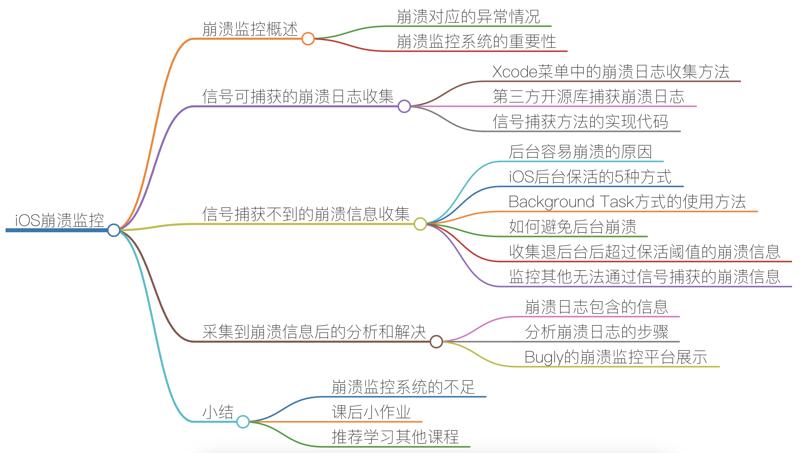
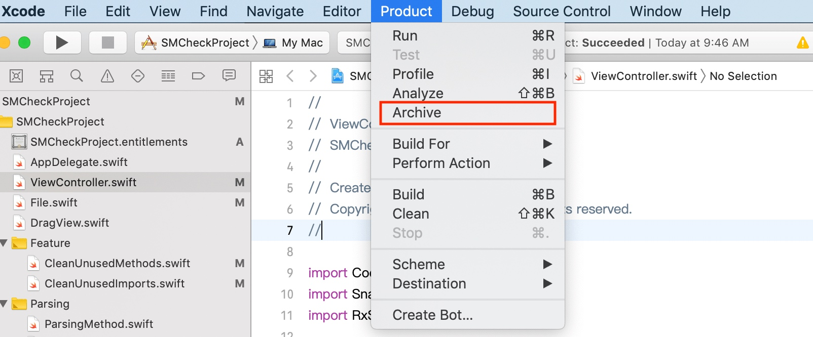
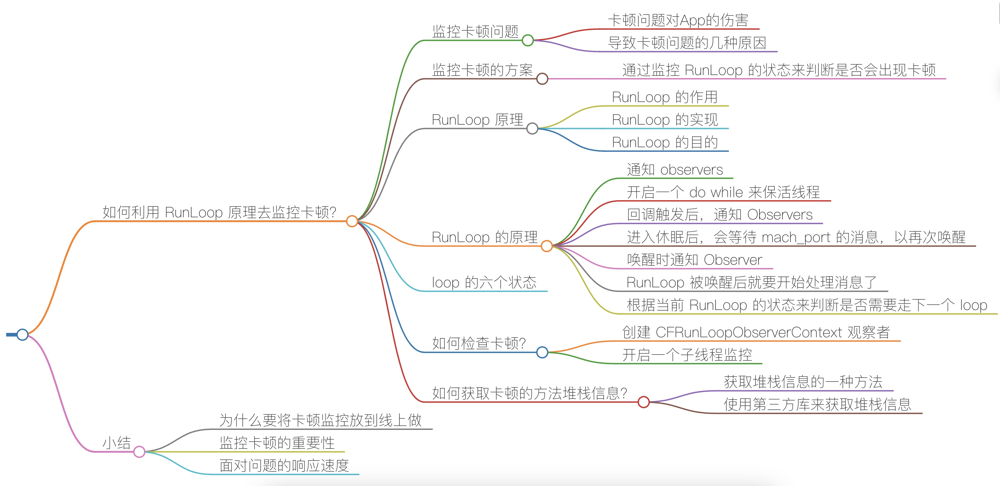
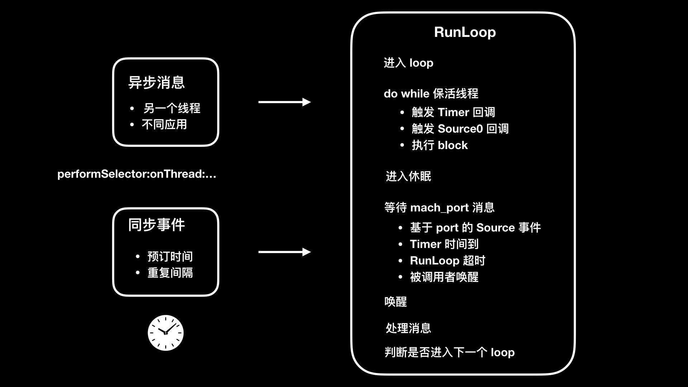
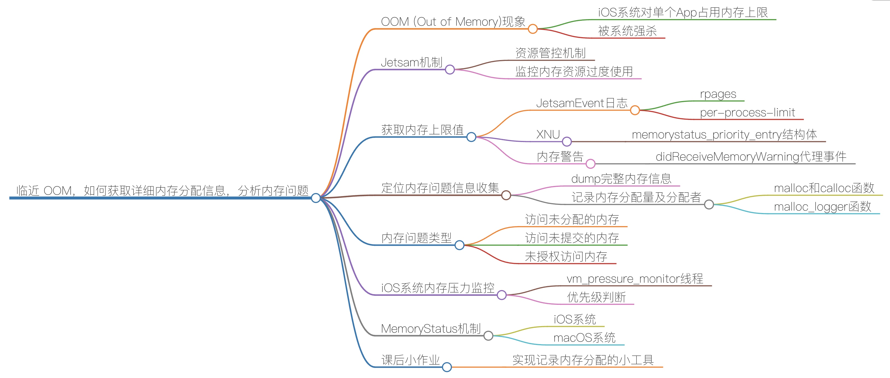

# 性能优化
CPU、内存占用量，耗电量，包体积，启动优化
## iOS App启动优化
对于iOS App的启动优化，我们可以从以下几个方面进行：

1. 减少App启动时间：App的启动时间直接影响用户的体验，特别是对于那些需要频繁启动的App，更应优化启动时间。
   - 减少启动图片的大小。
   - 尽量减少在Application:didFinishLaunchingWithOptions:中执行的操作。
   - 避免在主线程中执行耗时的操作。
   - 减少界面的复杂度，以减少渲染时间。

2. 预加载：在App启动的过程中，可以通过预加载必要的数据，以减少启动后的加载时间。
   - 在一开始就加载最重要的数据。
   - 使用缓存减少网络请求的次数。

3. 指定初始界面：通过指定初始界面，可以让用户在App启动后立即看到内容。
   - 设置正确的LaunchScreen.storyboard。
   - 尽可能早地设置window.rootViewController。

4. 延迟加载：在App启动的过程中，可以选择延迟加载一些不必要的数据，以加快启动速度。
   - 使用lazy加载。
   - 在需要的时候再进行网络请求。

5. 使用优化的架构模式：比如使用MVVM而不是MVC，可以减少Controller的逻辑，让数据和视图进行解耦，提高代码的效率。

6. Unused Code Stripping：删除未使用的代码可以减少App的体积，提高启动速度。

7. 缩小动态库的使用：动态库虽然有许多优点，但是对App的启动性能有很大影响，一方面，需要额外的时间来加载动态库，另一方面，如果一个App引用了太多的库，可能会占用大量的内存和CPU。

8. 使用Asset Catalogs管理资源：Asset Catalogs不仅可以让管理资源更方便，而且还可以改进App的性能。Asset Catalogs会自动选择正确的资源，无论当前设备的屏幕大小或者分辨率是多少，从而减少浪费和提高效率。
## 崩溃监控
https://time.geekbang.com/column/article/88600

* 数组越界：在取数据索引时越界，App 会发生崩溃。还有一种情况，就是给数组添加了 nil 会崩溃。
* 多线程问题：在子线程中进行 UI 更新可能会发生崩溃。多个线程进行数据的读取操作，因为处理时机不一致，比如有一个线程在置空数据的同时另一个线程在读取这个数据，可能会出现崩溃情况。
* 主线程无响应：如果主线程超过系统规定的时间无响应，就会被 Watchdog 杀掉。这时，崩溃问题对应的异常编码是 0x8badf00d。
* 野指针：指针指向一个已删除的对象访问内存区域时，会出现野指针崩溃。野指针问题是需要我们重点关注的，因为它是导致 App 崩溃的最常见，也是最难定位的一种情况。


KVO 问题、NSNotification 线程问题、数组越界、野指针等崩溃信息，是可以通过信号捕获的。但是，像后台任务超时、内存被打爆、主线程卡顿超阈值等信息，是无法通过信号捕捉到的。
### 信号可捕获的崩溃日志收集
收集崩溃日志最简单的方法，就是打开 Xcode 的菜单选择 Product -> Archive。如下图所示：

然后，在提交时选上“Upload your app’s symbols to receive symbolicated reports from Apple”，以后你就可以直接在 Xcode 的 Archive 里看到符号化后的崩溃日志了。
通过 [PLCrashReporter](https://github.com/microsoft/plcrashreporter) 这样的第三方开源库捕获崩溃日志，然后上传到自己服务器上进行整体监控的。而没有服务端开发能力，或者对数据不敏感的公司，则会直接使用 [Fabric](https://firebase.google.com/?hl=zh-cn) 或者 [Bugly](https://bugly.qq.com/v2/) 来监控崩溃。
iOS 后台保活的 5 种方式：Background Mode、Background Fetch、Silent Push、PushKit、Background Task。
* 使用 Background Mode 方式的话，App Store 在审核时会提高对 App 的要求。通常情况下，只有那些地图、音乐播放、VoIP 类的 App 才能通过审核。
* Background Fetch 方式的唤醒时间不稳定，而且用户可以在系统里设置关闭这种方式，导致它的使用场景很少。
* Silent Push 是推送的一种，会在后台唤起 App 30 秒。它的优先级很低，会调用 application:didReceiveRemoteNotifiacation:fetchCompletionHandler: 这个 delegate，和普通的 remote push notification 推送调用的 delegate 是一样的。
* PushKit 后台唤醒 App 后能够保活 30 秒。它主要用于提升 VoIP 应用的体验。
* Background Task 方式，是使用最多的。App 退后台后，默认都会使用这种方式。

在你的程序退到后台以后，只有几秒钟的时间可以执行代码，接下来就会被系统挂起。进程挂起后所有线程都会暂停，不管这个线程是文件读写还是内存读写都会被暂停。但是，数据读写过程无法暂停只能被中断，中断时数据读写异常而且容易损坏文件，所以系统会选择主动杀掉 App 进程。
而 Background Task 这种方式，就是系统提供了 beginBackgroundTaskWithExpirationHandler 方法来延长后台执行时间，可以解决你退后台后还需要一些时间去处理一些任务的诉求。
```
- (void)applicationDidEnterBackground:(UIApplication *)application {
    self.backgroundTaskIdentifier = [application beginBackgroundTaskWithExpirationHandler:^( void) {
        [self yourTask];
    }];
}
```
yourTask 任务最多执行 3 分钟，3 分钟内 yourTask 运行完成，你的 App 就会挂起。 如果 yourTask 在 3 分钟之内没有执行完的话，系统会强制杀掉进程，从而造成崩溃，这就是为什么 App 退后台容易出现崩溃的原因。
采用 Background Task 方式时，我们可以根据 beginBackgroundTaskWithExpirationHandler 会让后台保活 3 分钟这个阈值，先设置一个计时器，在接近 3 分钟时判断后台程序是否还在执行。如果还在执行的话，我们就可以判断该程序即将后台崩溃，进行上报、记录，以达到监控的效果。
对于内存打爆信息的收集，你可以采用内存映射（mmap）的方式来保存现场。主线程卡顿时间超过阈值这种情况，你只要收集当前线程的堆栈信息就可以了。
我们采集到的崩溃日志，主要包含的信息为：进程信息、基本信息、异常信息、线程回溯。
* 进程信息：崩溃进程的相关信息，比如崩溃报告唯一标识符、唯一键值、设备标识；
* 基本信息：崩溃发生的日期、iOS 版本；
* 异常信息：异常类型、异常编码、异常的线程；
* 线程回溯：崩溃时的方法调用栈。

常见的异常编码：
* 0x8badf00d，表示 App 在一定时间内无响应而被 watchdog 杀掉的情况。
* 0xdeadfa11，表示 App 被用户强制退出。
* 0xc00010ff，表示 App 因为运行造成设备温度太高而被杀掉。
## 卡顿监控

导致卡顿问题的几种原因：
* 复杂 UI 、图文混排的绘制量过大；
* 在主线程上做网络同步请求；
* 在主线程做大量的 IO 操作；
* 运算量过大，CPU 持续高占用；
* 死锁和主子线程抢锁。

线程的消息事件是依赖于 NSRunLoop 的，通过监听 NSRunLoop 的状态，就能够发现调用方法是否执行时间过长，从而判断出是否会出现卡顿。
RunLoop 这个对象，在 iOS 里由 CFRunLoop 实现。简单来说，RunLoop 是用来监听输入源，进行调度处理的。这里的输入源可以是输入设备、网络、周期性或者延迟时间、异步回调。RunLoop 会接收两种类型的输入源：一种是来自另一个线程或者来自不同应用的异步消息；另一种是来自预订时间或者重复间隔的同步事件。
RunLoop 的目的是，当有事件要去处理时保持线程忙，当没有事件要处理时让线程进入休眠。
通过将那些繁重而不紧急会大量占用 CPU 的任务（比如图片加载），放到空闲的 RunLoop 模式里执行，就可以避开在 UITrackingRunLoopMode 这个 RunLoop 模式时执行。UITrackingRunLoopMode 是用户进行滚动操作时会切换到的 RunLoop 模式，避免在这个 RunLoop 模式执行繁重的 CPU 任务，就能避免影响用户交互操作上体验。

如果 RunLoop 的线程，**进入睡眠前方法的执行时间过长而导致无法进入睡眠，或者线程唤醒后接收消息时间过长而无法进入下一步**的话，就可以认为是线程受阻了。如果这个线程是主线程的话，表现出来的就是出现了卡顿。
如果我们要利用 RunLoop 原理来监控卡顿的话，就是要关注这两个阶段。RunLoop 在进入睡眠之前和唤醒后的两个 loop 状态定义的值，分别是 kCFRunLoopBeforeSources 和 kCFRunLoopAfterWaiting ，也就是要触发 Source0 回调和接收 mach_port 消息两个状态。
WatchDog 在不同状态下设置的不同时间，如下所示：
* 启动（Launch）：20s；
* 恢复（Resume）：10s；
* 挂起（Suspend）：10s；
* 退出（Quit）：6s；
* 后台（Background）：3min（在 iOS 7 之前，每次申请 10min； 之后改为每次申请 3min，可连续申请，最多申请到 10min）。
## 内存监控

JetSam 机制，指的就是操作系统为了控制内存资源过度使用而采用的一种资源管控机制。
内核用线程的优先级是最高的，操作系统的优先级其次，App 的优先级排在最后。并且，前台 App 程序的优先级是高于后台运行 App 的；线程使用优先级时，CPU 占用多的线程的优先级会被降低。