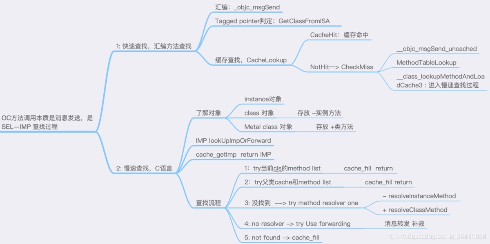
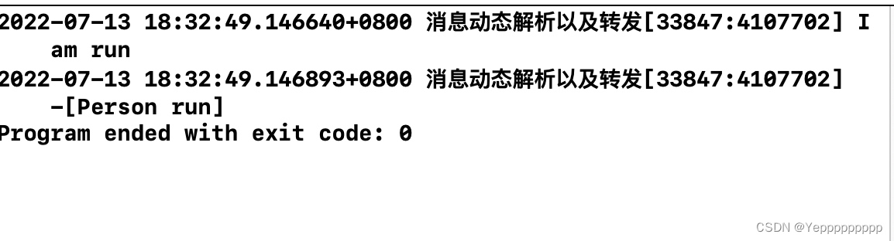
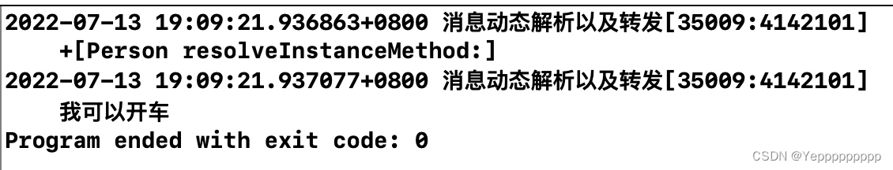
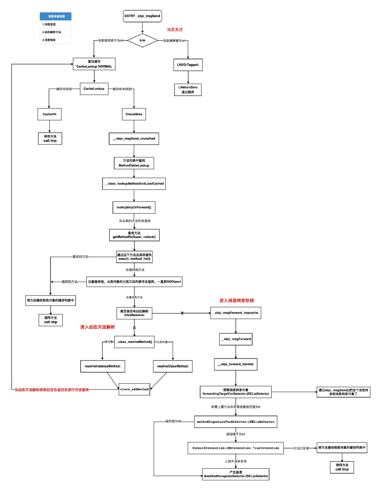

# 消息传递和消息转发机制
https://blog.csdn.net/weixin_51638861/article/details/125733738
## 消息传递机制
在学习消息传递机制是如何实现之前，有几个基础知识我们必须要理解：
* 在OC里使用对象调用方法十分普遍，用OC的术语来说调用对象的方法就是**给某个对象发送某条消息**，简单的来说就是我们去调用方法编译器告诉某个对象你该执行某个方法了，这个过程就是消息的传递。所以消息有“名称”或“选择子(selector)”之说。
* 消息是可以接受参数，还可以有返回值。
下面通过一行代码来理解一下：
```
UIImage *image = [UIImage imageNamed:@""];
```
UIImage叫做方法调用者，也叫做接受者。imageNamed:是方法名，也叫选择子。**选择子与参数合起来叫做“消息”**。在OC中，如果向某对象传递信息，那就会使用**动态绑定机制**来决定需要的方法。为什么OC是真正的动态语言呢？因为**对象收到信息之后，究竟该调用哪个方法则完全于运行期决定，甚至可以在程序运行时改变**。编译器看到"消息"时，会将它换为一条标准的 C 语言函数调用，所调用的函数乃是消息传递机制中的核心函数，叫做 **objc_msgSend**。
学习消息传递机制其实就是理解OC对象调用方法的过程以及含义。
给对象发送信息：
```
id returnValue = [someObject messageName:parameter];
```
objc_msgSend函数的原型如下所示：
```
void objc_msgSend(id self, SEL cmd, ...)
```
这是个“参数个数可变的函数”（variadic function）（可变参数函数），能接受两个或两个以上的参数。第一个参数代表接收者，第二个参数代表选择子（SEL 是选择子的类型），后续参数就是消息中的那些参数，其顺序不变。选择子指的就是方法的名字。“选择子”与“方法”这两个词经常交替使用。编译器会把刚才那个例子中的消息转换为如下函数:
```
id returnValue = objc_msgSend(someObject, @selectro(messageName:), parameter);
```
## 选择子SEL、IMP、Method
SEL：selector的简写，俗称方法选择器，实质存储的是方法的名称
IMP：implement的简写，俗称方法实现，看源码得知它就是一个函数指针
Method：对上述两者的一个包装结构.
### 选择子SEL
一开始我只知道选择子这个名词，但是对于什么是选择子十分疑惑吗，通过查资料，其实选择子SEL就是：**SEL选择器是一个变量类型，这个类型写作SEL。SEL的变量装载的是“成员方法”，更准确的说，装载的是“消息”，有点类似于函数指针**。与普通对象发送消息的区别在于编译器不会验证是否声明这个方法，直接向对象发送消息，但在实际中最好先验证一下对象是否存在或实现了该方法，以保证代码的安全性，避免出现错误。
SEL：定义： typedef struct objc_selector *SEL，代表方法的名称。仅以名字来识别。翻译成中文叫做选择子或者选择器，选择子代表方法在 Runtime期间的标识符。为 SEL类型，虽然 SEL是 objc_selector 结构体指针，但实际上它只是一个 C 字符串。在类加载的时候，编译器会生成与方法相对应的选择子，并注册到 Objective-C的 Runtime 运行系统。不论两个类是否存在依存关系，只要他们拥有相同的方法名，那么他们的SEL都是相同的。比如，有n个viewcontroller页面，每个页面都有一个viewdidload,每个页面的载入，肯定都是不尽相同的。但是我们可以通过打印，观察发现，这些viewdidload的SEL都是同一个.
OC在编译时会根据方法的名字（包括参数序列），生成一个用来区分这个办法的唯一的一个ID，这个ID就是SEL类型的。我们需要注意的是，只要方法的名字（包括参数序列）相同，那么他们的ID就是相同的。所以不管是父类还是子类，名字相同那么ID就是一样的。
### IMP
定义：typedef id (*IMP)(id, SEL, …)，代表函数指针，即函数执行的入口。该函数使用标准的 C调用。第一个参数指向 self（它代表当前类实例的地址，如果是类则指向的是它的元类），作为消息的接受者；第二个参数代表方法的选择子；… 代表可选参数，前面的 id 代表返回值
### Method
Method：定义：typedef struct objc_method *Method，Method对开发者来说是一种不透明的类型，被隐藏在我们平时书写的类或对象的方法背后。它是一个objc_method结构体指针，我们可以看到该结构体中包含一个SEL和IMP，实际上相当于在SEL和IMP之间作了一个映射。有了SEL，我们便可以找到对应的IMP，从而调用方法的实现代码。 objc_method的定义为：
```
/// Method
struct objc_method {
    SEL method_name; 
    char *method_types;
    IMP method_imp;
 };
```
方法名 method_name 类型为 SEL，相同名字的方法即使在不同类中定义，它们的方法选择器也相同。
方法类型 method_types 是个 char 指针，其实存储着方法的参数类型和返回值类型，即是 Type Encoding 编码。
method_imp 指向方法的实现，本质上是一个函数的指针
## 执行过程
在Objective—C中，方法的调用不再理解为对象调用其方法，要理解为对象接收消息，消息的发送采用动态绑定 机制，具体会调用哪个方法直到运行时才能确定，确定后才会去执行绑定的代码。**方法的调用实际上就是告诉对象要干什么，给对象传递一个消息，对象为接收者(receiver)，调用的方法及参数就是消息(message)，给一个对象传递消息表达为[receiver message]**; 接收者的类型可以通过动态类型识别在运行时确定。
在消息传递机制中，当开发者编写[receiver message];语句发送消息后，编译器都会将其转化成对应的一条objc_msgSend C语言消息发送原语。具体格式为: void objc_msgSend(id self,SEL cmd,…)
那么objc_msgSend()的执行流程是什么呢，如下所示：
* 消息发送阶段：负责从类及父类的缓存列表及方法列表查找方法
* 动态解析阶段：如果消息发送阶段没有找到方法，则会进入动态解析阶段，负责动态的添加方法实现
* 消息转发阶段：如果也没有实现动态解析方法，则会进行消息转发阶段，将消息转发给可以处理消息的接受者来处理
### 消息发送阶段
objc_msgSend的第一个参数为接收者，第二个参数是消息"选择子"，后面跟着可选的消息的参数
所以当我们接收到消息时，首先会在接收者的类中查找对应的方法，如果没找到就在其父类中查找。如果一直到没有父类还没有找到该方法，那么我们就要进入第二个阶段–动态方法解析。
我们先看看objc_method的内部实现，我们在runtime的源码中搜索_objc_msgSend，在objc-msg-arm64.s汇编文件可以知道_objc_msgSend函数的实现:
```
    ENTRY _objc_msgSend
    UNWIND _objc_msgSend, NoFrame
    MESSENGER_START

    cmp x0, #0          // nil check and tagged pointer check
    b.le    LNilOrTagged        //  (MSB tagged pointer looks negative)
    ldr x13, [x0]       // x13 = isa
    and x16, x13, #ISA_MASK // x16 = class  
LGetIsaDone:
    CacheLookup NORMAL      // calls imp or objc_msgSend_uncached
```
上述汇编源码中会首先判断消息接受者的值。
* 如果传入的消息接受者为nil则会执行LNilOrTagged
* LNilOrTagged内部会执行LReturnZero 而LReturnZero内部则直接return0
* 如果传入的消息接受者不为nill则执行CacheLookup
* CacheLookup内部对方法缓存列表进行查找如果找到则执行CacheHit进而调用方法,否则执行CheckMiss
* CheckMiss内部调用 __objc_msgSend_uncached
* __objc_msgSend_uncached内会执行MethodTableLookup，MethodTableLookup也就是方法列表查找MethodTableLookup内部的核心代码**__class_lookupMethodAndLoadCache3**
* __class_lookupMethodAndLoadCache3也就是C语言函数_class_lookupMethodAndLoadCache3

方法查找的核心函数就是_class_lookupMethodAndLoadCache3函数，接下来重点分析_class_lookupMethodAndLoadCache3函数内的源码。
_class_lookupMethodAndLoadCache3函数
```
IMP _class_lookupMethodAndLoadCache3(id obj, SEL sel, Class cls)
{
    return lookUpImpOrForward(cls, sel, obj, 
                              YES/*initialize*/, NO/*cache*/, YES/*resolver*/);
} 
```
lookUpImpOrForward 函数
```
IMP lookUpImpOrForward(Class cls, SEL sel, id inst, 
                       bool initialize, bool cache, bool resolver)
{
    // initialize = YES , cache = NO , resolver = YES
    IMP imp = nil;
    bool triedResolver = NO;
    runtimeLock.assertUnlocked();

    // 缓存查找, 因为cache传入的为NO, 这里不会进行缓存查找, 因为在汇编语言中CacheLookup已经查找过
    if (cache) {
        imp = cache_getImp(cls, sel);
        if (imp) return imp;
    }

    runtimeLock.read();
    if (!cls->isRealized()) {
        runtimeLock.unlockRead();
        runtimeLock.write();
        realizeClass(cls);
        runtimeLock.unlockWrite();
        runtimeLock.read();
    }
    if (initialize  &&  !cls->isInitialized()) {
        runtimeLock.unlockRead();
        _class_initialize (_class_getNonMetaClass(cls, inst));
        runtimeLock.read();
    }

 retry:    
    runtimeLock.assertReading();

    // 防止动态添加方法，缓存会变化，再次查找缓存,以确保准确性
    imp = cache_getImp(cls, sel);
    // 如果查找到imp, 直接调用done, 返回方法地址
    if (imp) goto done;

    // 查找方法列表, 传入类对象和方法名
    {
        // 根据sel去类对象里面查找方法
        Method meth = getMethodNoSuper_nolock(cls, sel);
        if (meth) {
            // 如果方法存在，则缓存方法，
            // 内部调用的就是 cache_fill 上文中已经详细讲解过这个方法，这里不在赘述了。
            log_and_fill_cache(cls, meth->imp, sel, inst, cls);
            // 方法缓存之后, 取出imp, 调用done返回imp
            imp = meth->imp;
            goto done;
        }
    }

    // 如果类方法列表中没有找到, 则去父类的缓存中或方法列表中查找方法
    {
        unsigned attempts = unreasonableClassCount();
        // 如果父类缓存列表及方法列表均找不到方法，则去父类的父类去查找。
        for (Class curClass = cls->superclass;
             curClass != nil;
             curClass = curClass->superclass)
        {
            // Halt if there is a cycle in the superclass chain.
            if (--attempts == 0) {
                _objc_fatal("Memory corruption in class list.");
            }

            // 查找父类的缓存
            imp = cache_getImp(curClass, sel);
            if (imp) {
                if (imp != (IMP)_objc_msgForward_impcache) {
                    // 在父类中找到方法, 在本类中缓存方法, 注意这里传入的是cls, 将方法缓存在本类缓存列表中, 而非父类中
                    log_and_fill_cache(cls, imp, sel, inst, curClass);
                    // 执行done, 返回imp
                    goto done;
                }
                else {
                    // 跳出循环, 停止搜索
                    break;
                }
            }

            // 查找父类的方法列表
            Method meth = getMethodNoSuper_nolock(curClass, sel);
            if (meth) {
                // 同样拿到方法, 在本类进行缓存
                log_and_fill_cache(cls, meth->imp, sel, inst, curClass);
                imp = meth->imp;
                // 执行done, 返回imp
                goto done;
            }
        }
    }
//到此结束消息发送阶段，接下来就进行动态解析阶段和消息转发阶段
```
通过上面的代码我们可以发现一个方法getMethodNoSuper_nolock()，这个方法是最主要的目的就是根据sel去类对象里面查找方法：
```
getMethodNoSuper_nolock(Class cls, SEL sel)
{
    runtimeLock.assertLocked();
    assert(cls->isRealized());
    // cls->data() 得到的是 class_rw_t
    // class_rw_t->methods 得到的是methods二维数组
    for (auto mlists = cls->data()->methods.beginLists(), 
              end = cls->data()->methods.endLists(); 
         mlists != end;
         ++mlists)
    {
         // mlists 为 method_list_t
        method_t *m = search_method_list(*mlists, sel);
        if (m) return m;
    }
    return nil;
} 
```
getMethodNoSuper_nolock函数中通过遍历方法列表拿到method_list_t
最终通过search_method_list函数查找方法
search_method_list函数
```
static method_t *search_method_list(const method_list_t *mlist, SEL sel)
{
    int methodListIsFixedUp = mlist->isFixedUp();
    int methodListHasExpectedSize = mlist->entsize() == sizeof(method_t);
    // 如果方法列表是有序的，则使用二分法查找方法，节省时间
    if (__builtin_expect(methodListIsFixedUp && methodListHasExpectedSize, 1)) {
        return findMethodInSortedMethodList(sel, mlist);
    } else {
        // 否则则遍历列表查找
        for (auto& meth : *mlist) {
            if (meth.name == sel) return &meth;
        }
    }
    return nil;
} 
```
用一张图来理解整个消息发送过程：

### 动态解析阶段
动态解析阶段发生在当在自己类对象的缓存和方法列表中都没有找到该方法，并且向上在父类的缓存和方法列表中也没有找到该方法时，便会进入动态解析阶段。
我们来看一下动态解析阶段源码:
```
	//进入动态解析阶段
    if (resolver  &&  !triedResolver) {
    //triedResolver用来判断是否曾经进行过动态方法解析，如果没有那就进入动态方法解析，如果进行过，就跳过
        runtimeLock.unlock();
        runtimeLock.unlockRead();
        _class_resolveMethod(cls, sel, inst);//动态解析方法函数
        runtimeLock.read();
        // Don't cache the result; we don't hold the lock so it may have 
        // changed already. Re-do the search from scratch instead.
        triedResolver = YES;//进行了动态解析就把triedResolver的值改为YES，和第一行的判断所对应
        goto retry;//前面发消息的整个过程，也就是说进行了方法解析后还要回到前面，从类对象的缓存和方法列表中查找。如果动态方法解析添加了方法实现，那么自然能找到，如果没有，那么还是找不到方法实现，此时也不会进入动态方法解析，而是直接进行下一步，消息转发        
    } 
```
动态解析阶段的代码基本上就是上面这些，我们可以看到最重要的应该就是动态解析方法函数：_class_resolveMethod，该函数内部，可以根据类对象或元类对象做不同的操作：
```
void _class_resolveMethod(Class cls, SEL sel, id inst)
{
    if (! cls->isMetaClass()) {
        // try [cls resolveInstanceMethod:sel]
        _class_resolveInstanceMethod(cls, sel, inst);
    } 
    else {
        // try [nonMetaClass resolveClassMethod:sel]
        // and [cls resolveInstanceMethod:sel]
        _class_resolveClassMethod(cls, sel, inst);
        if (!lookUpImpOrNil(cls, sel, inst, 
                            NO/*initialize*/, YES/*cache*/, NO/*resolver*/)) 
        {
            _class_resolveInstanceMethod(cls, sel, inst);
        }
    }
} 
```
通过对源码分析可知，_class_resolveMethod主要是判断类对象还是元类对象，如果是类对象则可知调用的是实例方法，则进行_class_resolveInstanceMethod调用，如果是元类对象则说明调用的是类方法，则进行_class_resolveClassMethod调用。
#### 动态解析测试
在进行测试之前我们需要知道如何在_class_resolveClassMethod和_class_resolveInstanceMethod中添加方法实现，我们需要借助class_addMethod：
```
class_addMethod(Class _Nullable cls, SEL _Nonnull name, IMP _Nonnull imp, const char * _Nullable types) 

@cls : 给哪个类对象添加方法
@name ： SEL类型，给哪个方法名添加方法实现
@imp : IMP类型的，要把哪个方法实现添加给给定的方法名
@types ： 就是表示返回值和参数类型的字符串
```
接下来我们进行动态解析测试：
首先我们在Person.h文件中定义两个方法，一个run方法，一个test方法：
```
#import <Foundation/Foundation.h>

NS_ASSUME_NONNULL_BEGIN

@interface Person : NSObject
-(void)run;
-(void)test;
@end

NS_ASSUME_NONNULL_END
```
然后我们在.m文件中对run进行实现，以及不实现test，但是我们在resolveInstanceMethod方法中给没有实现的test进行实现，其实就是说会自动调用类的resolveInstanceMethod:方法进行动态查找
所以我们可以在resolveInstanceMethod:方法内部使用class_addMethod动态的添加方法实现。如下所示：
```
#import "Person.h"
#import <objc/message.h>

@implementation Person
- (void) run {
    NSLog(@"I am run");
    NSLog(@"%s", __func__);
}

+ (BOOL)resolveInstanceMethod:(SEL)sel
{
    // 动态的添加方法实现
    if (sel == @selector(test)) {
        // 获取其他方法 指向method_t的指针
        Method otherMethod = class_getInstanceMethod(self, @selector(run));
 
        // 动态添加test方法的实现
        class_addMethod(self, sel, method_getImplementation(otherMethod), method_getTypeEncoding(otherMethod));
 
        // 返回YES表示有动态添加方法
        return YES;
    }
 
    NSLog(@"%s", __func__);
    return [super resolveInstanceMethod:sel];
}

@end 
```
然后在main函数里做测试：
```
int main(int argc, const char * argv[]) {
    @autoreleasepool {
        Person *person = [[Person alloc] init];
        [person test];
    }
    return 0;
}
```

这里需要注意class_addMethod用来向具有给定方法名称和实现的类添加新方法
class_addMethod将添加一个方法实现的覆盖，但是不会替换已有的实现
也就是说如果上述代码中已经实现了-(void)test方法，则不会再动态添加方法，这点在上述源码中也可以体现，因为一旦找到方法实现就直接return imp并调用方法了，不会再执行动态解析方法了。
我们再来看看如何动态解析类方法：
当动态解析类方法的时候，就会调用+(BOOL)resolveClassMethod:(SEL)sel函数
而我们知道类方法是存储在元类对象里面的，因此cls第一个对象需要传入元类对象以下代码为例:
```
void other(id self, SEL _cmd)
{
    NSLog(@"other - %@ - %@", self, NSStringFromSelector(_cmd));
}

+ (BOOL)resolveClassMethod:(SEL)sel
{
    if (sel == @selector(test)) {
        // 第一个参数是object_getClass(self)，传入元类对象。
        class_addMethod(object_getClass(self), sel, (IMP)other, "v16@0:8");
        return YES;
    }
    return [super resolveClassMethod:sel];
} 
```
我们需要注意：
* 无论我们是否实现了动态解析的方法，系统内部都会执行retry对方法再次进行查找
* 那么如果我们实现了动态解析方法，此时就会顺利查找到方法，进而返回imp对方法进行调用
* 如果我们没有实现动态解析方法。就会进行消息转发。
### 消息转发阶段
如果进行完动态解析阶段发现还是没有解决我们的问题，那么就证明本类没有能力去处理这个消息，那么就转发给其他的类，让其他类去处理。这就是消息转发的原因，那么消息转发是从哪个地方开始进行的呢，我们先看源码：
```
//进入动态解析阶段
    if (resolver  &&  !triedResolver) {
    //triedResolver用来判断是否曾经进行过动态方法解析，如果没有那就进入动态方法解析，如果进行过，就跳过
        runtimeLock.unlock();
        runtimeLock.unlockRead();
        _class_resolveMethod(cls, sel, inst);//动态解析方法函数
        runtimeLock.read();
        // Don't cache the result; we don't hold the lock so it may have 
        // changed already. Re-do the search from scratch instead.
        triedResolver = YES;//进行了动态解析就把triedResolver的值改为YES，和第一行的判断所对应
        goto retry;//前面发消息的整个过程，也就是说进行了方法解析后还要回到前面，从类对象的缓存和方法列表中查找。如果动态方法解析添加了方法实现，那么自然能找到，如果没有，那么还是找不到方法实现，此时也不会进入动态方法解析，而是直接进行下一步，消息转发        
    } 
//接下来进入消息转发阶段
imp = (IMP)_objc_msgForward_impcache; //由这一步进入消息转发
    cache_fill(cls, sel, imp, inst);
//如果消息转发失败，程序崩溃
 done:
    runtimeLock.unlock();
```
_objc_msgForward_impcache我们可以看到这个函数是消息转发函数，它的具体实现如下源码所示：
```
STATIC_ENTRY __objc_msgForward_impcache
	// Method cache version

	// THIS IS NOT A CALLABLE C FUNCTION
	// Out-of-band condition register is NE for stret, EQ otherwise.

	jne	__objc_msgForward_stret
	jmp	__objc_msgForward

	END_ENTRY __objc_msgForward_impcache
	
	
	ENTRY __objc_msgForward
	// Non-stret version

	movq	__objc_forward_handler(%rip), %r11
	jmp	*%r11

	END_ENTRY __objc_msgForward
```
__objc_msgForward_impcache函数中调用__objc_msgForward进而找到__objc_forward_handler。
```
objc_defaultForwardHandler(id self, SEL sel)
{
    _objc_fatal("%c[%s %s]: unrecognized selector sent to instance %p "
                "(no message forward handler is installed)", 
                class_isMetaClass(object_getClass(self)) ? '+' : '-', 
                object_getClassName(self), sel_getName(sel), self);
}
void *_objc_forward_handler = (void*)objc_defaultForwardHandler;
```
#### 消息转发测试
因为我们知道消息转发是你本身的类没有能力去处理某个问题，而将这个消息转发给了其他的类，举个例子，我是个类，但是我不会开车（没有开车方法的实现）所以我告诉另外一个会开车的类（消息转发）我说“你来开车”，然后他有开车的方法的实现所以帮我解决了问题。将这个思想变成代码，我们可以这样完成。
已知刚刚动态解析测试，有两个方法的实现，一个是run一个是test，现在我们要调用另一个方法drive，我们先声明另外一个Car类声明并实现drive方法：
```
#import "Car.h"

@implementation Car
- (void)drive {
    NSLog(@"我可以开车");
}
@end
```
然后在Person类里将消息转发给Car类，让Car类去实现：
```
#import "Person.h"
#import <objc/message.h>
#include <objc/runtime.h>
#include "Car.h"
@implementation Person
- (void)run {
    NSLog(@"I am run");
    NSLog(@"%s", __func__);
}

+ (BOOL)resolveInstanceMethod:(SEL)sel {
    // 动态的添加方法实现
    if (sel == @selector(test)) {
        // 获取其他方法 指向method_t的指针
        Method otherMethod = class_getInstanceMethod(self, @selector(run));
 
        // 动态添加test方法的实现
        class_addMethod(self, sel, method_getImplementation(otherMethod), method_getTypeEncoding(otherMethod));
 
        // 返回YES表示有动态添加方法
        return YES;
    }
 
    NSLog(@"%s", __func__);
    return [super resolveInstanceMethod:sel];
}

- (id)forwardingTargetForSelector:(SEL)aSelector {
    //返回能够处理消息的对象
    if (aSelector == @selector(drive)) {
        return [[Car alloc] init];
    }
    return [super forwardingTargetForSelector:aSelector];
}

@end 
```
在main函数里进行测试：
```
#import <Foundation/Foundation.h>
#import "Person.h"
#import <objc/message.h>

int main(int argc, const char * argv[]) {
    @autoreleasepool {
        Person *person = [[Person alloc] init];
        [person drive];
    }
    return 0;
}
```
看一下打印结果：

我们可以看到Person类里的drive方法并没有实现，但是它通过将消息转发给了Car类，所以成功的调用了drive方法。
**当本类没有实现方法，并且没有动态解析方法，就会调用forwardingTargetForSelector函数，进行消息转发**
我们可以实现forwardingTargetForSelector函数，在其内部将消息转发给可以实现此方法的对象
如果forwardingTargetForSelector函数返回为nil或者没有实现的话
就会调用methodSignatureForSelector方法，用来返回一个方法签名(这是我们正确跳转方法的最后机会）
如果methodSignatureForSelector方法返回正确的方法签名就会调用forwardInvocation方法
forwardInvocation方法内提供一个NSInvocation类型的参数
NSInvocation封装了一个方法的调用，包括方法的调用者，方法名，以及方法的参数
在forwardInvocation函数内修改方法调用对象即可
如果methodSignatureForSelector返回的为nil，就会来到doseNotRecognizeSelector:方法内部
程序crash提示无法识别选择器unrecognized selector sent to instance
验证一下：
```
- (id)forwardingTargetForSelector:(SEL)aSelector
{
    // 返回能够处理消息的对象
    if (aSelector == @selector(drive)) {
        // 返回nil则会调用methodSignatureForSelector方法
        return nil; 
        // return [[Car alloc] init];
    }
    return [super forwardingTargetForSelector:aSelector];
}

// 方法签名：返回值类型、参数类型
- (NSMethodSignature *)methodSignatureForSelector:(SEL)aSelector
{
    if (aSelector == @selector(drive)) {
       // return [NSMethodSignature signatureWithObjCTypes: "v@:"];
       // return [NSMethodSignature signatureWithObjCTypes: "v16@0:8"];
       // 也可以通过调用Car的methodSignatureForSelector方法得到方法签名，这种方式需要car对象有aSelector方法
        return [[[Car alloc] init] methodSignatureForSelector: aSelector];

    }
    return [super methodSignatureForSelector:aSelector];
}

//NSInvocation 封装了一个方法调用，包括：方法调用者，方法，方法的参数
//    anInvocation.target 方法调用者
//    anInvocation.selector 方法名
//    [anInvocation getArgument: NULL atIndex: 0]; 获得参数
- (void)forwardInvocation:(NSInvocation *)anInvocation
{
//   anInvocation中封装了methodSignatureForSelector函数中返回的方法。
//   此时anInvocation.target 还是person对象，我们需要修改target为可以执行方法的方法调用者。
//   anInvocation.target = [[Car alloc] init];
//   [anInvocation invoke];
    [anInvocation invokeWithTarget: [[Car alloc] init]];
}
```
## 总结
首先我们了解了什么是消息发送，明白了OC语言中所有对象的方法调用都是消息发送。
其次我们知道了**消息发送是SEL-IMP的查找过程**
通过执行过程我们知道了如果正常的消息发送找不到对应的方法实现时，OC提供了三个补救方法：
* 调用resolveInstanceMethod或者resolveClassMethod作为动态解析方法给本类一个补救的方法去动态添加没有实现的方法的实现
* 调用forwardingTargetForSelector让别的对象去执行这个函数（消息转发）
* forwardInvocation灵活的将目标函数以其他形式执行(我们的这个完整的消息转发的实现可以很简单：只需改变调用目标，使消息在新目标上得以调用即可。然而这种方式与第二次拯救让别的对象去执行这个函数所实现的方法等效，所以很少有人这么用。所以比较有效的实现方式：比如触发消息前，先以某种方式改变消息内容，比如追加另一个参数、或者改变选择子等等)

另外提出一个小问题，为什么在类的.h文件中声明了一个方法，但是没有在.m文件实现，在外部调用该方法程序会崩溃，抛出异常？
学习完消息传递和消息转发机制我们就很容易理解这个问题了：**其实虽然没有在.m中实现方法，但是不一定就会使程序崩溃，因为还有三种补救方法，所以程序之所以崩溃了简单来说就是没有抓住机会补救，第一步查找方法中发现自己和父类都没有该方法的实现，第二步在动态解析时没有动态的去添加该方法的实现，第三部消息转发发现可能我们没做什么或者说没有别的类可以帮助我们，所以顺理成章的程序就崩溃了。**
最后的最后，拿一张流程图再次理解这个消息传递和消息转发的过程
