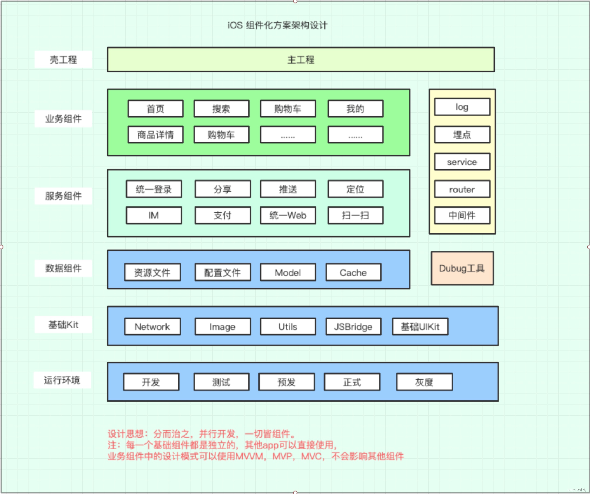

# 组件化方案
https://blog.csdn.net/yezuiqingxin/article/details/126018623
* iOS应用架构谈
https://casatwy.com/iosying-yong-jia-gou-tan-kai-pian.html
* 软件架构入门
http://www.ruanyifeng.com/blog/2016/09/software-architecture.html
## App主要工作
* 调用网络API（如何让业务开发工程师方便安全地调用网络API？然后尽可能保证用户在各种网络环境下都能有良好的体验？）
* 页面展示（页面如何组织，才能尽可能降低业务方代码的耦合度？尽可能降低业务方开发界面的复杂度，提高他们的效率？）
* 数据的本地持久化（当数据有在本地存取的需求的时候，如何能够保证数据在本地的合理安排？如何尽可能地减小性能消耗？）
* 动态部署方案（iOS应用有审核周期，如何能够通过不发版本的方式展示新的内容给用户？如何修复紧急bug？）
## 程序员工作
* 收集用户数据，给产品和运营提供参考
* 合理地组织各业务方开发的业务模块，以及相关基础模块
* 每日app的自动打包，提供给QA工程师的测试工具
## 问题
1. 网络层设计方案？设计网络层时要考虑哪些问题？对网络层做优化的时候，可以从哪些地方入手？
2. 页面的展示、调用和组织都有哪些设计方案？我们做这些方案的时候都要考虑哪些问题？
3. 本地持久化层的设计方案都有哪些？优劣势都是什么？不同方案间要注意的问题分别都是什么？
4. 要实现动态部署，都有哪些方案？不同方案之间的优劣点，他们的侧重点？
## 理念
组件解耦并不是说要求每个组件间都没有耦合，组件间也需要有上下层依赖的关系。组件间的上下层关系划分清楚了，就会容易维护和管理。而对于组件间如何分层这个问题，我认为层级最多不要超过三个，你可以这么设置：
* 底层可以是与业务无关的基础组件，比如网络和存储等；
* 中间层一般是通用的业务组件，比如账号、埋点、支付、购物车等；
* 最上层是迭代业务组件，更新频率最高。
## 团队分工
合理的团队结构应该是这样的：
* 首先，需要一个专门的基建团队，负责业务无关的基础功能组件和业务相关通用业务组件的开发。
* 然后，每个业务都由一个专门的团队来负责开发。业务可以按照功能耦合度来划分，耦合度高的业务可以划分成单独的业务团队。
* 基建团队人员应该是流动的，从业务团队里来，再回到业务团队中去。这么设计是因为业务团队和基建团队的边界不应该非常明显，否则就会出现基建团队埋头苦干，结果可能是做得过多、做得不够，或着功能不好用的问题，造成严重的资源浪费。
## 常⽤的三种方案
* URL Scheme
* Target - Action
* Protocol - Class 匹配
## URL Scheme路由
* 使 URL 处理本地的跳转
* 通过中间层进⾏注册 & 调⽤ （load方法里把被调用者注册到中间层）
* 注册表⽆需使用反射
* 非懒加载 / 注册表的维护 / 参数
### URL Scheme路由示例 
```
//MTMediator.h
typedef void(^MTMediatorProcessBlock)(NSDictionary *params);
 
+ (void)registerScheme:(NSString *)scheme processBlock:(MTMediatorProcessBlock)processBlock;
 
+ (void)openUrl:(NSString *)url params:(NSDictionary *)params;
 
//MTMediator.m
+ (NSMutableDictionary *)mediatorCache {
    static NSMutableDictionary *cacheScheme;
    static dispatch_once_t onceToken;
    dispatch_once(&onceToken, ^{
        cacheScheme = @{}.mutableCopy;
    });
 
    return cacheScheme;
}
 
+ (void)registerScheme:(NSString *)scheme processBlock:(MTMediatorProcessBlock)processBlock {
    if (scheme.length > 0 && processBlock) {
        [[[self class] mediatorCache] setObject:processBlock forKey:scheme];
    }
}
 
+ (void)openUrl:(NSString *)url params:(NSDictionary *)params {
    MTMediatorProcessBlock block = [[[self class] mediatorCache] objectForKey:url];
    if (block) {
        block(params);
    }
}
 
//注册
+ (void)load {
    [MTMediator registerScheme:@"detail://" processBlock:^(NSDictionary * _Nonnull params) {
        NSString *url = (NSString *)[params objectForKey:@"url"];
        UINavigationController *navigationController = (UINavigationController *)[params objectForKey:@"controller"];
        MTDetailViewController *controller = [[MTDetailViewController alloc] initWithUrlString:url];
//        controller.title = [NSString stringWithFormat:@"%@", @(indexPath.row)];
        [navigationController pushViewController:controller animated:YES];
    }];
}
 
//调用
//URL Scheme
[MTMediator openUrl:@"detail://" params:@{@"url":item.articleUrl,@"controller":self.navigationController}];
```
* 参考了系统 URL Scheme 机制
* 参数传递通过 dictionary，对调用者不透明 

目前iOS上大部分路由工具都是基于URL 进行匹配的，或者命名约定，通过runtime方法进行动态调用
**优点**
实现简单
**缺点**
需要维护字符串表，依赖于命名约定，无法在编译时暴露出所有问题，需要在运行时才能发现错误。
### MGJRouter
https://github.com/glt3953/MGJRouter
URL路由方式主要是以蘑菇街为代表的的MGJRouter
#### 实现原理
* App启动时实例化各组件模块，然后这些组件向ModuleManager注册Url，有些时候不需要实例化，使用class注册
* 当组件A需要调用组件B时，向ModuleManager传递URL，参数跟随URL以GET方式传递，类似openURL。然后由ModuleManager负责调度组件B，最后完成任务。
```
// 1、注册某个URL
MGJRouter.registerURLPattern("app://home") { (info) in
    print("info: (info)")
}
 
//2、调用路由
MGJRouter.openURL("app://home")
```
#### URL 路由的优点
* 极高的动态性，适合经常开展运营活动的app
* 方便地统一管理多平台的路由规则
* 易于适配URL Scheme，可以下发
#### URl 路由的缺点
* 传参方式有限，并且无法利用编译器进行参数类型检查，因为所有的参数都是通过字符串转换而来
* 只适用于界面模块，不适用于通用模块
* 参数的格式不明确，是个灵活的 dictionary，也需要有个地方可以查参数格式。
* 不支持storyboard
* 依赖于字符串硬编码，难以管理，蘑菇街做了个后台专门管理。
* 无法保证所使用的的模块一定存在
* 解耦能力有限，url 的”注册”、”实现”、”使用”必须用相同的字符规则，一旦任何一方做出修改都会导致其他方的代码失效，并且重构难度大
## Target - Action（中间者架构）
采用中间者统一管理的方式，来控制 App 的整个生命周期中组件间的调用关系。拆分的组件都会依赖于中间者，但是组间之间就不存在相互依赖的关系了。由于其他组件都会依赖于这个中间者，相互间的通信都会通过中间者统一调度，所以组件间的通信也就更容易管理了。在中间者上也能够轻松添加新的设计模式，从而使得架构更容易扩展。
* 抽离业务逻辑
* 通过中间层进行调⽤
* 中间层使⽤ runtime 反射
* 中间层代码优化


### Target - Action示例 
```
//MTMediator.h
#import <UIKit/UIKit.h>
#import <Foundation/Foundation.h>
 
NS_ASSUME_NONNULL_BEGIN
 
@interface MTMediator : NSObject
 
//target action
+ ( __kindof UIViewController *)detailViewControllerWithUrl:(NSString *)detailUrl;
 
@end
 
NS_ASSUME_NONNULL_END
 
//MTMediator.m
#import "MTMediator.h"
 
@implementation MTMediator
 
+ ( __kindof UIViewController *)detailViewControllerWithUrl:(NSString *)detailUrl {
    Class detailVC = NSClassFromString(@"MTDetailViewController");
    UIViewController *controller = [[detailVC alloc] performSelector:NSSelectorFromString(@"initWithUrlString:") withObject:detailUrl];
 
    return controller;
}
 
@end
 
//调用 
//Target - Action
 UIViewController *vc = [MTMediator detailViewControllerWithUrl:item.articleUrl];
 vc.title = @"详情啊";
 [self.navigationController pushViewController:vc animated:YES];
```
* 硬编码方式（直接调用，不利于维护和扩展）
* perform 最多能传递2个参数，可以传入字典避免参数过多
* initWithUrlString:方法必须实现，否则找不到selector会导致崩溃
* 业务逻辑柔合在Mediator中，可以各个模块写各自的MTMediator扩展
### CTMediator
https://github.com/glt3953/CTMediator
原理是通过oc的runtime、category特性动态获取模块，例如通过NSClassFromString获取类并创建实例，通过performSelector + NSInvocation动态调用方法。
#### 实现原理：
* 利用分类为路由添加新接口，在接口中通过字符串获取对应的类
* 通过runtime创建实例，动态调用实例的方法
##### CTMediator使用
```
//******* 1、分类定义新接口
extension CTMediator{
    @objc func A_showHome()->UIViewController?{
 
        //在swift中使用时，需要传入对应项目的target名称，否则会找不到视图控制器
        let params = [
            kCTMediatorParamsKeySwiftTargetModuleName: "CJLBase_Example"
        ]
        //CTMediator提供的performTarget:action:params:shouldCacheTarget:方法 通过传入name，找到对应的targer和action
        if let vc = self.performTarget("A", action: "Extension_HomeViewController", params: params, shouldCacheTarget: false) as? UIViewController{
            return vc
        }
        return nil
    }
}
 
//******* 2、模块提供者提供target-action的调用方式（对外需要加上public关键字）
class Target_A: NSObject {
 
    @objc func Action_Extension_HomeViewController(_ params: [String: Any])->UIViewController{
 
        let home = HomeViewController()
        return home
    }
 
}
 
//******* 3、使用
if let vc = CTMediator.sharedInstance().A_showHome() {
            self.navigationController?.pushViewController(vc, animated: true)
        }
```
模块间的关系：
**模块A——Mediator——target——模块B**
**优点**
* 在功能逻辑和组件划分上做到同层级解耦，上下层依赖清晰，使得上层组件易插拔，下层组件更稳固。
* 中间者的易管控和易扩展性，也使得整体架构能够长期保持稳健与活力。

**缺点**
* 直接硬编码的调用方式，参数是以 string 的方法保存在内存里，虽然和将参数保存在 Text 字段里占用的内存差不多，同时还可以避免.h 文件的耦合，但是其对代码编写效率的降低也比较明显。
* 由于是在运行时才确定的调用方法，调用方式由 [obj method] 变成 [obj performSelector:@""]。这样的话，在调用时就缺少类型检查，是个很大的缺憾。因为，如果方法和参数比较多的时候，代码编写效率就会比较低。
## Protocol - Class
协议式架构设计主要采用的是协议式编程的思路：在编译层面使用协议定义规范，实现可在不同地方，从而达到分布管理和维护组件的目的。这种方式也遵循了依赖反转原则，是一种很好的面向对象编程的实践。
* 增加 Protocol Wrapper层 （中间件先注册Protocol和Class对应关系，将protocol和对应的类进行字典匹配）
* 中间件返回 Protocol 对应的 Class，然后动态创建实例
* 解决硬编码的问题
### Protocol - Class示例
```
//具体的Protocol
//MTMediator.h
@protocol MTDetailViewControllerProtocol <NSObject>
 
+ (__kindof UIViewController *)detailViewControllerWithUrl:(NSString *)detailUrl;
 
@end
 
@interface MTMediator : NSObject
+ (void)registerProtocol:(Protocol *)protocol class:(Class)cls;
+ (Class)classForProtocol:(Protocol *)protocol;
@end
 
//MTMediator.m
+ (void)registerProtocol:(Protocol *)protocol class:(Class)cls {
    if (protocol && cls) {
        [[[self class] mediatorCache] setObject:cls forKey:NSStringFromProtocol(protocol)];
    }
}
 
+ (Class)classForProtocol:(Protocol *)protocol {
    return [[[self class] mediatorCache] objectForKey:NSStringFromProtocol(protocol)];
}

//被调用
//MTDetailViewController.h
@protocol MTDetailViewControllerProtocol;
@interface MTDetailViewController : UIViewController<MTDetailViewControllerProtocol>
@end
 
//MTDetailViewController.m
+ (void)load {
    [MTMediator registerProtocol:@protocol(MTDetailViewControllerProtocol) class:[self class]];
}
 
#pragma mark - MTDetailViewControllerProtocol
+ ( __kindof UIViewController *)detailViewControllerWithUrl:(NSString *)detailUrl {
    return [[MTDetailViewController alloc] initWithUrlString:detailUrl];
}
 
//调用
Class cls = [MTMediator classForProtocol: @protocol(MTDetailViewControllerProtocol)];
if ([cls respondsToSelector: @selector(detailViewControllerWithUrl:)]) {
        [self.navigationController pushViewController:[cls detailViewControllerWithUrl:item.articleUrl] animated:YES];
}
```
* 被调用者先在中间件注册Protocol和Class对应关系，对外只暴露Protocol
### BeeHive
protocol比较典型的三方框架就是阿里的BeeHive。BeeHive借鉴了Spring Service、Apache DSO的架构理念，采用AOP+扩展App生命周期API形式，将业务功能、基础功能模块以模块方式以解决大型应用中的复杂问题，并让模块之间以Service形式调用，将复杂问题切分，以AOP方式模块化服务。
#### BeeHive 核心思想
* 各个模块间调用从直接调用对应模块，变成调用Service的形式，避免了直接依赖。
* App生命周期的分发，将耦合在AppDelegate中逻辑拆分，每个模块以微应用的形式独立存在。

示例如下:
```
//******** 1、注册
[[BeeHive shareInstance] registerService:@protocol(HomeServiceProtocol) service:[BHViewController class]];
 
//******** 2、使用
#import "BHService.h"
id< HomeServiceProtocol > homeVc = [[BeeHive shareInstance] createService:@protocol(HomeServiceProtocol)];
```
**优点**
* 利用接口调用，实现了参数传递时的类型安全
* 直接使用模块的protocol接口，无需再重复封装

**缺点**
* 用框架来创建所有对象，创建方式不同，即不支持外部传入参数。
* 用OC runtime创建对象，不支持swift。
* 只做了protocol 和 class 的匹配，不支持更复杂的创建方式和依赖注入。
* 无法保证所使用的 protocol 一定存在对应的模块，也无法直接判断某个 protocol 是否能用于获取模块。
* 由于协议式编程缺少统一调度层，导致难于集中管理，特别是项目规模变大、团队变多的情况下，架构管控就会显得越来越重要。
* 协议式编程接口定义模式过于规范，从而使得架构的灵活性不够高。当需要引入一个新的设计模式来开发时，我们就会发现很难融入到当前架构中，缺乏架构的统一性。

**建议：URL Scheme - handler 配合 Protocol - Class 使用**
## iOS组件化方案架构设计图

