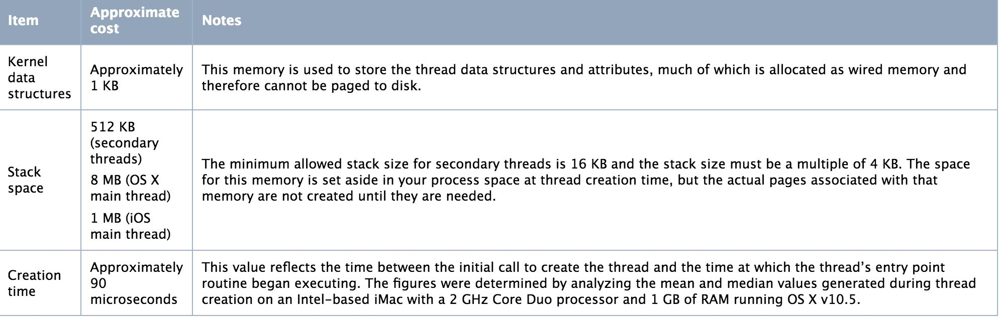

# 计算机基础
## 线程
### 线程创建实际的开销在内存方面是有多大？
https://developer.apple.com/library/archive/documentation/Cocoa/Conceptual/Multithreading/CreatingThreads/CreatingThreads.html

### 多线程的适用场景，为啥要用多线程呢？
#### 多线程的使用场景
1、 常见的浏览器、Web服务(现在写的web是中间件帮你完成了线程的控制)，web处理请求，各种专用服务器(如游戏服务器)
2、 servlet多线程
3、 FTP下载，多线程操作文件
4、 数据库用到的多线程
5、 分布式计算
6、 tomcat，tomcat内部采用多线程，上百个客户端访问同一个WEB应用，tomcat接入后就是把后续的处理扔给一个新的线程来处理，这个新的线程最后调用我们的servlet程序，比如doGet或者dpPost方法
7、 后台任务：如定时向大量(100W以上)的用户发送邮件；定期更新配置文件、任务调度(如quartz)，一些监控用于定期信息采集
8、 自动作业处理：比如定期备份日志、定期备份数据库
9、 异步处理：如发微博、记录日志
10、 页面异步处理：比如大批量数据的核对工作(有10万个手机号码，核对哪些是已有用户)
11、 数据库的数据分析(待分析的数据太多)，数据迁移
12、 多步骤的任务处理，可根据步骤特征选用不同个数和特征的线程来协作处理，多任务的分割，由一个主线程分割给多个线程完成
13、 desktop应用开发，一个费时的计算开个线程，前台加个进度条显示
14、 swing编程
#### 为什么用多线程
1、避免阻塞异步调用
2、避免CPU空转
3、提升性能
### 说出几种锁，介绍其区别
#### 互斥锁
互斥锁用于控制多个线程对他们之间共享资源互斥访问的一个信号量。也就是说是为了避免多个线程在某一时刻同时操作一个共享资源。
在某一时刻，只有一个线程可以获取互斥锁，在释放互斥锁之前其他线程都不能获取该互斥锁。如果其他线程想要获取这个互斥锁，那么这个线程只能以阻塞方式进行等待。
#### 条件锁
条件锁就是所谓的条件变量，某一个线程因为某个条件为满足时可以使用条件变量使改程序处于阻塞状态。一旦条件满足以“信号量”的方式唤醒一个因为该条件而被阻塞的线程。最为常见就是在线程池中，起初没有任务时任务队列为空，此时线程池中的线程因为“任务队列为空”这个条件处于阻塞状态。一旦有任务进来，就会以信号量的方式唤醒一个线程来处理这个任务。
#### 读写锁
计算机中某些数据被多个进程共享，对数据库的操作有两种：一种是读操作，就是从数据库中读取数据不会修改数据库中内容；另一种就是写操作，写操作会修改数据库中存放的数据。因此可以得到我们允许在数据库上同时执行多个“读”操作，但是某一时刻只能在数据库上有一个“写”操作来更新数据。这就是一个简单的读者-写者模型。
**读写锁里，读锁能允许多个线程同时去读，但是写锁在同一时刻只允许一个线程去写**。
#### 空转锁
这个锁其实非常**适合临界区非常短的场合，或者实时性要求比较高的场合。**
## 编译器
编译器的实现流程
GCC和LLVM的区别
## 网络
UDP实现可靠传输是如何实现的
介绍TCP协议
IPv4 和 IPv6 的校验和算法有什么区别？
TCP 有一个会添加 MD5 校验和到包中的扩展。该扩展什么时候起作用？
TCP 最小的端口号是多少?
描述TCP建立连接的三次握手过程？如果最后一次握手失败会怎样处理？
## 内存
### 内存中的栈和堆的区别是什么？那些数据在栈上，哪些在堆上？
栈由操作系统自动分配释放 ，用于存放函数的参数值、局部变量等，其操作方式类似于数据结构中的栈。
其中函数中定义的局部变量按照先后定义的顺序依次压入栈中，也就是说相邻变量的地址之间不会存在其它变量。栈的内存地址生长方向与堆相反，由高到底，所以后定义的变量地址低于先定义的变量。栈中存储的数据的生命周期随着函数的执行完成而结束。
堆由开发人员分配和释放， 若开发人员不释放，程序结束时由 OS 回收，分配方式类似于链表。
堆与栈实际上是操作系统对进程占用的内存空间的两种管理方式，主要有如下几种区别：
（1）管理方式不同。栈由操作系统自动分配释放，无需我们手动控制；堆的申请和释放工作由程序员控制，容易产生内存泄漏；
（2）空间大小不同。每个进程拥有的栈大小要远远小于堆大小。理论上，进程可申请的堆大小为虚拟内存大小，进程栈的大小 64bits 的 Windows 默认 1MB，64bits 的 Linux 默认 10MB；
（3）生长方向不同。堆的生长方向向上，内存地址由低到高；栈的生长方向向下，内存地址由高到低。
（4）分配方式不同。堆都是动态分配的，没有静态分配的堆。栈有 2 种分配方式：静态分配和动态分配。静态分配是由操作系统完成的，比如局部变量的分配。动态分配由alloc()函数分配，但是栈的动态分配和堆是不同的，它的动态分配是由操作系统进行释放，无需我们手工实现。
（5）分配效率不同。栈由操作系统自动分配，会在硬件层级对栈提供支持：分配专门的寄存器存放栈的地址，压栈出栈都有专门的指令执行，这就决定了栈的效率比较高。堆则是由C/C++提供的库函数或运算符来完成申请与管理，实现机制较为复杂，频繁的内存申请容易产生内存碎片。显然，堆的效率比栈要低得多。
### 设计一种内存管理算法。
## 存储
key/value存储，有什么优缺点，什么场景下用
## 数据结构
数组，链表，哈希表，二叉树的区别？数组索引和查找方便。链表插入和删除方便，链表一般运用在堆栈（后进先出）和队列中（先进先出），哈希表方便查找，插入和删除。二叉树方便查找和排序
链表的插入是O(1)还是O(n)？是O(1)
写个反转二叉树的代码？递归左右子树交换
求二叉树相距最远的两个叶子节点？
## 基础算法题
如何以最快时间找到与给定点最近的点算法
写个 aabbbccaabddeffcc 化为abcdef
0(1)时间求栈中最大元素的算法
什么是贪婪算法
背包容量150，7个物品，每个物品重量价值不同，要求装入包中物品价值最大。
n个人预约网球场，时间不同，求最少需要多少个网球场。
亿级数据里查找相同的字符以及出现次数
设计一种算法求出算法复杂度
两个字符串的最大公共子串