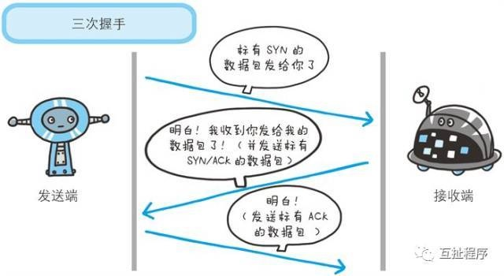

# 计算机基础
## 线程
### 线程创建实际的开销在内存方面是有多大？
https://developer.apple.com/library/archive/documentation/Cocoa/Conceptual/Multithreading/CreatingThreads/CreatingThreads.html

### 多线程的适用场景，为啥要用多线程呢？
#### 多线程的使用场景
1、 常见的浏览器、Web服务(现在写的web是中间件帮你完成了线程的控制)，web处理请求，各种专用服务器(如游戏服务器)
2、 servlet多线程
3、 FTP下载，多线程操作文件
4、 数据库用到的多线程
5、 分布式计算
6、 tomcat，tomcat内部采用多线程，上百个客户端访问同一个WEB应用，tomcat接入后就是把后续的处理扔给一个新的线程来处理，这个新的线程最后调用我们的servlet程序，比如doGet或者dpPost方法
7、 后台任务：如定时向大量(100W以上)的用户发送邮件；定期更新配置文件、任务调度(如quartz)，一些监控用于定期信息采集
8、 自动作业处理：比如定期备份日志、定期备份数据库
9、 异步处理：如发微博、记录日志
10、 页面异步处理：比如大批量数据的核对工作(有10万个手机号码，核对哪些是已有用户)
11、 数据库的数据分析(待分析的数据太多)，数据迁移
12、 多步骤的任务处理，可根据步骤特征选用不同个数和特征的线程来协作处理，多任务的分割，由一个主线程分割给多个线程完成
13、 desktop应用开发，一个费时的计算开个线程，前台加个进度条显示
14、 swing编程
#### 为什么用多线程
1、避免阻塞异步调用
2、避免CPU空转
3、提升性能
### 说出几种锁，介绍其区别
#### 互斥锁
互斥锁用于控制多个线程对他们之间共享资源互斥访问的一个信号量。也就是说是为了避免多个线程在某一时刻同时操作一个共享资源。
在某一时刻，只有一个线程可以获取互斥锁，在释放互斥锁之前其他线程都不能获取该互斥锁。如果其他线程想要获取这个互斥锁，那么这个线程只能以阻塞方式进行等待。
#### 条件锁
条件锁就是所谓的条件变量，某一个线程因为某个条件为满足时可以使用条件变量使改程序处于阻塞状态。一旦条件满足以“信号量”的方式唤醒一个因为该条件而被阻塞的线程。最为常见就是在线程池中，起初没有任务时任务队列为空，此时线程池中的线程因为“任务队列为空”这个条件处于阻塞状态。一旦有任务进来，就会以信号量的方式唤醒一个线程来处理这个任务。
#### 读写锁
计算机中某些数据被多个进程共享，对数据库的操作有两种：一种是读操作，就是从数据库中读取数据不会修改数据库中内容；另一种就是写操作，写操作会修改数据库中存放的数据。因此可以得到我们允许在数据库上同时执行多个“读”操作，但是某一时刻只能在数据库上有一个“写”操作来更新数据。这就是一个简单的读者-写者模型。
**读写锁里，读锁能允许多个线程同时去读，但是写锁在同一时刻只允许一个线程去写**。
#### 空转锁
这个锁其实非常**适合临界区非常短的场合，或者实时性要求比较高的场合。**
## 编译器
### 编译器的实现流程
**源程序(source code)→预处理器(preprocessor)→编译器(compiler)→汇编程序(assembler)→目标程序(object code)→连接器(链接器，Linker)→可执行程序(executables)**
虽然我们称gcc是C语言的编译器，但使用gcc由C语言源代码文件生成可执行文件的过程不仅仅是编译的过程，而是要经历四个相互关联的步骤∶
* 1.预处理(也称预编译，Preprocessing):命令gcc首先调用cpp进行预处理，在预处理过程中，对源代码文件中的文件包含(include)、预编译语句(如宏定义define等)进行分析。
* 2.编译(Compilation):接着调用cc1进行编译，这个阶段根据输入文件生成以.o为后缀的目标文件。
* 3.汇编(Assembly):汇编过程是针对汇编语言的步骤，调用as进行工作，一般来讲，.S为后缀的汇编语言源代码文件、.s为后缀的汇编语言文件经过预编译和汇编之后都生成以.o为后缀的目标文件。
* 4.链接(Linking):当所有的目标文件都生成之后，gcc就调用ld来完成最后的关键性工作，这个阶段就是连接。在连接阶段，所有的目标文件被安排在可执行程序中的恰当的位置，同时，该程序所调用到的库函数也从各自所在的档案库中连到合适的地方。
### GCC和LLVM的区别
传统编译器的工作原理基本上都是三段式的，可以分为**前端（Frontend）、优化器（Optimizer）、后端（Backend）**。前端负责解析源代码，检查语法错误，并将其翻译为抽象的语法树（Abstract Syntax Tree）。优化器对这一中间代码进行优化，试图使代码更高效。后端则负责将优化器优化后的中间代码转换为目标机器的代码，这一过程后端会最大化的利用目标机器的特殊指令，以提高代码的性能。
#### GCC
随着开源运动的兴起，自由软件基金会开发了自己的**开源免费的C语言编译器GNU C Compiler，简称GCC**。GCC中提供了C Preprocessor这个C语言的预处理器，简称CPP。后来GCC又加入了对C++等其它语言的支持，所以他的名字也改为GNU Compiler Collection。G++则是专门用来处理C++语言的。在GNU的官方手册中，有一个章节叫做G++ and GCC介绍了这二者的区别。G++是GCC编译器集合的一个前端。关于前端、后端的概念下面有更详细的介绍。而GPP呢，这个名字比较特殊，如果你用的是Linux系统，可能并没有这个命令。但是在某些特殊的系统下，例如DOS，是无法创建G++这样带有特殊符号的文件名的。所以按照DJGPP编译器的做法，GPP其实就是G++。
#### LLVM
LLVM最初是**Low Level Virtual Machine**的缩写，定位是一个虚拟机，但是是比较底层的虚拟机。它的出现正是为了解决编译器代码重用的问题，LLVM一上来就站在比较高的角度，制定了LLVM IR这一中间代码表示语言。LLVM IR充分考虑了各种应用场景，例如在IDE中调用LLVM进行实时的代码语法检查，对静态语言、动态语言的编译、优化等。
LLVM与GCC在三段式架构上并没有本质区别。LLVM与其它编译器最大的差别是，它不仅仅是Compiler Collection，也是Libraries Collection。举个例子，假如说我要写一个XYZ语言的优化器，我自己实现了PassXYZ算法，用以处理XYZ语言与其它语言差别最大的地方。而LLVM优化器提供的PassA和PassB算法则提供了XYZ语言与其它语言共性的优化算法。那么我可以选择XYZ优化器在链接的时候把LLVM提供的算法链接进来。LLVM不仅仅是编译器，也是一个SDK。
#### Apple LLVM compiler 4.2和LLVM GCC 4.2
现在我们可以回答本文最前面我遇到的那个问题了。Apple LLVM compiler 4.2是一个真正的LLVM编译器，前端使用的是Clang，基于最新的LLVM 3.2编译的。LLVM GCC 4.2编译器的核心仍然是LLVM，但是前端使用的是GCC 4.2编译器。从LLVM的下载页面（ https://releases.llvm.org/download.html ）可以看出，LLVM从1.0到2.5使用的都是GCC作为前端，直到2.6开始才提供了Clang前端。
## 网络
### UDP实现可靠传输是如何实现的
UDP不属于连接协议，具有资源消耗少，处理速度快的优点。传输层无法保证数据的可靠传输，只能通过应用层来实现了。实现的方式可以参照TCP可靠性传输的方式，只是实现不在传输层，实现转移到了应用层。
最简单的方式是在应用层模仿传输层TCP的可靠性传输。下面不考虑拥塞处理，可靠UDP的简单设计。
* 1、添加seq/ack机制，确保数据发送到对端
* 2、添加发送和接收缓冲区，主要是用户超时重传。
* 3、添加超时重传机制。

详细说明：送端发送数据时，生成一个随机seq=x，然后每一片按照数据大小分配seq。数据到达接收端后接收端放入缓存，并发送一个ack=x的包，表示对方已经收到了数据。发送端收到了ack包后，删除缓冲区对应的数据。时间到后，定时任务检查是否需要重传数据。
介绍三种使用UDP进行可靠数据传输的协议：
* RUDP（Reliable User Datagram Protocol）
可靠用户数据报协议（RUDP）是一种基于可靠数据协议（RDP： RFC908 和 1151 （第二版））的简单分组传输协议。作为一个可靠传输协议，RUDP 用于传输 IP 网络间的电话信号。它允许独立配置每个连接属性，这样在不同的平台可以同时实施不同传输需求下的协议。
RUDP 提供一组数据服务质量增强机制，如拥塞控制的改进、重发机制及淡化服务器算法等，从而在包丢失和网络拥塞的情况下， RTP 客户机（实时位置）面前呈现的就是一个高质量的 RTP 流。在不干扰协议的实时特性的同时，可靠 UDP 的拥塞控制机制允许 TCP 方式下的流控制行为。
为了与网络 TCP 通信量同时工作，  RUDP 使用类似于 TCP 的重发机制和拥塞控制算法。
* RTP（Real Time Protocol）
实时协议被用来为应用程序如音频，视频等的实时数据的传输提供端到端（end to end）的网络传输功能。传输的模型可以是单点传送或是多点传送。数据传输被一个姐妹协议——实时控制协议（RTCP）来监控，后者允许在一个大的多点传送网络上监视数据传送，并且提供最小限度的控制和识别功能。
TCP不能支持像交互视频，会议等的实时服务，这一原因是由于TCP只是一个“慢”协议，需要三次握手。就此在IP层上UDP是一个比TCP更好的选择。但是UDP是本质上是一个不可靠协议，不支持在包丢情况下的重传机制。诚然，UDP有一些特性，比如多路复用跟校验和服务，这些都是对实时服务很有利的。为了消除UDP的缺点，RTP是作为应用层而被提出来的。
RTP提供的各种服务包括有效负载识别，序列编号，时间戳和投递监听。
* UDT（UDP-based Data Transfer Protocol）
基于UDP的数据传输协议（UDP-basedData Transfer Protocol，简称UDT）是一种互联网数据传输协议。UDT的主要目的是支持高速广域网上的海量数据传输，而互联网上的标准数据传输协议TCP在高带宽长距离网络上性能很差。顾名思义，UDT建于UDP之上，并引入新的拥塞控制和数据可靠性控制机制。UDT是面向连接的双向的应用层协议。它同时支持可靠的数据流传输和部分可靠的数据报传输。由于UDT完全在UDP上实现，它也可以应用在除了高速数据传输之外的其它应用领域，例如点到点技术（P2P），防火墙穿透，多媒体数据传输等等。
### 介绍TCP协议
传输控制协议（TCP，Transmission Control Protocol）是**一种面向连接的、可靠的、基于字节流的传输层通信协议**，由IETF的RFC 793定义。

TCP旨在适应支持多网络应用的分层协议层次结构。连接到不同但互连的计算机通信网络的主计算机中的成对进程之间依靠TCP提供可靠的通信服务。TCP假设它可以从较低级别的协议获得简单的，可能不可靠的数据报服务。原则上，TCP应该能够在从硬线连接到分组交换或电路交换网络的各种通信系统之上操作。
TCP是一种面向连接、可靠的、基于字节流的传输层通信协议，在因特网协议族中，TCP是位于IP层之上，应用层之下的中间层，不同主机的应用层之间经常要可靠的，像管道一样的连接，但是IP层不提供这样的流机制，而是提供了不可靠的包交换。
应用层向TCP层发送用于网间传输的，用8位字节表述的数据流，然后TCP把数据流区分成适当长度的报文段，之后把结果传给IP层，由他来通过网络将包传送给接收端实体的TCP层。TCP为了保证包发送丢包，就给每个包一个序号，同样序号也保证了传送到接受实体的包的是按照序号接受了，然后接收端实体对已成功收到的包发回一个相应的确认（ACK），如果发送端实体在合理的往返时延内未收到确认，那么对应的数据包就被假设为已丢失，将会被进行重新传送。TCP用一个校验和函数来检查数据是否有错误，在发送和接受时都要计算校验和。
* 在数据准确性和合法性上，TCP用一个校验和函数来检验数据是否有错误，在发送和接受端都要计算校验和，同时可以使用MD5认证对数据加密。
* 在保证可靠性上，采用了超时重传和捎带确认机制。
* 在流量控制上，采用滑动窗口的协议，在协议中规定，对于窗口内未经确认的分组需要重传。
* 在拥塞控制上，采用了TCP拥塞控制算法，该算法有三个部分：加性增、乘性减；启动慢；对超时事件做出反应。
#### 首部格式

TCP的首部格式图上图所示:

Source Port是源端口，16位。

Destination Port是目的端口，16位。

Sequence Number是发送数据包中的第一个字节的序列号，32位。

Acknowledgment Number是确认序列号，32位。

Data Offset是数据偏移，4位，该字段的值是TCP首部（包括选项）长度除以4。

标志位： 6位，URG表示Urgent Pointer字段有意义：
ACK表示Acknowledgment Number字段有意义
PSH表示Push功能，RST表示复位TCP连接
SYN表示SYN报文（在建立TCP连接的时候使用）
FIN表示没有数据需要发送了（在关闭TCP连接的时候使用）
Window表示接收缓冲区的空闲空间，16位，用来告诉TCP连接对端自己能够接收的最大数据长度。
---Checksum是校验和，16位。
---Urgent Pointers是紧急指针，16位，只有URG标志位被设置时该字段才有意义，表示紧急数据相对序列号（Sequence Number字段的值）的偏移。
#### 连接建立
**TCP采用三次握手协议来建立连接，当主动方发出SYN连接请求后，等待对方回答SYN+ACK，并最终对对方的SYN执行ACK确认**，这种建立建立的方法可有效防止产生错误的连接，三次握手的过程如下：

* 客户端发送SYN报文给服务器，进入SYN_SEND状态。
* 服务器收到SYN报文，回应一个SYN（SEQ=y）ACK（ACK=x+1）报文，进入SYN_RECV状态。
* 客户端收到服务器的SYN报文，回应一个ACK（ACK=y+1）报文，进入Established状态。

三次握手完成，TCP客户端和服务器段就可以成功的建立连接了，就可以开始传输数据了。
#### 连接终止
建立一个连接需要三次握手，而**终止一个连接需要经过4次挥手，这是由于TCP的半关闭（half-close）造成的**，具体过程如下 ：

* 某个应用进程首先调用close，称该端执行主动关闭，该端的TCP于是发送一个FIN分节，表示数据发送完毕。
* 接受到这个FIN的对端执行被动关闭，这个FIN由TCP确认。
* 一段时间之后，接受到这个文件结束符的应用进程将调用close关闭它的套接字，这导致了他的TCP也发送了一个FIN。
* 接到这个FIN的元发送端TCP确认这个FIN。
#### 可靠性
TCP提供一种面向连接的。可靠的字节流服务，面向连接以为着两个使用TCP的应用在彼此交换数据包之前必须建立一个TCP连接。**在一个TCP连接中，仅有两方进行彼此通信，广播和多播是不能用于TCP的**。TCP有如下方式来保证可靠性：
* 应用数据被分割成TCP认为最合适发送的数据块。有TCP传递给IP的信息称为报文段或者段（segment）。
* 当TCP发送一个段后，它启动一个定时器，等待目的端确认收到这个报文段。如果不能及时收到这个确认，将重发这个报文段。当TCP收到发自TCP连接另一端的数据，它将发送一个确认，TCP有延迟确认的功能。
* TCP将保持它首部和数据的检验和，这是一个端到端的检验和，目的是检测数据在传输过程中的任何变化，如果收到段的检验和有差错，TCP将丢弃这个报文段和不确认收到此报文。
* 既然TCP报文段作为IP数据报来传输，而IP数据报的到达可能会失序，因此TCP报文段到达也可能失序，如果必要，TCP将对收到的数据进行重新排序，将收到的数据以正确的顺序交给应用层。
* IP数据报会发生重复，TCP的接收端必须丢弃重复的数据。
* TCP还能提供流量控制，TCP连接的每一方都有固定大小的缓冲空间。
* 重传策略
* 窗口确认
### IPv4 和 IPv6 的校验和算法有什么区别？
#### 什么是IPv6？
IPv6是英文“Internet Protocol Version 6”（互联网协议第6版）的缩写，是用于替代IPv4的下一代IP协议，也就是下一代互联网的协议。
IPv6的使用，不仅能解决网络地址资源数量的问题，而且也解决了多种接入设备连入互联网的障碍。其128位地址格式将以其在IP地址数量、安全性、移动性、服务质量等方面的巨大优势，改变现代信息生活。
互联网数字分配机构（IANA）在2016年已向国际互联网工程任务组（IETF）提出建议，要求新制定的国际互联网标准只支持IPv6，不再兼容IPv4。
#### IPv6和IPv4的区别
IP地址（IPV4）由32位正整数来表示，IP地址在计算机中是以二进制的方式处理，但为了方便记忆采用点十进制的标记方式（8位为一组，分四组，每一组都转换为十进制）如下：

与IPv4相比IPv6采用128位的地址，而IPv4使用的是32位。因此新增的地址空间支持2^128 个地址，具体数量为340,282,366,920,938,463,463,374,607,431,768,211,456个有人说IPv6的地址数可能比全世界的沙子还要多，足以解决目前IPv4地址量不足的问题。IPv6二进位制下为128位长度，以16位为一组，每组以冒号“:”隔开，可以分为8组：

IPv6文本格式为
xxxx:xxxx:xxxx:xxxx:xxxx:xxxx:xxxx:xxxx，其中每个 x 都是十六进制数，表示 4 位。例如：
2001:0db8:86a3:08d3:1319:8a2e:0370:7344
#### IPv6有哪些优点呢？
* 1.更大的地址空间
上面我们也反复提到了IPv6与IPv4相比拥有大得多的地址空间，可以满足现在所有用户以及未来物联网、工业互联网等新技术领域的需求。
* 2.更高效的路由
IPv6聚集减少了路由表条数，分层使路由更加高效。在IPv6网络中，数据包分片是由源节点而不是中间路由器来处理，提升了IPv6转发效率。
* 3.更高效的数据包处理
与IPv4相比，IPv6不 包含IP级别的校验和，因此不需要在每个路由器跃点都重新计算校验和。
* 4.更高的安全性能
与IPv4相比，IPv6不 包含IP级别的校验和，因此不需要在每个路由器跃点都重新计算校验和。
#### IPv6技术特性
IPv6 在解决了 IPv4 的地址匮乏问题的同时，还在许多方面实现了优化改进，主要包括以下五点：
* 第一，IPv6 具有层次化的编址方式，地址分配遵循聚类（Aggregation）的原则，同时通过使用更小的路由表，使得路由器能在路由表中用一条记录（Entry）表示一片子网，大大减小了路由器中路由表的长度，有利于骨干网路由器对数据包的快速转发有效提高转发速度。
* 第 二，IPv6 增 强 了 组 播 支 持 以 及 对 流 的控制能力，为多媒体应用和服务质量（QoS，Quality of Service） 控 制 提 供 了 更 好 的 网 络 平台。
* 第三，IPv6 同时定义了更灵活的地址配置机制：**无状态和有状态地址自动配置机制**。
* 第四，IPv6 简化了数据包报头，减少处理器开销并节省网络带宽。这就使得路由器在处理 IPv6 报头时更为高效。此外，IPv6 使用新的头部格式，其选项与基本头部分开，如果新的技术或应用需要，可将选项插入到基本头部与上层数据之间，这在简化路由处理过程中保证了协议的可扩展性。
* 第五，IPv6 拥有基于海量地址空间下的即插即用优势，可更便捷地支持移动性，并可更方便地支持快速、层次、代理以及分布式等多种模式下的移动性管理。
### TCP 有一个会添加 MD5 校验和到包中的扩展。该扩展什么时候起作用？
TCP用一个校验和函数来检查数据是否有错误，在发送和接受时都要计算校验和。
* 在数据准确性和合法性上，TCP用一个校验和函数来检验数据是否有错误，在发送和接受端都要计算校验和，同时可以使用MD5认证对数据加密。
* 在保证可靠性上，采用了超时重传和捎带确认机制。
* 在流量控制上，采用滑动窗口的协议，在协议中规定，对于窗口内未经确认的分组需要重传。
* 在拥塞控制上，采用了TCP拥塞控制算法，该算法有三个部分：**加性增、乘性减；启动慢；对超时事件做出反应。**
### TCP 最小的端口号是多少?
TCP端口是一组16位数字，其中**范围从0到65535**。它们用于确定特定的计算机上的服务，例如FTP（文件传输协议），HTTP（超文本传输协议），SMTP（简单邮件传输协议）等。每个协议都有一个特定的TCP端口，因此当您想要访问特定的服务时，您可以使用正确的端口来连接到该服务。**TCP协议默认端口号是80**，比如IP地址为192.3.4.16而端口号为80，那么得到的套接字为192.3.4.16:80。
### 描述TCP建立连接的三次握手过程？如果最后一次握手失败会怎样处理？
https://www.zhihu.com/question/36495943
HTTP 是基于 TCP 协议的，浏览器最快也要在第三次握手时才能捎带 HTTP 请求报文，达到真正的建立连接，但是这些连接无法复用会导致每次请求都经历三次握手和慢启动。三次握手在高延迟的场景下影响较明显，慢启动则对文件类大请求影响较大。
* 第一次握手：建立连接时，客户端发送syn包（syn=j）到服务器，并进入**SYN_SENT**状态，等待服务器确认；
SYN：同步序列编号（Synchronize Sequence Numbers）。
* 第二次握手：服务器收到syn包，必须确认客户的SYN（ack=j+1），同时自己也发送一个SYN包（syn=k），即SYN+ACK包，此时服务器进入**SYN_RECV**状态；
* 第三次握手：客户端收到服务器的SYN+ACK包，向服务器发送确认包ACK(ack=k+1），此包发送完毕，客户端和服务器进入**ESTABLISHED**（TCP连接成功）状态，完成三次握手。

**完成三次握手，客户端与服务器开始传送数据。**

https://www.zhihu.com/question/36495943
* 当客户端发起的 TCP 第一次握手 SYN 包，在超时时间内没收到服务端的 ACK，就会在超时重传 SYN 数据包，每次超时重传的 RTO 是翻倍上涨的，直到 SYN 包的重传次数到达 tcp_syn_retries 值后，客户端不再发送 SYN 包。
客户端 SYN 包超时重传的最大次数，是由 tcp_syn_retries 决定的，默认值是 5 次。
* 当第二次握手的 SYN、ACK 丢包时，客户端会超时重发 SYN 包，服务端也会超时重传 SYN、ACK 包。
客户端 SYN 包超时重传的最大次数，是由 tcp_syn_retries 决定的，默认值是 5 次；服务端 SYN、ACK 包时重传的最大次数，是由 tcp_synack_retries 决定的，默认值是 5 次。
* 在建立 TCP 连接时，如果第三次握手的 ACK，服务端无法收到，则服务端就会短暂处于 SYN_RECV 状态，而客户端会处于 ESTABLISHED 状态。
由于服务端一直收不到 TCP 第三次握手的 ACK，则会一直重传 SYN、ACK 包，直到重传次数超过 tcp_synack_retries 值（默认值 5 次）后，服务端就会断开 TCP 连接。
而客户端则会有两种情况：
    * 如果客户端没发送数据包，一直处于 ESTABLISHED 状态，然后经过 2 小时 11 分 15 秒才可以发现一个「死亡」连接，于是客户端连接就会断开连接。
    * 如果客户端发送了数据包，一直没有收到服务端对该数据包的确认报文，则会一直重传该数据包，直到重传次数超过 tcp_retries2 值（默认值 15 次）后，客户端就会断开 TCP 连接。
## 内存
### 内存中的栈和堆的区别是什么？那些数据在栈上，哪些在堆上？
**栈由操作系统自动分配释放**，用于存放函数的参数值、局部变量等，其操作方式类似于数据结构中的栈。
其中函数中定义的局部变量按照先后定义的顺序依次压入栈中，也就是说相邻变量的地址之间不会存在其它变量。栈的内存地址生长方向与堆相反，由高到底，所以后定义的变量地址低于先定义的变量。栈中存储的数据的生命周期随着函数的执行完成而结束。
**堆由开发人员分配和释放**，若开发人员不释放，程序结束时由 OS 回收，分配方式类似于链表。
堆与栈实际上是操作系统对进程占用的内存空间的两种管理方式，主要有如下几种区别：
（1）**管理方式不同**。栈由操作系统自动分配释放，无需我们手动控制；堆的申请和释放工作由程序员控制，容易产生内存泄漏；
（2）**空间大小不同**。每个进程拥有的栈大小要远远小于堆大小。理论上，进程可申请的堆大小为虚拟内存大小，进程栈的大小 64bits 的 Windows 默认 1MB，64bits 的 Linux 默认 10MB；
（3）**生长方向不同**。堆的生长方向向上，内存地址由低到高；栈的生长方向向下，内存地址由高到低。
（4）**分配方式不同**。**堆都是动态分配的**，没有静态分配的堆。**栈有2种分配方式：静态分配和动态分配**。静态分配是由操作系统完成的，比如局部变量的分配。动态分配由alloc()函数分配，但是栈的动态分配和堆是不同的，它的动态分配是由操作系统进行释放，无需我们手工实现。
（5）**分配效率不同**。栈由操作系统自动分配，会在硬件层级对栈提供支持：分配专门的寄存器存放栈的地址，压栈出栈都有专门的指令执行，这就决定了栈的效率比较高。堆则是由C/C++提供的库函数或运算符来完成申请与管理，实现机制较为复杂，频繁的内存申请容易产生内存碎片。显然，堆的效率比栈要低得多。
### 设计一种内存管理算法。
## 存储
key/value存储，有什么优缺点，什么场景下用
## 数据结构
数组，链表，哈希表，二叉树的区别？数组索引和查找方便。链表插入和删除方便，链表一般运用在堆栈（后进先出）和队列中（先进先出），哈希表方便查找，插入和删除。二叉树方便查找和排序
链表的插入是O(1)还是O(n)？是O(1)
写个反转二叉树的代码？递归左右子树交换
求二叉树相距最远的两个叶子节点？
## 基础算法题
如何以最快时间找到与给定点最近的点算法
写个 aabbbccaabddeffcc 化为abcdef
0(1)时间求栈中最大元素的算法
什么是贪婪算法
背包容量150，7个物品，每个物品重量价值不同，要求装入包中物品价值最大。
n个人预约网球场，时间不同，求最少需要多少个网球场。
亿级数据里查找相同的字符以及出现次数
设计一种算法求出算法复杂度
两个字符串的最大公共子串