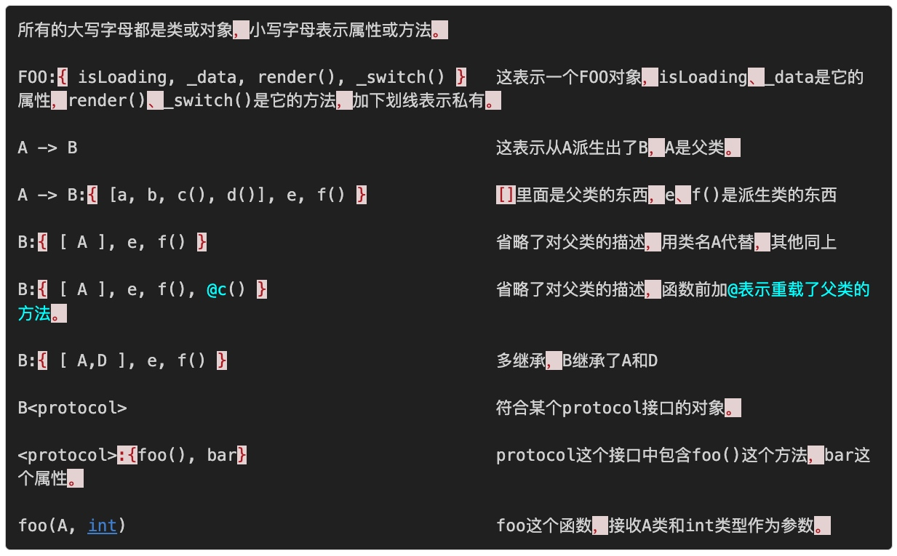
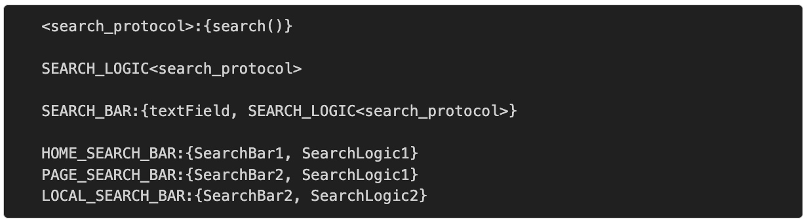
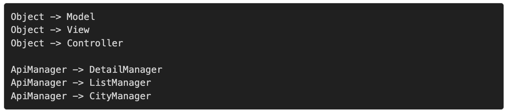
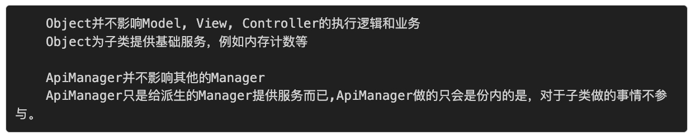
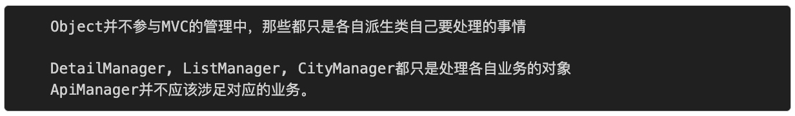
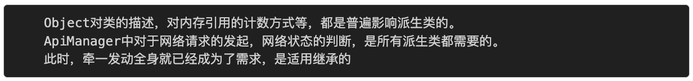

# 跳出面向对象思想
面向对象思想三大支柱：**继承、封装、多态**。

## 继承
https://casatwy.com/tiao-chu-mian-xiang-dui-xiang-si-xiang-yi-ji-cheng.html
继承从代码复用的角度来说，特别好用，也特别容易被滥用和被错用。不恰当地使用继承导致的最大的一个特征就是高耦合。
在这里我要补充一点，耦合是一个特征，虽然大部分情况是缺陷的特征，但是当耦合成为需求的时候，耦合就不是缺陷了。
**继承是紧耦合的一种模式，主要的体现就在于牵一发动全身。**
### 用组合替代继承

搜索框和搜索逻辑分别形成了两个不同的组件，分别在HOME_SEARCH_BAR, PAGE_SEARCH_BAR, LOCAL_SEARCH_BAR中以不同的形态组合而成。 textField和SEARCH_LOGIC<search_protocol>之间通过delegate的模式进行数据交互。 
### 正确的继承方式
父类应当扮演的是底层的角色，子类是上层的业务。

使用继承的3大要点：
* 父类只是给子类提供服务，并不涉及子类的业务逻辑。

* 层级关系明显，功能划分清晰，父类和子类各做各的。

* 父类的所有变化，都需要在子类中体现，也就是说此时耦合已经成为需求。

**万不得已不要用继承，优先考虑组合。**