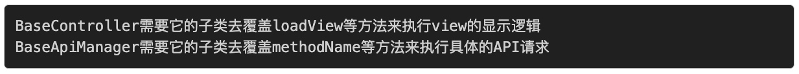
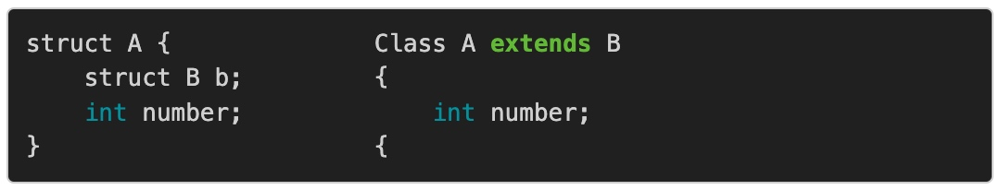

# 跳出面向对象思想
面向对象思想三大支柱：**继承、封装、多态**。

## 继承
https://casatwy.com/tiao-chu-mian-xiang-dui-xiang-si-xiang-yi-ji-cheng.html
继承从代码复用的角度来说，特别好用，也特别容易被滥用和被错用。不恰当地使用继承导致的最大的一个特征就是高耦合。
在这里我要补充一点，耦合是一个特征，虽然大部分情况是缺陷的特征，但是当耦合成为需求的时候，耦合就不是缺陷了。
**继承是紧耦合的一种模式，主要的体现就在于牵一发动全身。**
### 用组合替代继承

搜索框和搜索逻辑分别形成了两个不同的组件，分别在HOME_SEARCH_BAR, PAGE_SEARCH_BAR, LOCAL_SEARCH_BAR中以不同的形态组合而成。 textField和SEARCH_LOGIC<search_protocol>之间通过delegate的模式进行数据交互。 
### 正确的继承方式
父类应当扮演的是底层的角色，子类是上层的业务。

使用继承的3大要点：
* 父类只是给子类提供服务，并不涉及子类的业务逻辑。

* 层级关系明显，功能划分清晰，父类和子类各做各的。

* 父类的所有变化，都需要在子类中体现，也就是说此时耦合已经成为需求。

**万不得已不要用继承，优先考虑组合。**
## 多态
https://casatwy.com/tiao-chu-mian-xiang-dui-xiang-si-xiang-er-duo-tai.html
多态一般都要跟继承结合起来说，其本质是子类通过**覆盖或重载**父类的方法，来使得对同一类对象同一方法的调用产生不同的结果。这里需要辨析的地方在：同一类对象指的是继承层级再上一层的对象，更加泛化。
举个例子：

有些在设计的时候就是用于继承的父类，希望子类覆盖自己的某些方法，然后才能够使程序正常运行下去。

实际采用多态的时候会有下面四种情况（坑）：
* 父类有部分public的方法是不需要，也不允许子类覆盖或重载
避免使得一个对象引入了原本不属于它的业务逻辑
* 父类有一些特别的方法是必须要子类去覆盖或重载的，在父类的方法其实是个空方法
由于逻辑的主要代码在父类中，若要跑完整个逻辑，则需要调用一些特定的方法来基于不同的子类获得不同的数据，这个特定的方法最终交由子类通过覆重来实现。
* 父类有一些方法是可选覆盖或重载的，一旦覆盖或重载，则以子类为准
设计可选覆重的动机其中有一个就是可能要做拦截器，在每个父类方法调用时，先调一个willDoSomething()，然后调用完了再调一个didFinishedSomething()，由子类根据具体情况进行覆重。
* 父类有一些方法即便被覆盖或重载，父类原方法还是要执行的
### 解决方案
面向接口编程（Interface Oriented Programming, IOP）是解决这类问题比较好的一种思路。

* 父类有部分public的方法是不需要，也不允许子类覆重
由于子类必须要遵从<ManagerInterface>，架构师可以跟客户程序员约定**所有的public方法在一般情况下都是不需要覆重的**。除非特殊需要，则可以覆重，其他情况都通过实现接口中定义的方法解决。由于这是接口方法，所以即便引入了原本不需要的逻辑，也能很容易将其剥离。
* 父类有一些特别的方法是必须要子类去覆重的，在父类的方法其实是个空方法
因为引入了child，父类不再需要摆一个空方法在那儿了，直接从child调用即可，因为child是实现了对应接口的，所以可以放心调用。空方法就消灭了。
* 父类有一些方法是可选覆重的，一旦覆重，则以子类为准
我们可以通过在接口中设置哪些方法是必须要实现，哪些方法是可选实现的来处理对应的问题。这本身倒不是缺陷，正是多态希望的样子。
* 父类有一些方法即便被覆重，父类原方法还是要执行的
由于我们通过接口规避了多态，那么这些其实是可以通过在接口中定义可选方法来实现的，由父类方法调用child的可选方法，调用时机就可以由父类决定。这两个方法不必重名，因此也不存在多态时，不能分辨调用时机或是否需要调用父类方法的情况。

通过IOP，我们做好了两件事：
* 将子类与可能被子类引入的不相关逻辑剥离开来，提高了子类的可重用性，降低了迁移时可能的耦合。
* 接口实际上是子类头上的金箍，规范了子类哪些必须实现，哪些可选实现。那些不在接口定义的方法列表里的父类方法，事实上就是不建议覆重的方法。
### 什么时候用多态
假设父类是架构师去设计，子类由客户程序员去实现，那么这个问题实际上是这样的两个问题：
* 作为架构师，我何时要为多态提供接入点？
* 作为客户程序员，我何时要去覆重父类方法？

是否决定应当使用多态的两个要素：
* 如果引入多态之后导致对象角色不够单纯，那就不应当引入多态，如果引入多态之后依旧是单纯角色，那就可以引入多态。
* 如果要覆重的方法是角色业务的其中一个组成部分，例如split()和resort()，那么就最好不要用多态的方案，用IOP，因为在外界调用的时候其实并不需要通过多态来满足定制化的需求。

这是一个角色问题，越单纯的角色就越容易维护。还有一个就是区分被覆重的方法是否需要被外界调用的问题。好了，现在我们回到这一节前面提出的两个问题：**何时引入接入点和何时采用覆重**。
针对第一个问题架构师一定要分清楚角色，在保证角色单纯的情况下可以引入多态。另外一点要考虑被覆重的方法是否需要被外界使用，还是只是父类运行时需要子类通过覆重提供中间数据的。如果是只要子类通过覆重提供中间数据的，一律应当采用IOP而不是多态。
针对第二个问题，在必须要覆重的场合下就采取覆重的方案好了，主要是可覆重可不覆重的情况下，客户程序员主要还是要遵守：
* 覆重的方法本身是跟逻辑密切相关的，不要在覆重方法里做跟这个方法本意不相关的事情
* 如果要覆重一系列的方法，那么就要考虑角色问题和外界是否需要调用的问题，这些方法是不是这个对象的角色应当承担的任务
### 总结
多态在面向对象程序中的应用相当广泛，只要有继承的地方，或多或少都会用到多态。然而多态比起继承来，更容易被不明不白地使用，一切看起来都那么顺其自然。在客户程序员这边，一般是只要多态是可行方案的一种，到最后大部分都会采用多态的方案来解决问题。
然而多态正如它名字中所暗示的，它有非常大的潜在可能引入不属于对象初衷的逻辑，巨大的灵活性也导致客户程序员在面对问题的时候不太愿意采用其他相对更优的方案，比如IOP。在决定是否采用多态时，我们要有一个清晰的角色概念，做好角色细分，不要角色混乱。该是拦截器的，就给他制定一个拦截器接口，由另一个对象（逻辑上的另一个对象，当然也可以是自己）去实现接口里的方法集。不要让一个对象在逻辑上既是拦截器又是业务模块。这样才方便未来的维护。另外也要注意被覆重方法的作用，如果只是单纯为了提供父类所需要的中间数据的，一律都用IOP，这是比直接采用多态更优的方案。
IOP能够带来的好处当然不止文中写到的这些，它在其他场合也有非常好的应用，它最主要的好处就在于分离了定义和实现，并且能够带来更高的灵活性，灵活到既可以对语言过高的自由度有一个限制，也可以灵活到允许同一接口的不同实现能够合理地组合。在架构设计方面是个非常重要的思想。
## 封装
https://casatwy.com/tiao-chu-mian-xiang-dui-xiang-si-xiang-san-feng-zhuang.html
"封装"的概念在面向对象思想中是最基础的概念，它实质上是通过将相关的一堆函数和一堆对象放在一起，对外有函数作为操作通道，对内则以变量作为操作原料。
### 将数据结构和函数放在一起是否真的合理？
函数就是做事情的，它们有输入，有执行逻辑，有输出。 数据结构就是用来表达数据的，要么作为输入，要么作为输出。
两者本质上是属于完全不同的东西，面向对象思想将他们放到一起，使得函数的作用被限制在某一个区域里，这样做虽然能够很好地将操作归类，但是这种归类方法是根据"作用领域"来归类的，在现实世界中可以，但在程序的世界中，有些不妥。
**数据部分就是数据部分，执行部分就是执行部分，不同类的东西放在一起是不合适的。**
函数就是一个执行黑盒，只要满足函数调用的充要条件（给够参数），就是能够确定输出结果的。面向对象思想将函数和数据绑在一起，这样的封装扩大了代码重用时的粒度。如果将函数和数据拆开，代码重用的基本元素就由对象变为了函数，这样才能更灵活更方便地进行代码重用。
嗯，谁都经历过重用对象时，要把这个对象所依赖的所有东西都要移过来，哪怕你想用的只是这个对象里的一个方法，然而很有可能你的这些依赖是跟你所需要的方法无关的。
但如果是函数的话，由于函数自身已经是天然完美封装的了，所以如果你要用到这个函数，那么这个函数所有的依赖你都需要，这才是合理的。
### 是否所有的东西都需要对象化？
在iOS开发中，有一个类叫做NSNumber，它封装了所有数值：double，float，unsigned int, int...等等类型，在使用的时候它弱化了数值的类型，使得非常方便。但问题也来了，计算的时候是不能直接对这个对象做运算的，你得把它们拆成数值，然后进行运算，然后再把结果变成NSNumber对象，然后返回。这是第一点不合理。第二点不合理的地方在于，运算的时候你不知道原始数据的类型是什么，拆箱装箱过程中难免会导致内存的浪费（比如原来uint8_t的数据变成unsigned int），这也十分没有必要。
还有就是我们的file descriptor，它本身是一个资源的标识号，如果将资源抽象成对象，那么不可避免的就会使得这个对象变得非常庞大，资源有非常多的用法，你需要将这些函数都放到对象里去。在真正传递资源的时候，其实我们也只是关心资源标识而已，其它的真的无需关心。
### 类型爆炸
由于数据和函数绑定到了一起，在逻辑上有派生关系的两种对象往往可以当作一种，以派生链最上端的那个对象为准。单纯地看这个现象直觉上会觉得非常棒，父亲有的儿子都有。但在实际工程中，派生是非常不好控制的，它导致同一类类型在工程中泛滥：ViewController、AViewController、BViewController、ThisViewController、ThatViewController...
你有没有发现，一旦把执行和数据拆解开，就不需要这么多ViewController了，派生只是给对象添加属性和方法。但事实上是这样：

前者和后者的相同点是：在内存中，它们的数值部分的布局是一模一样的。不同点是：前者更强烈地表达了组合，后者更强烈地表达的是继承。然而我们都知道一个常识：组合要比继承更加合适。
### 总结
为什么面向对象会如此流行？我想了一下业界关于这个谈论的最多的是以下几点：
* 它能够非常好地进行代码复用
* 它能够非常方便地应对复杂代码
* 在进行程序设计时，面向对象更加符合程序员的直觉

第一点在理论上确实成立，但实际上大家都懂，在面向对象的大背景下，写一段便于复用的代码比面向过程背景下难多了。关于第二点，你不觉得正是面向对象，才把工程变复杂的么？如果层次清晰，调用规范，无论面向对象还是面向过程，处理复杂业务都是一样好，等真的到了非常复杂的时候，对象间错综复杂的关系只会让你处理起来更加头疼，不如面向过程来得简洁。关于第三点，这其实是一个障眼法，因为无论面向什么的设计，最终落实下来，还是要面向过程的，面向对象只是在处理调用关系时符合直觉，在架构设计时，理清需求是第一步，理清调用关系是第二步，理清实现过程是第三步。面向对象让你在第二步时就产生了设计完成的错觉，只有再往下落地到实现过程的时候，你才会发现第二步中都有哪些错误。
所以综上所述，我的观点是：面向对象是在架构设计时非常好的思想，但如果只是简单映射到程序实现上来，引入的缺点会让我们得不偿失。